# Phase 26.2: モバイル専用ページ実装 - WBS・ガントチャート

**作成日**: 2025-11-24
**仕様ID**: github-pages-optimization
**Phase**: 26.2（改訂版 - 別ページ方式）

---

## プロジェクト概要

GitHub Pagesのモバイル表示最適化を**別ページ方式**で実装します。

**方針転換の理由**:
- Phase 26.2/26.3のレスポンシブ切り替え方式が複雑化して失敗
- 静的サイトでは複雑なレスポンシブ制御が困難
- リスク分離と段階的な移行が可能

---

## WBS（作業分解図）

```mermaid
graph TB
    A[Phase 26.2: モバイル専用ページ実装]

    A --> B[1. 計画・設計]
    A --> C[2. モバイルページ実装]
    A --> D[3. 振り分けロジック実装]
    A --> E[4. 検証・テスト]
    A --> F[5. ドキュメント整備]
    A --> G[6. デプロイ]

    B --> B1[WBS・ガントチャート作成]
    B --> B2[システム構成図作成]
    B --> B3[フロー図作成]

    C --> C1[mobile.html作成]
    C --> C2[technical-mobile.html作成]
    C --> C3[モバイル専用CSS設計]
    C --> C4[テーブルベースレイアウト]

    D --> D1[index.htmlにリダイレクト追加]
    D --> D2[technical.htmlにリダイレクト追加]
    D --> D3[デバイス判定ロジック実装]

    E --> E1[ローカル環境でモバイルテスト]
    E --> E2[E2Eテスト作成]
    E --> E3[デスクトップ版動作確認]

    F --> F1[完了ドキュメント作成]
    F --> F2[ダイアグラム集作成]
    F --> F3[引き継ぎドキュメント作成]

    G --> G1[Gitコミット]
    G --> G2[CodeRabbitレビュー]
    G --> G3[GitHub Pages デプロイ]
    G --> G4[本番環境確認]

    style A fill:#FFE4B5
    style C fill:#E8F5E9
    style E fill:#E1F5FE
    style F fill:#F3E5F5
    style G fill:#FFF9C4
```

---

## ガントチャート（実装スケジュール）

```mermaid
gantt
    title Phase 26.2 モバイル専用ページ実装スケジュール
    dateFormat HH:mm

    section 計画・設計
    WBS・ガントチャート作成 :done, plan1, 22:30, 20m
    システム構成図作成 :plan2, after plan1, 15m
    フロー図作成 :plan3, after plan2, 10m

    section モバイルページ実装
    mobile.html作成 :impl1, after plan3, 30m
    technical-mobile.html作成 :impl2, after impl1, 20m

    section 振り分けロジック
    index.htmlリダイレクト追加 :logic1, after impl2, 10m
    technical.htmlリダイレクト追加 :logic2, after logic1, 10m

    section 検証・テスト
    ローカル環境テスト :test1, after logic2, 15m
    E2Eテスト作成 :test2, after test1, 20m
    デスクトップ版確認 :test3, after test2, 10m

    section ドキュメント整備
    完了ドキュメント作成 :doc1, after test3, 20m
    ダイアグラム集作成 :doc2, after doc1, 15m

    section デプロイ
    Gitコミット :deploy1, after doc2, 5m
    CodeRabbitレビュー :deploy2, after deploy1, 5m
    GitHub Pages デプロイ :deploy3, after deploy2, 10m
    本番環境確認 :deploy4, after deploy3, 10m
```

---

## タスク一覧

### 1. 計画・設計（45分）

| タスクID | タスク名 | 成果物 | 状態 |
|---------|---------|--------|------|
| P-1 | WBS・ガントチャート作成 | phase26.2-mobile-separate-wbs-2025-11-24.md | ✅ 完了 |
| P-2 | システム構成図作成 | phase26.2-mobile-separate-diagram-2025-11-24.md | 🔄 進行中 |
| P-3 | フロー図作成 | （同上） | 📝 予定 |

### 2. モバイルページ実装（50分）

| タスクID | タスク名 | 成果物 | 状態 |
|---------|---------|--------|------|
| I-1 | mobile.html作成 | docs/mobile.html | 📝 予定 |
| I-2 | technical-mobile.html作成 | docs/technical-mobile.html | 📝 予定 |

### 3. 振り分けロジック実装（20分）

| タスクID | タスク名 | 成果物 | 状態 |
|---------|---------|--------|------|
| L-1 | index.htmlリダイレクト追加 | docs/index.html | 📝 予定 |
| L-2 | technical.htmlリダイレクト追加 | docs/technical.html | 📝 予定 |

### 4. 検証・テスト（45分）

| タスクID | タスク名 | 成果物 | 状態 |
|---------|---------|--------|------|
| T-1 | ローカル環境テスト | - | 📝 予定 |
| T-2 | E2Eテスト作成 | e2e/mobile-separate-page.spec.ts | 📝 予定 |
| T-3 | デスクトップ版確認 | - | 📝 予定 |

### 5. ドキュメント整備（35分）

| タスクID | タスク名 | 成果物 | 状態 |
|---------|---------|--------|------|
| D-1 | 完了ドキュメント作成 | phase26.2-completion-2025-11-24.md | 📝 予定 |
| D-2 | ダイアグラム集作成 | phase26.2-mobile-separate-diagram-2025-11-24.md | 🔄 進行中 |

### 6. デプロイ（30分）

| タスクID | タスク名 | 成果物 | 状態 |
|---------|---------|--------|------|
| DP-1 | Gitコミット | - | 📝 予定 |
| DP-2 | CodeRabbitレビュー | - | 📝 予定 |
| DP-3 | GitHub Pages デプロイ | - | 📝 予定 |
| DP-4 | 本番環境確認 | - | 📝 予定 |

---

## 総工数見積もり

- **計画・設計**: 45分
- **実装**: 70分
- **テスト**: 45分
- **ドキュメント**: 35分
- **デプロイ**: 30分

**合計**: 約3時間45分

---

## リスク管理

| リスク | 影響度 | 対策 |
|--------|--------|------|
| モバイル判定が正しく動作しない | 高 | シンプルなwindow.innerWidth判定のみ使用 |
| デスクトップ版が壊れる | 高 | リダイレクトロジックを最小限に |
| ブラウザキャッシュ問題 | 中 | デプロイ後にハードリロード案内 |
| コンテンツ重複管理 | 中 | モバイル版は最小限のコンテンツに |

---

## 次フェーズ候補

- Phase 26.3: モバイルページのコンテンツ充実化
- Phase 27: デスクトップ版の機能強化

---

詳細は以下のドキュメントを参照：
- [システム構成図・フロー図](./phase26.2-mobile-separate-diagram-2025-11-24.md)
- [完了ドキュメント](./phase26.2-completion-2025-11-24.md)（実装後作成）
