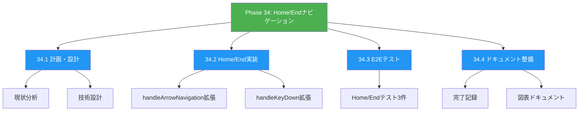
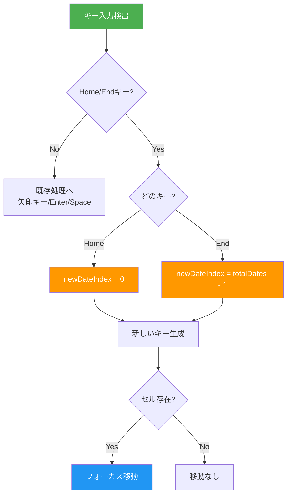
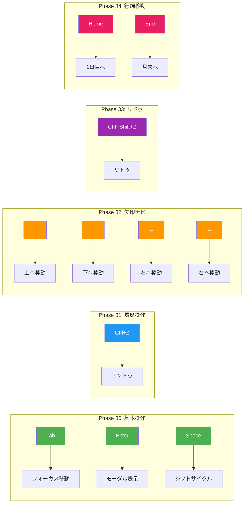
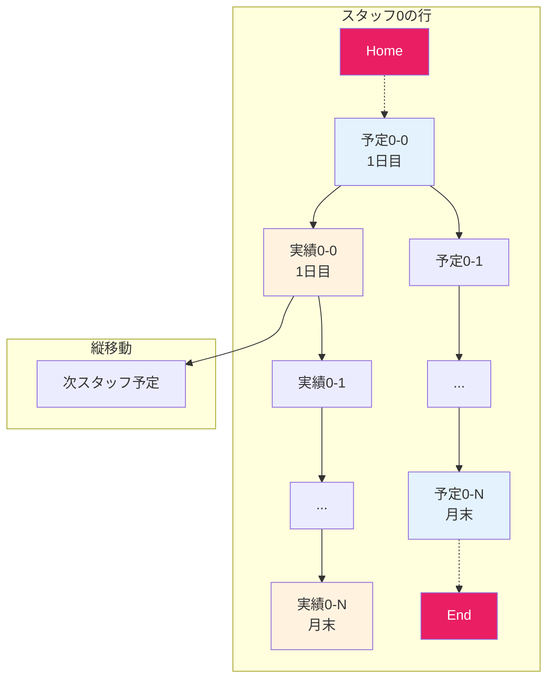
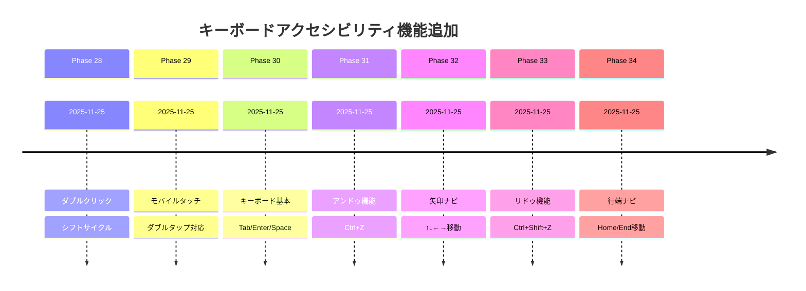
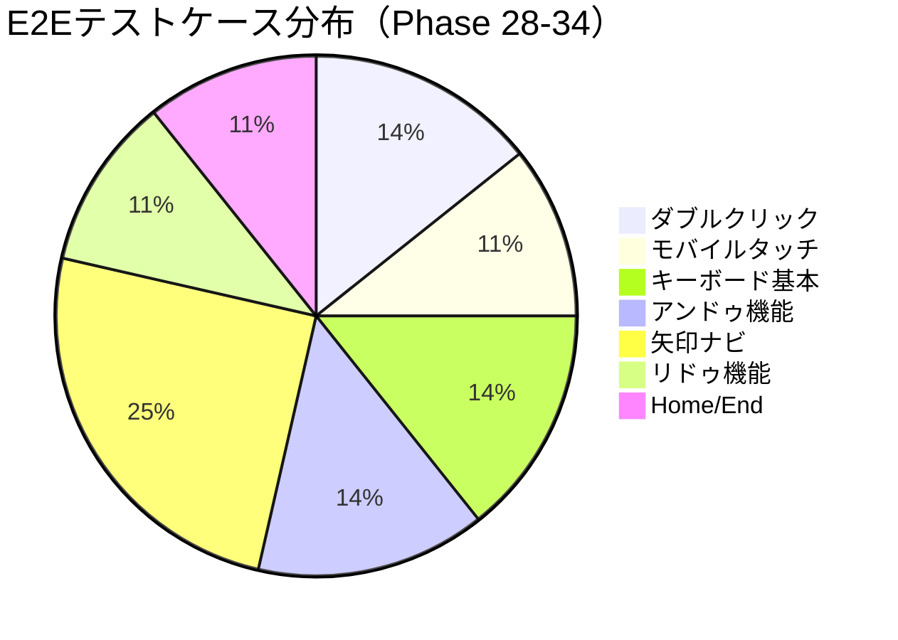
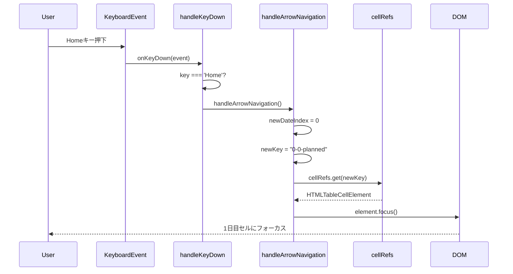

# Phase 34: Home/Endキーナビゲーション - 図表ドキュメント

**作成日**: 2025-11-25
**仕様ID**: home-end-navigation
**Phase**: 34

---

## WBS（作業分解図）

---

## ガントチャート

```mermaid
gantt
    title Phase 34 実装スケジュール
    dateFormat HH:mm
    axisFormat %H:%M

    section 計画・設計
    現状分析           :done, a1, 00:00, 5m
    技術設計           :done, a2, after a1, 5m

    section 実装
    handleArrowNavigation拡張 :done, b1, after a2, 10m
    handleKeyDown拡張         :done, b2, after b1, 5m

    section E2Eテスト
    Home/Endテスト3件  :done, c1, after b2, 10m

    section 完了処理
    ドキュメント整備   :done, d1, after c1, 10m
    Git push           :active, d2, after d1, 5m
```

---

## Home/Endナビゲーション動作フロー

---

## キーボード操作マトリックス（Phase 28-34）

---

## グリッドナビゲーション全体像

---

## Phase 28-34 キーボードアクセシビリティ進捗

---

## テストカバレッジ

---

## シーケンス図：Home/End操作

---

## 関連ドキュメント

- [Phase 34完了記録](./phase34-completion-2025-11-25.md)
- [Phase 34計画](./phase34-plan-2025-11-25.md)
- [Phase 32図表](../arrow-key-navigation/phase32-diagrams-2025-11-25.md)
- [Phase 33図表](../redo-functionality/phase33-diagrams-2025-11-25.md)
