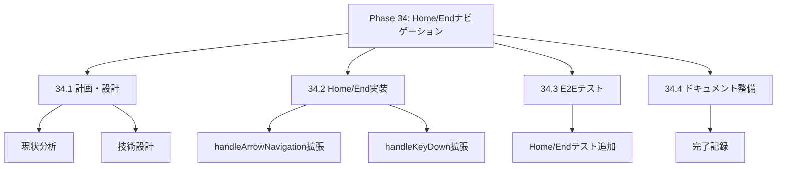

# Phase 34: Home/Endキーナビゲーション

**作成日**: 2025-11-25
**仕様ID**: home-end-navigation
**Phase**: 34
**ステータス**: ✅ 完了

---

## エグゼクティブサマリー

Homeキーで行の先頭（1日目）、Endキーで行の末尾（月末日）に移動できるようにします。グリッドナビゲーションをより効率的にします。

### 目標

- [x] Homeキーで行の先頭に移動
- [x] Endキーで行の末尾に移動
- [x] 既存の矢印キーナビゲーションとの共存

---

## 技術設計

### 1. handleArrowNavigation関数の拡張

**Home/Endキー処理を追加:**

```typescript
const handleArrowNavigation = useCallback((
  e: React.KeyboardEvent,
  staffIndex: number,
  dateIndex: number,
  type: 'planned' | 'actual',
  totalStaff: number,
  totalDates: number
) => {
  let newStaffIndex = staffIndex;
  let newDateIndex = dateIndex;
  let newType = type;

  switch (e.key) {
    // ... 既存の矢印キー処理 ...

    case 'Home':
      // 行の先頭（1日目）に移動
      newDateIndex = 0;
      break;
    case 'End':
      // 行の末尾（月末日）に移動
      newDateIndex = totalDates - 1;
      break;
    default:
      return false;
  }

  const newKey = `${newStaffIndex}-${newDateIndex}-${newType}`;
  const targetCell = cellRefs.current.get(newKey);

  if (targetCell) {
    e.preventDefault();
    targetCell.focus();
    return true;
  }
  return false;
}, []);
```

### 2. handleKeyDown関数の拡張

**Home/Endキーを矢印キーと同様に処理:**

```typescript
// 矢印キー＋Home/Endナビゲーション
if (['ArrowUp', 'ArrowDown', 'ArrowLeft', 'ArrowRight', 'Home', 'End'].includes(e.key)) {
  handleArrowNavigation(e, staffIndex, dateIndex, type, totalStaff, totalDates);
  return;
}
```

---

## WBS（作業分解図）



---

## ガントチャート

```mermaid
gantt
    title Phase 34 実装スケジュール
    dateFormat HH:mm
    axisFormat %H:%M

    section 計画・設計
    現状分析           :done, a1, 00:00, 5m
    技術設計           :done, a2, after a1, 5m

    section 実装
    handleArrowNavigation拡張 :b1, after a2, 10m
    handleKeyDown拡張         :b2, after b1, 5m

    section E2Eテスト
    Home/Endテスト     :c1, after b2, 10m

    section 完了処理
    ドキュメント整備   :d1, after c1, 10m
    Git push           :d2, after d1, 5m
```



---

## 成功基準

- [x] Homeキーで1日目に移動
- [x] Endキーで月末日に移動
- [x] TypeScriptエラーなし
- [x] E2Eテスト通過

---

## 関連ドキュメント

- [Phase 32完了記録](../arrow-key-navigation/phase32-completion-2025-11-25.md)
- [Phase 33完了記録](../redo-functionality/phase33-completion-2025-11-25.md)
- [ShiftTable.tsx](../../../components/ShiftTable.tsx)
