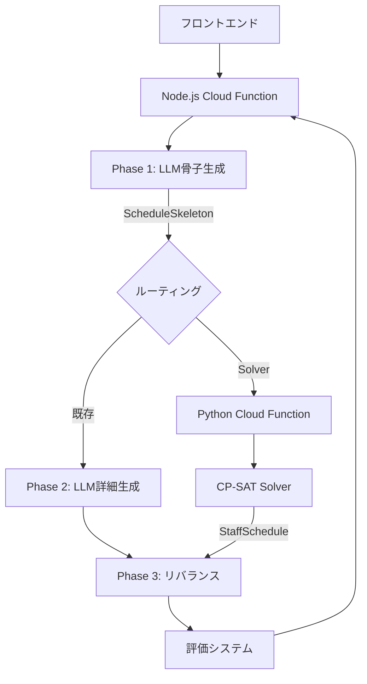
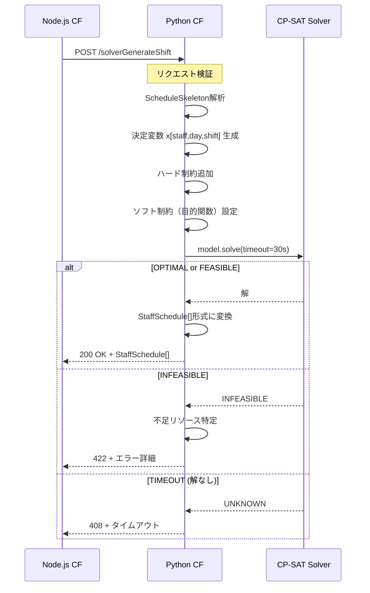
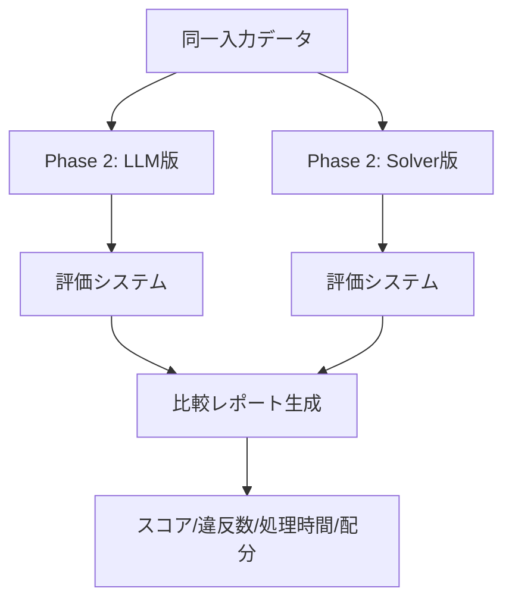
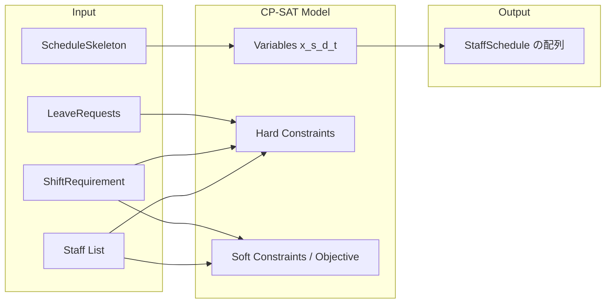
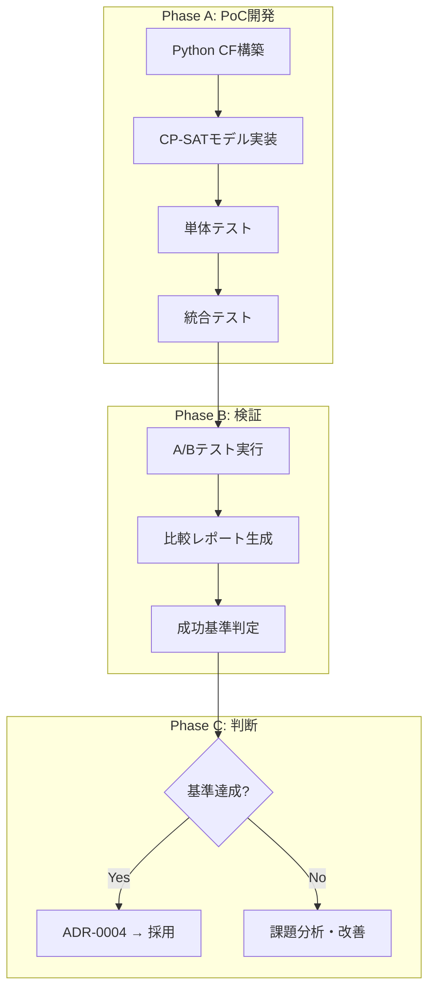

# Technical Design: hybrid-solver-poc

## Overview

**Purpose**: Phase 2（詳細シフト生成）をLLM（Gemini 2.5 Pro）からGoogle OR-Tools CP-SAT Solverに置換するPoCを実施し、処理時間・品質・コストの改善を検証する。

**Users**: 開発者がPoC結果を評価し、施設管理者が最終的にSolver生成シフトの恩恵を受ける。

**Impact**: 既存3フェーズパイプライン（Phase 1: LLM骨子生成 → Phase 2: LLM詳細生成 → Phase 3: アルゴリズムリバランス）のPhase 2をPython Cloud Functionとして新設し、A/Bテストで既存LLM版と比較する。

### Goals

- CP-SAT Solverで5名規模のシフト生成を10秒以内に完了する
- 評価スコア80以上を安定的に達成する（5回中5回）
- Level 1違反（労基法）ゼロを保証する
- 既存の評価システム（EvaluationService）で定量比較可能な出力を生成する
- ADR-0004のステータスを「提案」→「採用」に変更する根拠を提供する

### Non-Goals

- Phase 1（骨子生成）のSolver化（将来フェーズ）
- 100名以上のスケーラビリティ検証（本PoCは5名規模）
- 本番パイプラインの自動切替（手動A/Bテスト）
- フロントエンドUIの変更
- Phase 3リバランスのSolver統合（将来フェーズ）

---

## Architecture

### Existing Architecture Analysis

現在のシフト生成パイプラインは3フェーズ構成:

```
Phase 1 (LLM) → Phase 2 (LLM) → Phase 3 (Algorithm)
骨子生成          詳細生成          リバランス
```

- **Phase 1**: Gemini 2.5 ProでScheduleSkeletonを生成（休日・夜勤パターン決定）
- **Phase 2**: Gemini 2.5 Proで日勤シフト配分を決定（早番・日勤・遅番の割当）
- **Phase 3**: アルゴリズムベースで日別人員配置を最適化（TypeScript実装済み）

Phase 2の課題:
- 処理時間: 60-280秒（バッチ数に比例）
- JSON出力不安定（BUG-014, BUG-022）
- スコアばらつき（確率的出力）

### High-Level Architecture



**Architecture Integration**:
- 既存パターン維持: Phase 1（LLM）→ Phase 3（リバランス）の入出力は変更なし
- 新コンポーネント: Python Cloud Functionを独立エンドポイントとして追加
- 技術整合: Firebase Functions v2のマルチコードベース機能を活用
- Steering準拠: `asia-northeast1`リージョン、TypeScript型互換の入出力

### Technology Stack and Design Decisions

#### Technology Stack

| レイヤー | 技術 | 選定理由 |
|---------|------|---------|
| Solver | Google OR-Tools CP-SAT | Apache 2.0、NSP実績、GCP親和性 |
| Runtime | Python 3.12 | OR-Toolsネイティブサポート、Cloud Functions v2対応 |
| Deployment | Firebase Cloud Functions v2 (Python) | 既存Node.js Functionsと共存可能 |
| Framework | firebase-functions-python | Firebase公式Python SDK |

#### Key Design Decisions

**Decision 1: Python Cloud Functionとして独立デプロイ**

- **Context**: OR-ToolsはPython/C++/Java/C#をサポートするが、既存バックエンドはNode.js/TypeScript
- **Alternatives**:
  1. Node.js WASM binding（or-tools-wasm）
  2. Cloud Run（Dockerコンテナ）
  3. Python Cloud Function（Firebase multi-codebase）
- **Selected Approach**: Python Cloud Function。firebase.jsonの`functions`配列に第2エントリを追加し、既存Node.js Functionsと並行デプロイ
- **Rationale**: OR-ToolsのPython APIが最も成熟・ドキュメント豊富。Firebase multi-codebaseで運用インフラを統一できる。Cloud Runは過剰なオーケストレーション
- **Trade-offs**: Python/Node.js 2言語の保守コスト増。ただしSolverロジックは独立性が高く影響は限定的

**Decision 2: Phase 2のみを置換し、Phase 1・3は既存のまま**

- **Context**: 段階的移行でリスクを最小化する必要がある
- **Alternatives**:
  1. Phase 1-3を一括Solver化
  2. Phase 2のみSolver化（本設計）
  3. Phase 2-3を統合Solver化
- **Selected Approach**: Phase 2のみを置換。Phase 1のScheduleSkeletonを入力とし、StaffSchedule[]を出力する
- **Rationale**: Phase 1は自然言語理解（制約解釈）にLLMの強みがある。Phase 3は既にアルゴリズム実装済みで安定稼働中。Phase 2は典型的な制約充足問題でSolverに最適
- **Trade-offs**: Phase 2-3間のデータ変換が必要だが、既存のStaffSchedule[]形式で互換性あり

**Decision 3: Node.js側からHTTP呼び出しでPython Functionを連携**

- **Context**: Phase 1（Node.js）→ Phase 2（Python）→ Phase 3（Node.js）のデータフロー
- **Alternatives**:
  1. クライアント側でオーケストレーション
  2. Node.js Cloud FunctionからPython Cloud FunctionをHTTP呼び出し
  3. Pub/Sub経由の非同期連携
- **Selected Approach**: Node.js側のshift-generation.tsから、Python Cloud FunctionのHTTPエンドポイントを内部呼び出し
- **Rationale**: 同期的なパイプラインを維持し、既存のエラーハンドリング・タイムアウト制御を活用できる
- **Trade-offs**: Cloud Functions間のレイテンシ追加（数十ms）。ただしSolver自体が数秒で完了するため影響は軽微

---

## System Flows

### CP-SAT求解フロー



### A/Bテストフロー



---

## Requirements Traceability

| Requirement | Summary | Components | Interfaces |
|-------------|---------|------------|------------|
| 1 (CP-SAT制約モデル) | 決定変数・固定値の構築 | SolverModelBuilder | build_model() |
| 2 (ハード制約) | 人員配置・資格・連勤・インターバル | ConstraintBuilder | add_hard_constraints() |
| 3 (ソフト制約) | 希望・公平性・目的関数 | ObjectiveBuilder | add_soft_constraints() |
| 4 (Python CF) | HTTP API・処理時間・出力形式 | SolverCloudFunction | solver_generate_shift() |
| 5 (統合) | Phase1→Solver→評価連携 | PipelineIntegration | Node.js→Python HTTP |
| 6 (PoC検証) | 成功基準・比較レポート | ComparisonService | compare_results() |
| 7 (エラーハンドリング) | INFEASIBLE・タイムアウト・メモリ | ErrorHandler | handle_solver_error() |

---

## Components and Interfaces

### Python Solver Layer

#### SolverCloudFunction

**Responsibility & Boundaries**
- **Primary Responsibility**: HTTP POSTリクエストを受け付け、CP-SATモデルを構築・求解し、StaffSchedule[]を返却する
- **Domain Boundary**: シフト最適化ドメイン（Solver専用）
- **Data Ownership**: 求解中の一時的な制約モデルのみ（永続化なし）

**Dependencies**
- **Inbound**: Node.js Cloud Function（shift-generation.ts）からのHTTP呼び出し
- **Outbound**: なし（外部サービス依存なし、CPU計算のみ）
- **External**: google-or-tools（PyPIパッケージ）

**API Contract**

| Method | Endpoint | Request | Response | Errors |
|--------|----------|---------|----------|--------|
| POST | /solverGenerateShift | SolverRequest | SolverResponse | 400, 408, 422, 500 |

**Request Schema**:
```python
class SolverRequest(TypedDict):
    staffList: list[StaffDict]
    skeleton: ScheduleSkeletonDict
    requirements: ShiftRequirementDict
    leaveRequests: dict[str, dict[str, str]]
```

**Response Schema**:
```python
class SolverResponse(TypedDict):
    success: bool
    schedule: list[StaffScheduleDict]  # StaffSchedule[]互換
    solverStats: SolverStats

class SolverStats(TypedDict):
    status: str           # "OPTIMAL", "FEASIBLE"
    solveTimeMs: int      # 求解時間（ミリ秒）
    numVariables: int     # 変数数
    numConstraints: int   # 制約数
    objectiveValue: int   # 目的関数値
```

**Error Response Schema**:
```python
class SolverErrorResponse(TypedDict):
    success: Literal[False]
    error: str
    errorType: str        # "INFEASIBLE", "TIMEOUT", "VALIDATION", "INTERNAL"
    details: dict         # エラー種別固有の詳細
```

#### SolverModelBuilder

**Responsibility & Boundaries**
- **Primary Responsibility**: ScheduleSkeletonとStaffListからCP-SATの決定変数と制約を構築する
- **Domain Boundary**: 制約モデリングドメイン

**Service Interface**:
```python
class SolverModelBuilder:
    def __init__(self, staff_list: list[StaffDict],
                 skeleton: ScheduleSkeletonDict,
                 requirements: ShiftRequirementDict,
                 leave_requests: dict) -> None: ...

    def build_model(self) -> cp_model.CpModel:
        """CP-SATモデルを構築して返す"""

    def get_variables(self) -> dict[tuple[str, int, str], cp_model.IntVar]:
        """決定変数辞書 {(staffId, day, shiftType): BoolVar} を返す"""

    def extract_solution(self, solver: cp_model.CpSolver) -> list[StaffScheduleDict]:
        """求解結果をStaffSchedule[]形式に変換する"""
```

- **Preconditions**: staffList, skeleton, requirementsが有効でバリデーション済み
- **Postconditions**: 返却されるCpModelは全ハード制約を含む
- **Invariants**: 1スタッフ・1日につき最大1シフトが割当される

#### ConstraintBuilder

**Responsibility & Boundaries**
- **Primary Responsibility**: ハード制約（必須）をCpModelに追加する

**Service Interface**:
```python
class ConstraintBuilder:
    @staticmethod
    def add_hard_constraints(model: cp_model.CpModel,
                             variables: dict,
                             staff_list: list[StaffDict],
                             skeleton: ScheduleSkeletonDict,
                             requirements: ShiftRequirementDict,
                             leave_requests: dict) -> None:
        """
        ハード制約を追加:
        1. 1日1シフト制約
        2. Skeleton固定値（休日・夜勤・明け休み）
        3. 休暇申請の反映
        4. 日別必要人数の充足
        5. 資格要件の充足
        6. 連続勤務6日以下
        7. 勤務間インターバル（遅番→翌日早番禁止）
        """
```

#### ObjectiveBuilder

**Responsibility & Boundaries**
- **Primary Responsibility**: ソフト制約を目的関数として設定する

**Service Interface**:
```python
class ObjectiveBuilder:
    @staticmethod
    def add_soft_constraints(model: cp_model.CpModel,
                             variables: dict,
                             staff_list: list[StaffDict],
                             requirements: ShiftRequirementDict) -> None:
        """
        目的関数を設定:
        1. timeSlotPreference適合の最大化（重み: 10）
        2. シフト種類の月間均等配分（重み: 5）
        3. 日別人数の要件近接（重み: 3）
        """
```

### Node.js Integration Layer

#### PipelineIntegration（既存shift-generation.tsの拡張）

**Responsibility & Boundaries**
- **Primary Responsibility**: Phase 2のルーティング（LLM版 or Solver版）を制御する
- **Modification Approach**: 既存のshift-generation.tsにSolverルーティング分岐を追加

**Service Interface**:
```typescript
// 既存の shift-generation.ts に追加
async function callSolverPhase2(
  staffList: Staff[],
  skeleton: ScheduleSkeleton,
  requirements: ShiftRequirement,
  leaveRequests: LeaveRequest
): Promise<StaffSchedule[]>
```

- **Backward Compatibility**: 既存のLLM Phase 2は変更しない。Solverは別エンドポイント（`/solverGenerateShift`）として独立
- **Migration Path**: PoC期間中はA/Bテスト用の手動切替。本格移行時にデフォルトをSolverに変更

---

## Data Models

### CP-SATモデル変数定義

**決定変数**: `x[s, d, t]` - スタッフsが日dにシフトtを担当するか（0/1）

```
s ∈ staffList（スタッフID）
d ∈ [1, daysInMonth]（日付）
t ∈ {"早番", "日勤", "遅番"}（シフトタイプ、休・夜勤・明け休みはSkeleton固定）
```

**変数数の概算（5名・30日）**: 5 x 30 x 3 = 450変数（うちSkeleton固定分を除く）

### 入出力データマッピング



### Python側の型定義（TypeScript互換）

```python
class StaffDict(TypedDict):
    id: str
    name: str
    role: str                          # Role enum値
    qualifications: list[str]          # Qualification enum値
    weeklyWorkCount: WeeklyWorkCount
    maxConsecutiveWorkDays: int
    availableWeekdays: list[int]
    timeSlotPreference: str            # "日勤のみ" | "夜勤のみ" | "いつでも可"
    isNightShiftOnly: bool

class StaffScheduleSkeletonDict(TypedDict):
    staffId: str
    staffName: str
    restDays: list[int]
    nightShiftDays: list[int]
    nightShiftFollowupDays: list[int]

class ScheduleSkeletonDict(TypedDict):
    staffSchedules: list[StaffScheduleSkeletonDict]

class DailyRequirementDict(TypedDict):
    totalStaff: int
    requiredQualifications: list[QualReqDict]
    requiredRoles: list[RoleReqDict]

class StaffScheduleDict(TypedDict):
    staffId: str
    staffName: str
    monthlyShifts: list[GeneratedShiftDict]

class GeneratedShiftDict(TypedDict):
    date: str        # "YYYY-MM-DD"
    shiftType: str   # "早番" | "日勤" | "遅番" | "夜勤" | "休" | "明け休み"
```

---

## Error Handling

### Error Strategy

CP-SAT Solverの求解結果ステータスに基づく分類:

| Solverステータス | HTTPコード | errorType | 対応 |
|-----------------|-----------|-----------|------|
| OPTIMAL | 200 | - | 最適解を返却 |
| FEASIBLE | 200 | - | 実行可能解を返却（solverStatsに記録） |
| INFEASIBLE | 422 | INFEASIBLE | 不足リソースを特定してエラー返却 |
| UNKNOWN (timeout) | 408 | TIMEOUT | タイムアウトエラー返却 |
| MODEL_INVALID | 500 | INTERNAL | モデル構築エラーをログ出力 |

### Error Categories and Responses

**Validation Errors (400)**:
- 必須フィールド欠落（staffList, skeleton, requirements）
- Skeleton内のstaffIdが staffListと不一致
- 日数やシフトタイプの不正値

**Business Logic Errors (422 - INFEASIBLE)**:
- スタッフ数不足で必要人数を満たせない
- 資格保有者不足で資格要件を満たせない
- 詳細: `details.shortages`に不足情報を含める

```python
{
    "success": False,
    "error": "制約充足不可能",
    "errorType": "INFEASIBLE",
    "details": {
        "shortages": [
            {"date": "2026-03-05", "shiftType": "日勤", "required": 2, "available": 1},
            {"date": "2026-03-05", "qualification": "看護師", "required": 1, "available": 0}
        ]
    }
}
```

**Timeout Errors (408)**:
- 30秒の求解上限に到達
- feasible solutionが見つかっていればFEASIBLEとして200返却

**Internal Errors (500)**:
- OR-Toolsライブラリエラー
- 予期しない例外

### Monitoring

- Cloud Functions標準ログに求解時間・変数数・制約数を出力
- INFEASIBLEケースのログレベルをWARNINGに設定
- メモリ使用量をsolverStatsに含める

---

## Testing Strategy

### Unit Tests (pytest)

1. **test_model_builder**: ScheduleSkeleton→決定変数生成の正確性
2. **test_hard_constraints**: 各ハード制約の個別検証（1日1シフト、連勤制限、インターバル）
3. **test_soft_constraints**: 目的関数の重み付け検証（preference適合度）
4. **test_solution_extraction**: Solver解→StaffSchedule[]変換の正確性
5. **test_infeasible_detection**: INFEASIBLE時の不足リソース特定

### Integration Tests

1. **test_solver_endpoint**: HTTP POST→レスポンスのE2E検証
2. **test_pipeline_integration**: Node.js CF→Python CF→評価のフルパイプライン
3. **test_skeleton_compatibility**: 実際のPhase 1出力をSolver入力として使用
4. **test_evaluation_compatibility**: Solver出力を既存EvaluationServiceで評価

### Performance Tests

1. **test_solve_time_5staff**: 5名規模で10秒以内の完了を検証
2. **test_memory_usage**: 256MiB以内のメモリ使用を検証
3. **test_deterministic_output**: 同一入力で同一結果の再現性検証

### Comparison Tests

1. **test_ab_comparison**: LLM版とSolver版の同一入力での結果比較
2. **test_score_stability**: 5回実行でスコア80以上の安定性検証
3. **test_level1_zero_violations**: 全テストケースでLevel 1違反ゼロを検証

---

## Performance & Scalability

### Target Metrics

| 指標 | 目標値 | 測定方法 |
|------|--------|---------|
| 求解時間（5名） | < 10秒 | solverStats.solveTimeMs |
| 全体処理時間（5名） | < 15秒 | HTTPレスポンス時間 |
| メモリ使用量（5名） | < 256MiB | Cloud Functions metrics |
| 変数数（5名・30日） | ~450 | solverStats.numVariables |
| スコア安定性 | 80+ (5/5回) | 評価システム |

### Solver最適化

- **タイムアウト設定**: 30秒（solver.parameters.max_time_in_seconds = 30）
- **初期解ヒント**: Phase 1のSkeletonデータを初期解として活用
- **対称性除去**: 同一資格スタッフ間の対称性を制約で除去し探索空間を削減

---

## Migration Strategy



### Phase A: PoC開発（本設計スコープ）

1. `solver-functions/` ディレクトリを新設
2. Python Cloud Function（`solverGenerateShift`）を実装
3. firebase.jsonにPythonコードベースを追加
4. 単体テスト・統合テスト作成

### Phase B: 検証

1. 既存テストデータ（5名）でA/Bテスト実施
2. 評価システムで定量比較（スコア・違反数・処理時間）
3. 比較レポート生成

### Phase C: 判断

- 全テストケースで成功基準達成 → ADR-0004を「採用」に更新
- 未達成 → 課題分析・モデル改善後に再検証

### firebase.json変更（マルチコードベース）

既存の`functions`配列に第2エントリを追加:

```json
{
  "functions": [
    {
      "source": "functions",
      "codebase": "default",
      "ignore": ["node_modules", ".git", "firebase-debug.log", "firebase-debug.*.log"],
      "predeploy": ["npm --prefix \"$RESOURCE_DIR\" run build"]
    },
    {
      "source": "solver-functions",
      "codebase": "solver",
      "runtime": "python312",
      "ignore": ["venv", "__pycache__", ".git"],
      "predeploy": ["python -m pip install -r requirements.txt -t ./"]
    }
  ]
}
```

### ディレクトリ構成

```
ai-care-shift-scheduler/
├── functions/                    # 既存Node.js Functions（変更なし）
├── solver-functions/             # 新規Python Functions
│   ├── main.py                   # Cloud Functionエントリーポイント
│   ├── solver/
│   │   ├── __init__.py
│   │   ├── model_builder.py      # SolverModelBuilder
│   │   ├── constraints.py        # ConstraintBuilder
│   │   ├── objective.py          # ObjectiveBuilder
│   │   └── types.py              # Python型定義
│   ├── requirements.txt          # ortools, firebase-functions等
│   └── tests/
│       ├── test_model_builder.py
│       ├── test_constraints.py
│       ├── test_objective.py
│       └── test_integration.py
└── firebase.json                 # マルチコードベース設定
```
