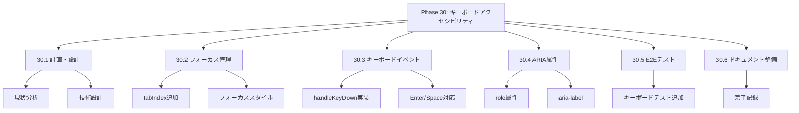

# Phase 30: キーボードアクセシビリティ

**作成日**: 2025-11-25
**仕様ID**: keyboard-accessibility
**Phase**: 30
**ステータス**: 🔄 実装中

---

## エグゼクティブサマリー

シフトテーブルのセルをキーボードで操作できるようにします。Tab/矢印キーでセル間を移動し、Enter/Spaceでシフト編集を行えます。

### 目標

- ✅ Tabキーでセル間フォーカス移動
- ✅ Enterキーでモーダル表示（シングルクリック相当）
- ✅ Spaceキーでシフトサイクル（ダブルクリック相当）
- ✅ aria属性によるスクリーンリーダー対応

---

## 技術設計

### 1. フォーカス管理

**セルをフォーカス可能にする:**
```tsx
<td
  tabIndex={0}
  role="button"
  aria-label={`${staffName} ${date} ${shiftType}`}
  onKeyDown={handleKeyDown}
  ...
>
```

### 2. キーボードイベント

**対応キー:**
| キー | アクション |
|------|-----------|
| Tab | 次のセルへ移動 |
| Shift+Tab | 前のセルへ移動 |
| Enter | モーダル表示 |
| Space | シフトサイクル |
| Escape | モーダルを閉じる |

**実装:**
```typescript
const handleKeyDown = (e: React.KeyboardEvent, /* params */) => {
  if (e.key === 'Enter') {
    e.preventDefault();
    openEditModal(/* params */);
  } else if (e.key === ' ') {
    e.preventDefault();
    handleDoubleClick(/* params */);
  }
};
```

### 3. ARIA属性

```tsx
<td
  role="button"
  aria-label={`${staffName}の${date}のシフト: ${shiftType}`}
  aria-describedby="shift-instructions"
>
```

---

## WBS（作業分解図）



---

## ガントチャート

```mermaid
gantt
    title Phase 30 実装スケジュール
    dateFormat HH:mm
    axisFormat %H:%M

    section 計画・設計
    現状分析           :done, a1, 00:00, 10m
    技術設計           :done, a2, after a1, 10m

    section フォーカス管理
    tabIndex追加       :b1, after a2, 10m
    フォーカススタイル :b2, after b1, 10m

    section キーボードイベント
    handleKeyDown      :c1, after b2, 15m
    Enter/Space対応    :c2, after c1, 10m

    section ARIA属性
    role/aria-label    :d1, after c2, 10m

    section E2Eテスト
    キーボードテスト   :e1, after d1, 15m

    section 完了処理
    ドキュメント整備   :f1, after e1, 15m
    Git push           :f2, after f1, 5m
```



---

## 成功基準

- [ ] Tabキーでセル間移動
- [ ] Enterでモーダル表示
- [ ] Spaceでシフトサイクル
- [ ] aria属性適切
- [ ] E2Eテスト通過

---

## 関連ドキュメント

- [Phase 29完了記録](../mobile-touch-support/phase29-completion-2025-11-25.md)
- [ShiftTable.tsx](../../../components/ShiftTable.tsx)
