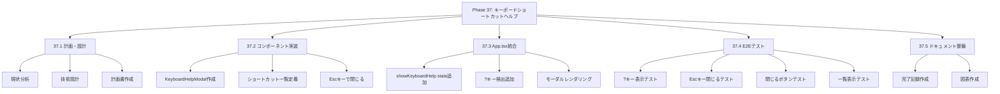
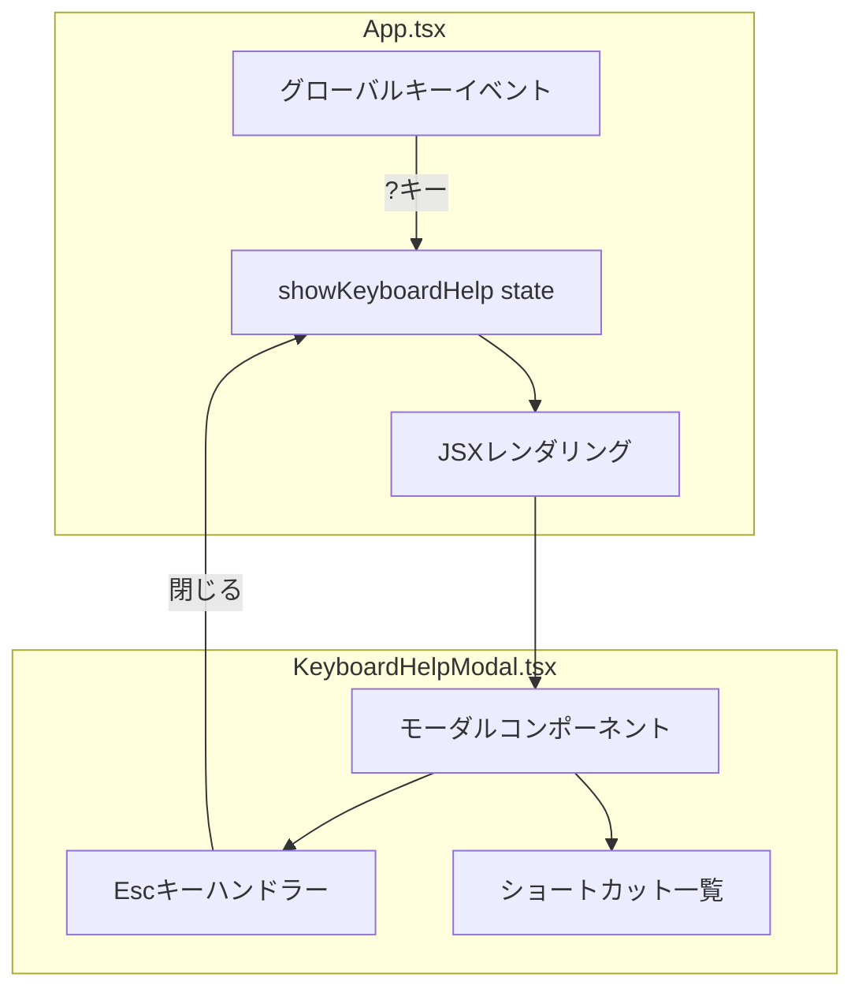
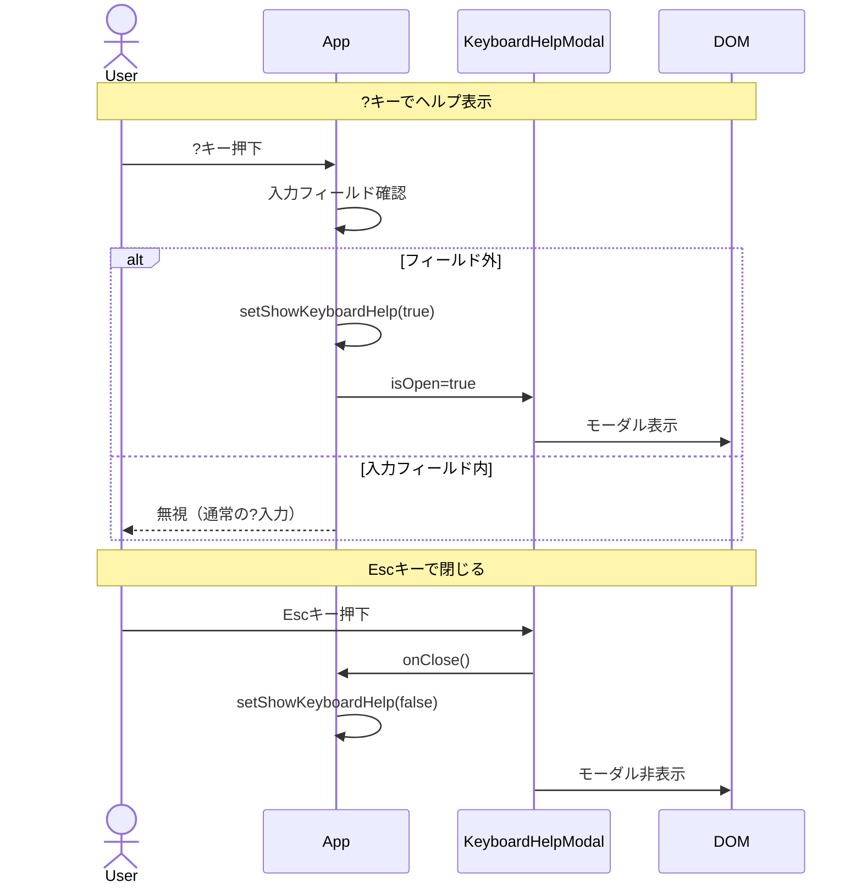
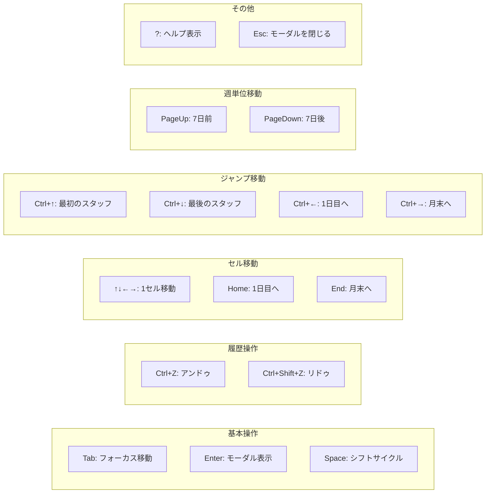
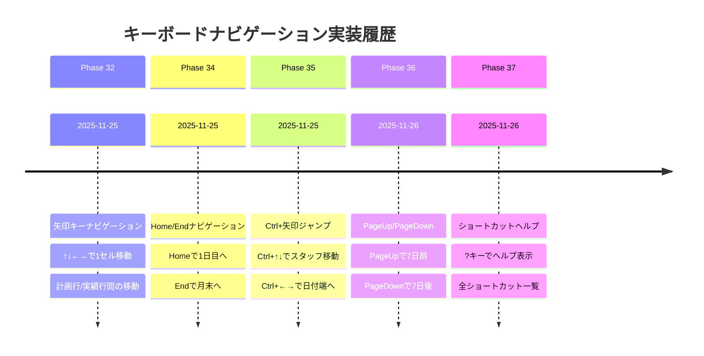
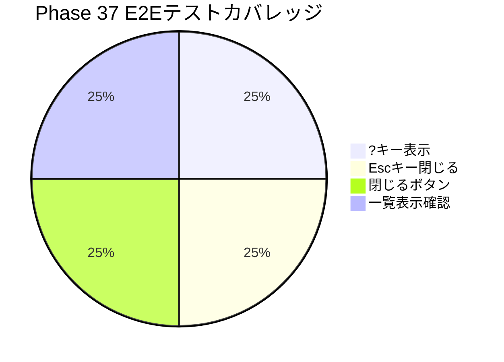

# Phase 37: キーボードショートカットヘルプ - 図表

**作成日**: 2025-11-26
**仕様ID**: keyboard-shortcut-help
**Phase**: 37

---

## WBS（作業分解図）

---

## ガントチャート

```mermaid
gantt
    title Phase 37 実装スケジュール
    dateFormat HH:mm
    axisFormat %H:%M

    section 計画・設計
    現状分析           :done, a1, 00:00, 5m
    技術設計           :done, a2, after a1, 5m
    計画書作成         :done, a3, after a2, 10m

    section コンポーネント実装
    KeyboardHelpModal  :done, b1, after a3, 15m
    ショートカット定義  :done, b2, after b1, 5m

    section App.tsx統合
    state追加          :done, c1, after b2, 5m
    ?キー検出          :done, c2, after c1, 10m
    モーダルレンダリング :done, c3, after c2, 5m

    section E2Eテスト
    テストケース追加    :done, d1, after c3, 15m

    section ドキュメント
    完了記録・図表     :done, e1, after d1, 15m
    Git push           :active, e2, after e1, 5m
```

---

## コンポーネント構成図

---

## ユーザーインタラクションフロー

---

## ショートカットカテゴリ構成

---

## Phase 32-37 キーボードナビゲーション実装タイムライン

---

## E2Eテストカバレッジ

---

## 関連ドキュメント

- [Phase 37計画](./phase37-plan-2025-11-26.md)
- [Phase 37完了記録](./phase37-completion-2025-11-26.md)
- [Phase 36図表](../pageup-pagedown-navigation/phase36-diagrams-2025-11-26.md)
