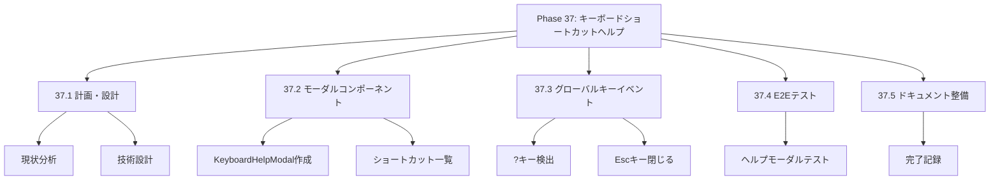

# Phase 37: キーボードショートカットヘルプ

**作成日**: 2025-11-26
**仕様ID**: keyboard-shortcut-help
**Phase**: 37
**ステータス**: 🔄 実装中

---

## エグゼクティブサマリー

?キー（Shift+/）でキーボードショートカット一覧をモーダル表示します。ユーザーが利用可能なショートカットを簡単に確認できるようになります。

### 目標

- [ ] ?キーでショートカット一覧モーダル表示
- [ ] Escキーでモーダル閉じる
- [ ] モーダル外クリックで閉じる
- [ ] 全ショートカット（Phase 30-36）を網羅

---

## 技術設計

### 1. KeyboardHelpModalコンポーネント作成

**新規コンポーネント:**
```typescript
interface KeyboardHelpModalProps {
  isOpen: boolean;
  onClose: () => void;
}

const KeyboardHelpModal: React.FC<KeyboardHelpModalProps> = ({ isOpen, onClose }) => {
  if (!isOpen) return null;

  return (
    <div className="fixed inset-0 bg-black/50 flex items-center justify-center z-50" onClick={onClose}>
      <div className="bg-white rounded-lg p-6 max-w-lg w-full mx-4" onClick={e => e.stopPropagation()}>
        <h2>キーボードショートカット</h2>
        <table>
          {/* ショートカット一覧 */}
        </table>
        <button onClick={onClose}>閉じる</button>
      </div>
    </div>
  );
};
```

### 2. グローバルキーイベント

**App.tsxに追加:**
```typescript
const [showKeyboardHelp, setShowKeyboardHelp] = useState(false);

useEffect(() => {
  const handleKeyDown = (e: KeyboardEvent) => {
    if (e.key === '?' || (e.shiftKey && e.key === '/')) {
      e.preventDefault();
      setShowKeyboardHelp(true);
    }
    if (e.key === 'Escape') {
      setShowKeyboardHelp(false);
    }
  };
  // ...
}, []);
```

---

## WBS（作業分解図）



---

## ガントチャート

```mermaid
gantt
    title Phase 37 実装スケジュール
    dateFormat HH:mm
    axisFormat %H:%M

    section 計画・設計
    現状分析           :done, a1, 00:00, 5m
    技術設計           :done, a2, after a1, 5m

    section モーダル実装
    KeyboardHelpModal作成 :b1, after a2, 15m
    ショートカット一覧    :b2, after b1, 10m

    section キーイベント
    ?キー検出           :c1, after b2, 5m
    Escキー閉じる       :c2, after c1, 5m

    section E2Eテスト
    ヘルプモーダルテスト :d1, after c2, 10m

    section 完了処理
    ドキュメント整備   :e1, after d1, 10m
    Git push           :e2, after e1, 5m
```



---

## 成功基準

- [ ] ?キーでモーダル表示
- [ ] Escキーでモーダル閉じる
- [ ] 全ショートカット網羅
- [ ] TypeScriptエラーなし
- [ ] E2Eテスト通過

---

## 関連ドキュメント

- [Phase 30完了記録](../keyboard-accessibility/phase30-completion-2025-11-25.md)
- [Phase 36完了記録](../pageup-pagedown-navigation/phase36-completion-2025-11-26.md)
- [App.tsx](../../../App.tsx)
