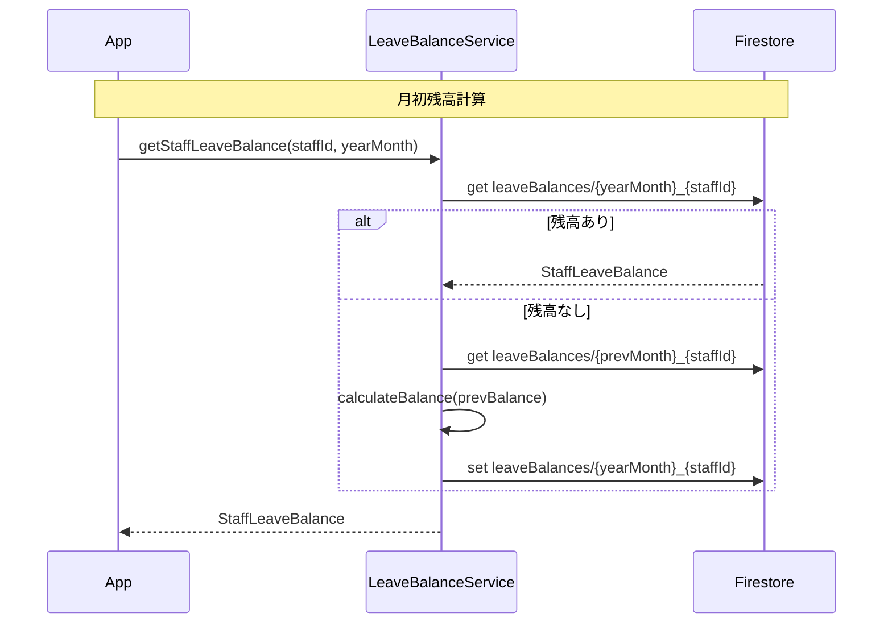

# Phase 39: 休暇残高管理 - 設計書

**作成日**: 2025-11-26
**仕様ID**: leave-balance-management
**Phase**: 39

---

## アーキテクチャ

```
┌─────────────────────────────────────────────────────────────────┐
│                       App.tsx                                    │
│  ┌─────────────────┐  ┌────────────────────────────────────────┐│
│  │ leaveSettings   │  │ LeaveBalanceDashboard                  ││
│  │ state           │  │ ├─ スタッフ一覧                        ││
│  └────────┬────────┘  │ ├─ 残高表示                            ││
│           │           │ └─ 詳細モーダル                        ││
│           ▼           └────────────────────────────────────────┘│
│  LeaveBalanceService                                             │
│  ├─ getLeaveSettings()                                           │
│  ├─ saveLeaveSettings()                                          │
│  ├─ getStaffLeaveBalances()                                      │
│  ├─ updateStaffLeaveBalance()                                    │
│  └─ adjustBalance()                                              │
└─────────────────────────────────────────────────────────────────┘
                              │
                              ▼
┌─────────────────────────────────────────────────────────────────┐
│                       Firestore                                  │
│  /facilities/{facilityId}/leaveSettings/default                  │
│  /facilities/{facilityId}/leaveBalances/{yearMonth}_{staffId}    │
└─────────────────────────────────────────────────────────────────┘
```

---

## 型定義

### types.ts追加

```typescript
// ==================== 休暇残高管理（Phase 39）====================

// 公休残高
export interface PublicHolidayBalance {
  allocated: number;      // 月間付与数
  used: number;           // 当月使用数
  carriedOver: number;    // 前月繰越数
  balance: number;        // 残高 = allocated + carriedOver - used
}

// 有給残高
export interface PaidLeaveBalance {
  annualAllocated: number;  // 年間付与数
  used: number;             // 使用累計
  carriedOver: number;      // 前年繰越数
  balance: number;          // 残高 = annualAllocated + carriedOver - used
  expiresAt: Timestamp;     // 有効期限
}

// スタッフ休暇残高
export interface StaffLeaveBalance {
  id: string;                      // {yearMonth}_{staffId}
  staffId: string;
  yearMonth: string;               // YYYY-MM形式
  publicHoliday: PublicHolidayBalance;
  paidLeave: PaidLeaveBalance;
  adjustments: LeaveAdjustment[];  // 調整履歴
  updatedAt: Timestamp;
  updatedBy: string;
}

// 残高調整履歴
export interface LeaveAdjustment {
  type: 'publicHoliday' | 'paidLeave';
  amount: number;           // 正=追加、負=減算
  reason: string;
  adjustedBy: string;
  adjustedAt: Timestamp;
}

// 施設休暇設定
export interface FacilityLeaveSettings {
  facilityId: string;
  publicHoliday: {
    monthlyAllocation: number;  // 月間付与日数（デフォルト: 9）
    maxCarryOver: number;       // 繰越上限（-1: 無制限）
  };
  paidLeave: {
    carryOverYears: number;     // 繰越年数（デフォルト: 2）
  };
  updatedAt: Timestamp;
  updatedBy: string;
}

// 休暇残高サービスエラー型
export type LeaveBalanceError =
  | { code: 'PERMISSION_DENIED'; message: string }
  | { code: 'VALIDATION_ERROR'; message: string }
  | { code: 'FIRESTORE_ERROR'; message: string }
  | { code: 'NOT_FOUND'; message: string };
```

---

## constants.ts追加

```typescript
// ==================== 休暇残高管理（Phase 39）====================

// デフォルト休暇設定
export const DEFAULT_LEAVE_SETTINGS = {
  publicHoliday: {
    monthlyAllocation: 9,  // 月9日
    maxCarryOver: -1,      // 無制限
  },
  paidLeave: {
    carryOverYears: 2,     // 2年繰越
  },
};
```

---

## LeaveBalanceService API

### getLeaveSettings
```typescript
async function getLeaveSettings(
  facilityId: string
): Promise<Result<FacilityLeaveSettings, LeaveBalanceError>>
```

### saveLeaveSettings
```typescript
async function saveLeaveSettings(
  facilityId: string,
  settings: Partial<Omit<FacilityLeaveSettings, 'facilityId' | 'updatedAt' | 'updatedBy'>>,
  userId: string
): Promise<Result<void, LeaveBalanceError>>
```

### getStaffLeaveBalances
```typescript
async function getStaffLeaveBalances(
  facilityId: string,
  yearMonth: string
): Promise<Result<StaffLeaveBalance[], LeaveBalanceError>>
```

### getStaffLeaveBalance
```typescript
async function getStaffLeaveBalance(
  facilityId: string,
  staffId: string,
  yearMonth: string
): Promise<Result<StaffLeaveBalance, LeaveBalanceError>>
```

### adjustBalance
```typescript
async function adjustBalance(
  facilityId: string,
  staffId: string,
  yearMonth: string,
  adjustment: Omit<LeaveAdjustment, 'adjustedAt'>
): Promise<Result<void, LeaveBalanceError>>
```

### calculateBalance
```typescript
function calculateBalance(
  settings: FacilityLeaveSettings,
  previousBalance: StaffLeaveBalance | null,
  currentUsage: { publicHoliday: number; paidLeave: number }
): { publicHoliday: PublicHolidayBalance; paidLeave: PaidLeaveBalance }
```

---

## UIコンポーネント

### LeaveBalanceDashboard.tsx

```typescript
interface LeaveBalanceDashboardProps {
  facilityId: string;
  staffList: Staff[];
  yearMonth: string;
  onAdjust?: (staffId: string, type: 'publicHoliday' | 'paidLeave') => void;
}
```

**機能:**
- スタッフ一覧と残高表示
- フィルタ（全員/残高少/マイナス）
- ソート（名前/残高）
- 残高警告表示（残高3日以下で黄色、0以下で赤）

### LeaveBalanceDetailModal.tsx

```typescript
interface LeaveBalanceDetailModalProps {
  isOpen: boolean;
  onClose: () => void;
  staffId: string;
  staffName: string;
  balance: StaffLeaveBalance;
  onAdjust: (type: 'publicHoliday' | 'paidLeave', amount: number, reason: string) => void;
}
```

**機能:**
- 残高詳細表示
- 調整履歴表示
- 手動調整フォーム

### LeaveSettingsPanel.tsx

```typescript
interface LeaveSettingsPanelProps {
  settings: FacilityLeaveSettings;
  onSave: (settings: Partial<FacilityLeaveSettings>) => Promise<void>;
  disabled?: boolean;
}
```

**機能:**
- 公休設定（月間付与数、繰越上限）
- 有給設定（繰越年数）

---

## Firestoreパス

```
/facilities/{facilityId}/leaveSettings/default
/facilities/{facilityId}/leaveBalances/{yearMonth}_{staffId}
```

---

## データフロー

### 残高計算フロー



---

## App.tsx統合

### 状態追加
```typescript
const [leaveSettings, setLeaveSettings] = useState<FacilityLeaveSettings | null>(null);
```

### アコーディオン追加
```jsx
<Accordion title="休暇残高管理" icon={<CalendarIcon/>}>
  <LeaveBalanceDashboard
    facilityId={selectedFacilityId}
    staffList={staffList}
    yearMonth={requirements.targetMonth}
  />
</Accordion>
```

---

## 成功基準

- [ ] FacilityLeaveSettings, StaffLeaveBalance型定義
- [ ] LeaveBalanceService実装
- [ ] LeaveBalanceDashboard UI
- [ ] LeaveSettingsPanel UI
- [ ] App.tsx統合
- [ ] Firestoreルール追加
- [ ] TypeScriptエラーなし

---

## 関連ドキュメント

- [要件定義書](./requirements.md)
- [タスク一覧](./tasks.md)
- [Phase 38設計書](../shift-type-settings/design.md)
