# Phase 39: 休暇残高管理 - 図表

**作成日**: 2025-11-26
**仕様ID**: leave-balance-management
**Phase**: 39

---

## WBS（作業分解図）


---

## ガントチャート

```mermaid
gantt
    title Phase 39 実装スケジュール
    dateFormat HH:mm
    axisFormat %H:%M

    section 基盤
    型定義追加           :done, a1, 00:00, 30m
    定数追加             :done, a2, after a1, 15m

    section Service
    LeaveBalanceService  :b1, after a2, 2h

    section UI
    LeaveSettingsPanel   :c1, after b1, 1h
    LeaveBalanceDashboard:c2, after b1, 2h
    LeaveBalanceDetailModal:c3, after c2, 1h30m

    section 統合
    App.tsx統合          :d1, after c3, 1h
    Firestoreルール      :d2, after d1, 15m

    section 完了処理
    完了記録・コミット   :e1, after d2, 30m
```



---

## データフロー図


---

## コンポーネント構成図

```mermaid
graph TB
    subgraph "App.tsx"
        AppState[leaveSettings state]
        Subscribe[LeaveBalanceService.subscribe]
    end

    subgraph "LeaveSettingsPanel.tsx"
        Settings[設定フォーム]
        PublicSettings[公休設定]
        PaidSettings[有給設定]
    end

    subgraph "LeaveBalanceDashboard.tsx"
        List[スタッフ一覧]
        Filter[フィルタ]
        Sort[ソート]
        WarningBadge[警告バッジ]
    end

    subgraph "LeaveBalanceDetailModal.tsx"
        Detail[残高詳細]
        History[調整履歴]
        AdjustForm[調整フォーム]
    end

    subgraph "Firestore"
        LeaveSettings[leaveSettings/default]
        LeaveBalances[leaveBalances/{id}]
    end

    AppState --> Settings
    AppState --> List
    Subscribe --> LeaveSettings
    List --> Detail
    Detail --> AdjustForm
    AdjustForm --> LeaveBalances
```

---

## ER図（データモデル）


---

## UIモックアップ

```
┌─────────────────────────────────────────────────────────────────┐
│ ▼ 休暇残高管理                                                   │
├─────────────────────────────────────────────────────────────────┤
│                                                                 │
│  ┌─────────────────────────────────────────────────────────────┐│
│  │ 対象月: [2025年11月 ▼]    フィルタ: [全員 ▼]  ソート: [名前 ▼]││
│  └─────────────────────────────────────────────────────────────┘│
│                                                                 │
│  ┌────────────────────────────────────────────────────────────┐ │
│  │ スタッフ名     │ 公休残高  │ 有給残高  │ ステータス │ 操作  │ │
│  ├────────────────┼───────────┼───────────┼────────────┼───────┤ │
│  │ 山田 太郎      │ 5日       │ 12日      │ ✓         │ [詳細]│ │
│  │ 佐藤 花子      │ 2日 ⚠️    │ 8日       │ 残少      │ [詳細]│ │
│  │ 田中 一郎      │ -1日 🔴   │ 5日       │ マイナス  │ [詳細]│ │
│  │ 鈴木 美咲      │ 7日       │ 15日      │ ✓         │ [詳細]│ │
│  └────────────────────────────────────────────────────────────┘ │
│                                                                 │
│  ───────────────────────────────────────────────────────────── │
│                                                                 │
│  施設設定:                                                       │
│  公休: 月 [9] 日付与  繰越上限: [無制限 ▼]                        │
│  有給: 繰越期間 [2] 年                    [設定を保存]            │
│                                                                 │
└─────────────────────────────────────────────────────────────────┘

詳細モーダル:
┌─────────────────────────────────────────┐
│ 佐藤 花子 の休暇残高             [×]    │
├─────────────────────────────────────────┤
│                                         │
│ 【公休】2025年11月                       │
│ ┌─────────────────────────────────────┐ │
│ │ 月間付与:  9日                       │ │
│ │ 前月繰越:  3日                       │ │
│ │ 使用済み: 10日                       │ │
│ │ 残高:     2日 ⚠️                     │ │
│ └─────────────────────────────────────┘ │
│                                         │
│ 【有給】                                 │
│ ┌─────────────────────────────────────┐ │
│ │ 年間付与: 10日                       │ │
│ │ 前年繰越:  5日                       │ │
│ │ 使用済み:  7日                       │ │
│ │ 残高:     8日                        │ │
│ │ 有効期限: 2027-03-31                 │ │
│ └─────────────────────────────────────┘ │
│                                         │
│ 調整履歴:                                │
│ ┌─────────────────────────────────────┐ │
│ │ 2025-11-15 公休 +1日 (管理者調整)    │ │
│ │ 2025-10-01 有給 -2日 (誤入力修正)    │ │
│ └─────────────────────────────────────┘ │
│                                         │
│ [+ 残高を調整]                           │
│                                         │
├─────────────────────────────────────────┤
│                              [閉じる]    │
└─────────────────────────────────────────┘
```

---

## 関連ドキュメント

- [要件定義書](./requirements.md)
- [設計書](./design.md)
- [タスク一覧](./tasks.md)
