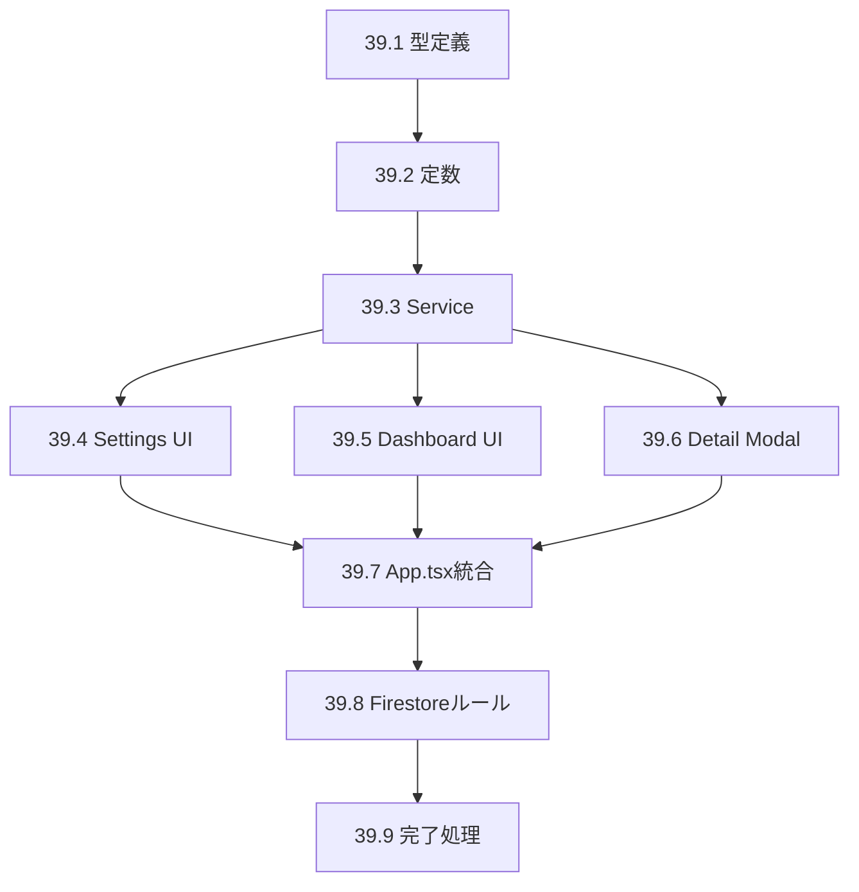

# Phase 39: 休暇残高管理 - タスク一覧

**作成日**: 2025-11-26
**完了日**: 2026-02-19
**仕様ID**: leave-balance-management
**Phase**: 39

---

## タスク一覧

### 39.1 型定義追加 (30分)
- [x] `PublicHolidayBalance` interface追加
- [x] `PaidLeaveBalance` interface追加
- [x] `StaffLeaveBalance` interface追加
- [x] `LeaveAdjustment` interface追加
- [x] `FacilityLeaveSettings` interface追加
- [x] `LeaveBalanceError` type追加

### 39.2 定数追加 (15分)
- [x] `DEFAULT_LEAVE_SETTINGS` 追加

### 39.3 LeaveBalanceService実装 (2時間)
- [x] `getLeaveSettings()` 実装
- [x] `saveLeaveSettings()` 実装
- [x] `subscribeToLeaveSettings()` 実装
- [x] `getStaffLeaveBalances()` 実装
- [x] `getStaffLeaveBalance()` 実装
- [x] `adjustBalance()` 実装
- [x] `calculateBalance()` 実装

### 39.4 LeaveSettingsPanel UI (1時間)
- [x] 設定パネルコンポーネント作成（App.tsx内に `handleSaveLeaveSettings` として統合）
- [x] 公休設定フォーム
- [x] 有給設定フォーム
- [x] 保存ハンドラー

### 39.5 LeaveBalanceDashboard UI (2時間)
- [x] ダッシュボードコンポーネント作成（`src/components/LeaveBalanceDashboard.tsx` 491行）
- [x] スタッフ一覧表示
- [x] 残高表示
- [x] 警告表示（残高少・マイナス）
- [x] フィルタ機能
- [x] ソート機能

### 39.6 LeaveBalanceDetailModal UI (1時間30分)
- [x] 詳細モーダルコンポーネント作成（LeaveBalanceDashboard.tsx内）
- [x] 残高詳細表示
- [x] 調整履歴表示
- [x] 手動調整フォーム

### 39.7 App.tsx統合 (1時間)
- [x] `leaveSettings` state追加
- [x] `subscribeToLeaveSettings` 購読
- [x] アコーディオン追加（「休暇残高管理」セクション）
- [x] ダッシュボード組み込み

### 39.8 Firestoreルール追加 (15分)
- [x] `leaveSettings` コレクションルール
- [x] `leaveBalances` コレクションルール

### 39.9 完了処理 (30分)
- [x] TypeScriptチェック
- [x] 完了記録作成
- [x] Git commit

---

## タスク依存関係

---

## 優先度

| タスク | 優先度 | 理由 |
|--------|--------|------|
| 39.1-39.3 | 高 | 基盤となる型とService |
| 39.5 | 高 | メイン機能 |
| 39.4, 39.6 | 中 | 設定・詳細画面 |
| 39.7-39.9 | 高 | 統合・完了 |

---

## 見積もり時間

| タスク | 時間 |
|--------|------|
| 39.1 型定義追加 | 30分 |
| 39.2 定数追加 | 15分 |
| 39.3 LeaveBalanceService | 2時間 |
| 39.4 LeaveSettingsPanel | 1時間 |
| 39.5 LeaveBalanceDashboard | 2時間 |
| 39.6 LeaveBalanceDetailModal | 1時間30分 |
| 39.7 App.tsx統合 | 1時間 |
| 39.8 Firestoreルール | 15分 |
| 39.9 完了処理 | 30分 |
| **合計** | **約9時間** |

---

## 関連ドキュメント

- [要件定義書](./requirements.md)
- [設計書](./design.md)
