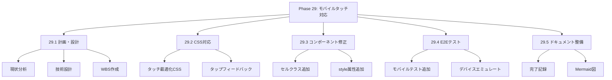
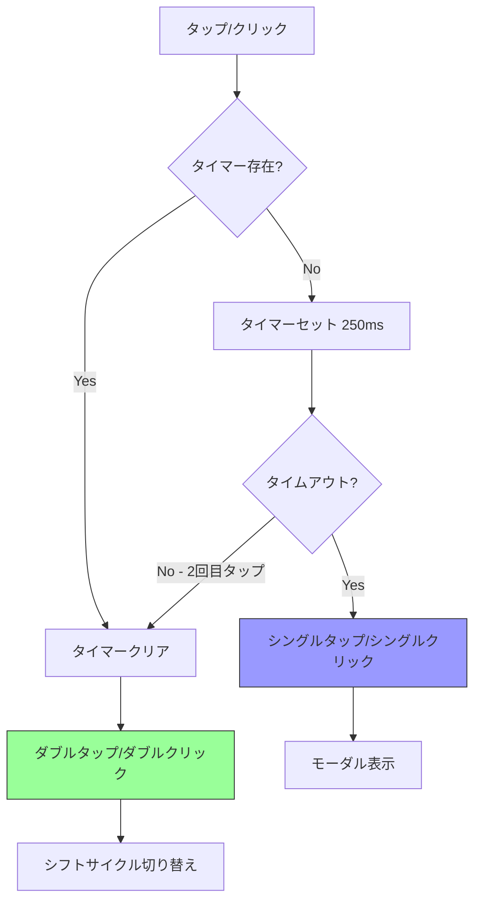
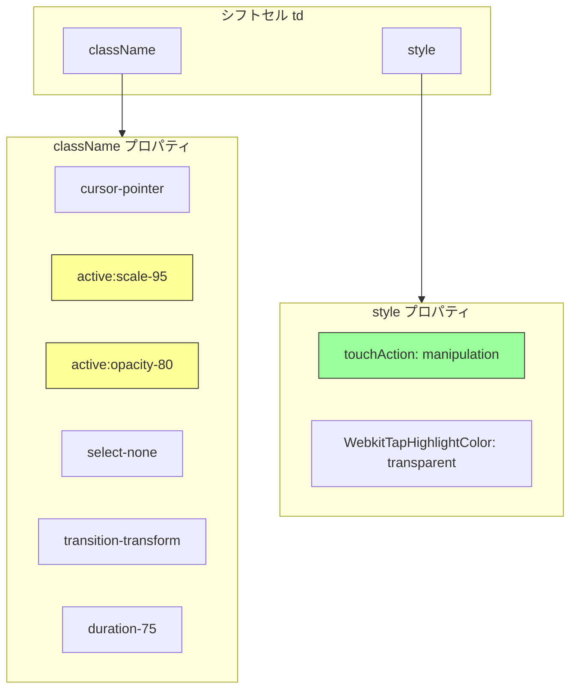
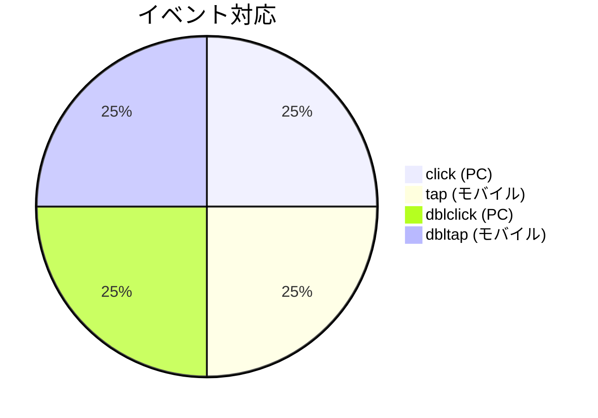
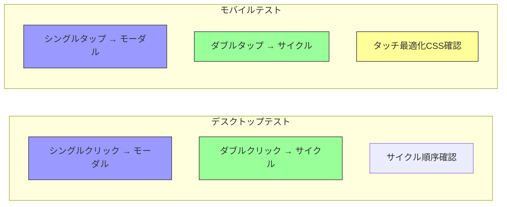
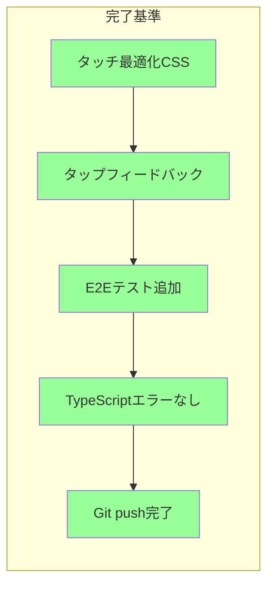

# Phase 29: モバイルタッチ対応 - ダイアグラム集

**作成日**: 2025-11-25
**仕様ID**: mobile-touch-support
**Phase**: 29

---

## 1. WBS（作業分解図）

---

## 2. ガントチャート

```mermaid
gantt
    title Phase 29 実装スケジュール
    dateFormat HH:mm
    axisFormat %H:%M

    section 計画・設計
    現状分析           :done, a1, 00:00, 10m
    技術設計           :done, a2, after a1, 10m
    WBS作成            :done, a3, after a2, 10m

    section CSS対応
    タッチ最適化CSS    :done, b1, after a3, 15m
    タップフィードバック :done, b2, after b1, 10m

    section コンポーネント修正
    セルクラス追加     :done, c1, after b2, 10m
    style属性追加      :done, c2, after c1, 5m

    section E2Eテスト
    モバイルテスト追加 :done, d1, after c2, 20m
    デバイスエミュレート :done, d2, after d1, 10m

    section 完了処理
    ドキュメント整備   :done, e1, after d2, 15m
    Git push           :done, e2, after e1, 5m
```

---

## 3. タッチイベント処理フロー

---

## 4. CSS適用構造

---

## 5. デバイス対応マトリックス

### 対応デバイス

| デバイス | シングル操作 | ダブル操作 | フィードバック |
|----------|--------------|------------|----------------|
| PC (マウス) | click → モーダル | dblclick → サイクル | hover |
| モバイル (タッチ) | tap → モーダル | dbltap → サイクル | active:scale |
| タブレット | tap → モーダル | dbltap → サイクル | active:scale |

---

## 6. E2Eテスト構成

---

## 7. 実装完了基準

### チェックリスト

- [x] touch-action: manipulation 適用
- [x] タップハイライト無効化
- [x] active:scale-95 アニメーション
- [x] select-none テキスト選択防止
- [x] モバイルE2Eテスト3件追加
- [x] TypeScriptコンパイル成功
- [x] Git push完了

---

## 関連ドキュメント

- [Phase 29計画](./phase29-plan-2025-11-25.md)
- [Phase 29完了記録](./phase29-completion-2025-11-25.md)
- [Phase 28ダイアグラム](../double-click-shift-edit/phase28-diagrams-2025-11-25.md)
