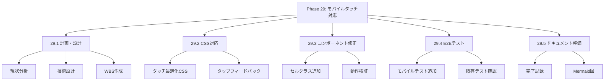

# Phase 29: モバイルタッチ対応

**作成日**: 2025-11-25
**仕様ID**: mobile-touch-support
**Phase**: 29
**ステータス**: 🔄 実装中

---

## エグゼクティブサマリー

Phase 28で実装したダブルクリック機能をモバイル端末のタッチ操作に対応させます。ダブルタップでシフトタイプをサイクル切り替え、シングルタップでモーダル表示を実現します。

### 目標

- ✅ ダブルタップでシフトタイプをサイクル切り替え
- ✅ シングルタップでモーダル表示
- ✅ PC/モバイル両対応（ハイブリッドイベント処理）
- ✅ タッチフィードバック（視覚的反応）

---

## 現状分析

### Phase 28実装（マウスイベント）

```typescript
// 現在のクリック判定
const handleCellClick = (/* params */) => {
  if (clickTimerRef.current[cellKey]) {
    // ダブルクリック
    clearTimeout(clickTimerRef.current[cellKey]!);
    handleDoubleClick(/* params */);
  } else {
    // シングルクリック（遅延実行）
    clickTimerRef.current[cellKey] = setTimeout(/* ... */, 250);
  }
};
```

### 問題点

1. `onClick`はマウスイベントベースでモバイルでも動作するが、タッチ固有の問題がある
2. ダブルタップ検出が不安定な可能性
3. タッチフィードバックがない

---

## 技術設計

### 1. タッチイベント対応

**アプローチ**: `onClick`のみで対応（React標準）

モバイルでは`onClick`がタッチイベントに変換されるため、現状のコードでも動作する可能性が高い。ただし、以下を追加：

1. **タップフィードバック**: `active:`状態でビジュアル変化
2. **タッチ遅延防止**: `touch-action: manipulation`
3. **ダブルタップズーム防止**: CSSで対応

### 2. CSS対応

```css
/* タッチ最適化 */
.shift-cell {
  touch-action: manipulation; /* ダブルタップズーム無効 */
  -webkit-tap-highlight-color: transparent; /* タップハイライト無効 */
  user-select: none; /* 選択無効 */
}

/* タップフィードバック */
.shift-cell:active {
  transform: scale(0.95);
  opacity: 0.8;
}
```

### 3. コンポーネント変更

**ShiftTable.tsx:**
- セルにタッチ最適化クラス追加
- `active:`疑似クラスでフィードバック

---

## WBS（作業分解図）



---

## ガントチャート

```mermaid
gantt
    title Phase 29 実装スケジュール
    dateFormat HH:mm
    axisFormat %H:%M

    section 計画・設計
    現状分析           :done, a1, 00:00, 10m
    技術設計           :done, a2, after a1, 10m
    WBS作成            :done, a3, after a2, 10m

    section CSS対応
    タッチ最適化CSS    :b1, after a3, 15m
    タップフィードバック :b2, after b1, 10m

    section コンポーネント修正
    セルクラス追加     :c1, after b2, 15m
    動作検証           :c2, after c1, 10m

    section E2Eテスト
    モバイルテスト追加 :d1, after c2, 20m
    既存テスト確認     :d2, after d1, 10m

    section 完了処理
    ドキュメント整備   :e1, after d2, 15m
    Git push           :e2, after e1, 5m
```



---

## 成功基準

### 機能要件

- [ ] モバイルでダブルタップ→シフトサイクル
- [ ] モバイルでシングルタップ→モーダル表示
- [ ] タップ時の視覚フィードバック

### 非機能要件

- [ ] PCでの既存動作維持
- [ ] E2Eテスト通過
- [ ] TypeScriptエラーなし

---

## 関連ドキュメント

- [Phase 28完了記録](../double-click-shift-edit/phase28-completion-2025-11-25.md)
- [ShiftTable.tsx](../../../components/ShiftTable.tsx)
