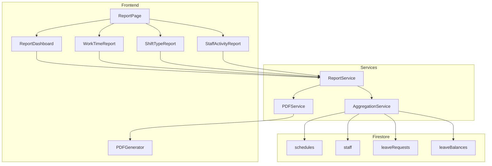
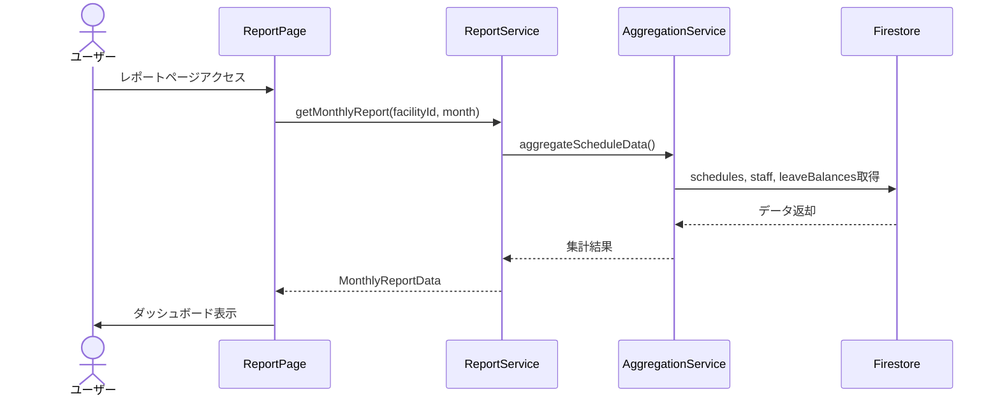
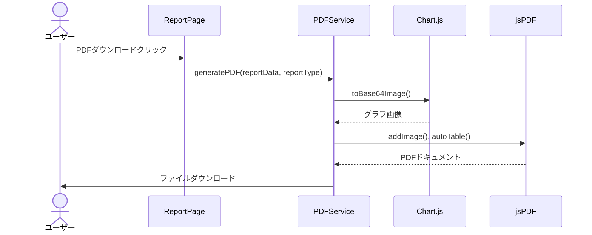
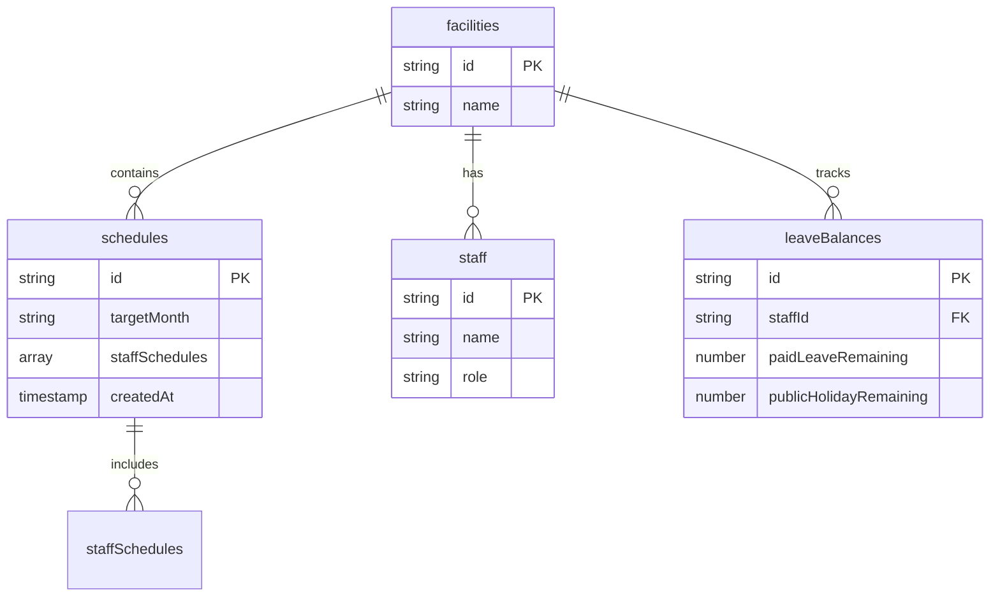

# Technical Design: 月次レポート機能強化

## 概要

**目的**: 本機能は、管理者とスタッフに対して月次シフトデータの可視化、分析、PDF出力機能を提供する。

**ユーザー**: 管理者は経営判断のための分析レポートを、スタッフは自身の勤務実績レポートを活用する。

**影響**: 既存のシフト表機能を拡張し、新たなレポートページとPDF出力機能を追加する。

### 目標

- 月次シフトデータの自動集計と可視化
- 管理者向け経営分析レポートの提供
- スタッフ向け個人勤務実績レポートの提供
- PDF形式での高品質なレポート出力
- モバイル対応のレスポンシブUI

### 非目標

- リアルタイムデータストリーミング（バッチ集計で対応）
- 複数月の横断分析（将来Phase対応）
- 外部システムへのレポート自動送信
- Excel形式でのエクスポート（CSV対応済み）

---

## アーキテクチャ

### 既存アーキテクチャ分析

本機能は既存のシステムを拡張する「Extension」タイプの実装である。

**現行パターン**:
- Firestoreベースのデータ永続化
- サービス層（`*Service.ts`）によるビジネスロジック分離
- Reactコンポーネントによるプレゼンテーション層
- 既存のjsPDF、Chart.jsライブラリ

**維持すべき設計原則**:
- Result型によるエラーハンドリング
- サービス層経由のFirestoreアクセス
- TypeScript strictモード準拠

### 高レベルアーキテクチャ



### 技術スタック連携

**既存技術の活用**:
- `jspdf` (v3.0.3): PDF生成エンジン
- `jspdf-autotable` (v5.0.2): テーブル出力プラグイン
- `chart.js` (v4.5.1) + `react-chartjs-2`: グラフ描画
- Firebase Firestore: データソース

**新規追加なし**: 既存の依存関係のみで実装可能

### 主要設計判断

#### 判断1: クライアントサイド集計 vs Cloud Functions集計

**決定**: クライアントサイドでの集計処理

**コンテキスト**: 月次レポートのデータ集計処理をどこで実行するか

**代替案**:
1. Cloud Functionsでの集計（サーバーサイド）
2. クライアントサイドでの集計
3. Firestore Aggregation Queries

**選択アプローチ**: クライアントサイドでAggregationServiceを使用して集計

**根拠**:
- 1施設あたりの月間シフトデータは約500-1000件程度で軽量
- リアルタイム性が不要（ページロード時の1回集計）
- Cloud Functions呼び出しのレイテンシ回避
- 既存のFirestoreセキュリティルールをそのまま活用

**トレードオフ**:
- 得られるもの: 低レイテンシ、シンプルな実装、コスト削減
- 犠牲にするもの: 大規模データ時のパフォーマンス（将来対応）

#### 判断2: PDF生成方式

**決定**: jsPDF + Canvas経由でのグラフ出力

**コンテキスト**: グラフを含むPDFの高品質出力方法

**代替案**:
1. html2canvas + jsPDF（DOM全体をキャプチャ）
2. jsPDF + Chart.js Canvas出力
3. サーバーサイドPDF生成

**選択アプローチ**: Chart.jsのtoBase64Image()でCanvas画像を取得し、jsPDFに埋め込み

**根拠**:
- 既存のjspdfライブラリを活用
- Chart.jsのネイティブ画像出力機能を使用
- 日本語フォント対応が容易（Noto Sans JP埋め込み）

**トレードオフ**:
- 得られるもの: 高品質なグラフ出力、軽量な実装
- 犠牲にするもの: 完全なDOM再現（レイアウトはPDF専用で再構築）

---

## システムフロー

### レポート表示フロー



### PDF生成フロー



---

## 要件トレーサビリティ

| 要件 | 概要 | コンポーネント | インターフェース |
|------|------|---------------|-----------------|
| 1 | 月次ダッシュボード | ReportDashboard | ReportService.getMonthlyReport |
| 2 | 勤務時間集計 | WorkTimeReport | AggregationService.aggregateWorkTime |
| 3 | シフト種別集計 | ShiftTypeReport | AggregationService.aggregateShiftTypes |
| 4 | スタッフ稼働統計 | StaffActivityReport | AggregationService.aggregateStaffActivity |
| 5 | 経営分析レポート | ManagementReport | ReportService.getManagementReport |
| 6 | スタッフ勤務実績 | PersonalReport | ReportService.getPersonalReport |
| 7 | PDF出力 | PDFService | PDFService.generatePDF |
| 8 | レスポンシブ対応 | 全UIコンポーネント | Tailwind CSS |
| 9 | キャッシュ | ReportService | 内部キャッシュ実装 |

---

## コンポーネントとインターフェース

### サービス層

#### ReportService

**責務と境界**:
- **主責務**: レポートデータの取得とキャッシュ管理
- **ドメイン境界**: レポート/分析ドメイン
- **データ所有**: キャッシュデータ（揮発性）

**依存関係**:
- **Inbound**: ReportPage, ReportDashboard
- **Outbound**: AggregationService, PDFService
- **External**: なし

**サービスインターフェース**:

```typescript
interface ReportService {
  getMonthlyReport(
    facilityId: string,
    targetMonth: string,
    forceRefresh?: boolean
  ): Promise<Result<MonthlyReportData, ReportError>>;

  getManagementReport(
    facilityId: string,
    targetMonth: string
  ): Promise<Result<ManagementReportData, ReportError>>;

  getPersonalReport(
    facilityId: string,
    staffId: string,
    targetMonth: string
  ): Promise<Result<PersonalReportData, ReportError>>;

  clearCache(): void;
}
```

**前提条件**: facilityId, targetMonthが有効な値であること
**事後条件**: Resultが成功の場合、完全な集計データを含む
**不変条件**: キャッシュは5分間有効

---

#### AggregationService

**責務と境界**:
- **主責務**: シフトデータの集計計算
- **ドメイン境界**: データ分析ドメイン
- **データ所有**: なし（計算のみ）

**依存関係**:
- **Inbound**: ReportService
- **Outbound**: ScheduleService, StaffService, LeaveBalanceService
- **External**: なし

**サービスインターフェース**:

```typescript
interface AggregationService {
  aggregateWorkTime(
    schedules: Schedule[],
    staff: Staff[],
    shiftSettings: FacilityShiftSettings
  ): WorkTimeAggregation[];

  aggregateShiftTypes(
    schedules: Schedule[]
  ): ShiftTypeAggregation;

  aggregateStaffActivity(
    schedules: Schedule[],
    staff: Staff[],
    leaveBalances: StaffLeaveBalance[]
  ): StaffActivityAggregation[];

  calculateFulfillmentRate(
    schedules: Schedule[],
    requirements: DailyRequirement[]
  ): FulfillmentRateData;
}
```

---

#### PDFService

**責務と境界**:
- **主責務**: PDF文書の生成とダウンロード
- **ドメイン境界**: ドキュメント出力ドメイン
- **データ所有**: なし

**依存関係**:
- **Inbound**: ReportPage
- **Outbound**: なし
- **External**: jsPDF, jspdf-autotable

**サービスインターフェース**:

```typescript
interface PDFService {
  generateManagementPDF(
    data: ManagementReportData,
    facilityName: string,
    targetMonth: string
  ): Promise<void>;

  generatePersonalPDF(
    data: PersonalReportData,
    staffName: string,
    targetMonth: string
  ): Promise<void>;

  generateDashboardPDF(
    data: MonthlyReportData,
    facilityName: string,
    targetMonth: string,
    chartImages: ChartImageMap
  ): Promise<void>;
}
```

---

### UIコンポーネント層

#### ReportPage

**責務**: レポート機能のルートコンポーネント、タブナビゲーション

**インターフェース**:

```typescript
interface ReportPageProps {
  facilityId: string;
  currentUser: User;
}

// 内部状態
interface ReportPageState {
  activeTab: 'dashboard' | 'worktime' | 'shifttype' | 'staff' | 'management' | 'personal';
  targetMonth: string;
  isLoading: boolean;
  reportData: MonthlyReportData | null;
  error: ReportError | null;
}
```

---

#### ReportDashboard

**責務**: サマリー指標の表示

**インターフェース**:

```typescript
interface ReportDashboardProps {
  data: MonthlyReportData;
  onExportPDF: () => void;
}
```

---

#### WorkTimeReport

**責務**: 勤務時間集計の表示

**インターフェース**:

```typescript
interface WorkTimeReportProps {
  data: WorkTimeAggregation[];
  onStaffClick: (staffId: string) => void;
}
```

---

#### ShiftTypeReport

**責務**: シフト種別集計の円グラフ・棒グラフ表示

**インターフェース**:

```typescript
interface ShiftTypeReportProps {
  data: ShiftTypeAggregation;
}
```

---

#### StaffActivityReport

**責務**: スタッフ別稼働統計の表示

**インターフェース**:

```typescript
interface StaffActivityReportProps {
  data: StaffActivityAggregation[];
  onStaffSelect: (staffId: string) => void;
}
```

---

## データモデル

### ドメインモデル

#### 集計結果エンティティ

```typescript
/** 月次レポートデータ */
interface MonthlyReportData {
  targetMonth: string;
  facilityId: string;
  summary: ReportSummary;
  workTimeData: WorkTimeAggregation[];
  shiftTypeData: ShiftTypeAggregation;
  staffActivityData: StaffActivityAggregation[];
  generatedAt: Date;
}

/** サマリー指標 */
interface ReportSummary {
  totalWorkHours: number;
  totalStaffCount: number;
  averageWorkHoursPerStaff: number;
  fulfillmentRate: number;
  paidLeaveUsageRate: number;
  workDaysCount: number;
}

/** 勤務時間集計 */
interface WorkTimeAggregation {
  staffId: string;
  staffName: string;
  totalHours: number;
  regularHours: number;
  nightHours: number;
  estimatedOvertimeHours: number;
  dailyDetails: DailyWorkDetail[];
  warningFlags: WorkTimeWarning[];
}

interface DailyWorkDetail {
  date: string;
  shiftType: string;
  hours: number;
  isNightShift: boolean;
}

type WorkTimeWarning = 'overtime' | 'consecutive_work' | 'insufficient_rest';

/** シフト種別集計 */
interface ShiftTypeAggregation {
  overall: ShiftTypeCount[];
  byStaff: StaffShiftTypeBreakdown[];
}

interface ShiftTypeCount {
  shiftType: string;
  count: number;
  percentage: number;
  color: string;
}

interface StaffShiftTypeBreakdown {
  staffId: string;
  staffName: string;
  breakdown: ShiftTypeCount[];
  nightShiftWarning: boolean;
}

/** スタッフ稼働統計 */
interface StaffActivityAggregation {
  staffId: string;
  staffName: string;
  workDays: number;
  restDays: number;
  paidLeaveDays: number;
  publicHolidayDays: number;
  maxConsecutiveWorkDays: number;
  averageWeeklyHours: number;
  monthlyCalendar: DayStatus[];
}

interface DayStatus {
  date: string;
  status: 'work' | 'rest' | 'paid_leave' | 'public_holiday' | 'absent';
  shiftType?: string;
}
```

#### 経営分析レポート

```typescript
interface ManagementReportData {
  summary: ReportSummary;
  timeSlotFulfillment: TimeSlotFulfillmentData[];
  qualificationCoverage: QualificationCoverageData[];
  costEstimate: CostEstimateData;
  monthComparison: MonthComparisonData | null;
  recommendations: string[];
}

interface TimeSlotFulfillmentData {
  timeSlot: string;
  requiredCount: number;
  actualCount: number;
  fulfillmentRate: number;
  shortfallDays: number;
}

interface QualificationCoverageData {
  qualification: string;
  requiredCount: number;
  availableCount: number;
  coverageRate: number;
}

interface CostEstimateData {
  regularHoursCost: number;
  overtimeHoursCost: number;
  nightShiftAllowance: number;
  totalEstimate: number;
  currency: 'JPY';
}

interface MonthComparisonData {
  previousMonth: string;
  workHoursDiff: number;
  fulfillmentRateDiff: number;
  costDiff: number;
}
```

#### 個人勤務実績レポート

```typescript
interface PersonalReportData {
  staffId: string;
  staffName: string;
  targetMonth: string;
  workSummary: PersonalWorkSummary;
  shiftBreakdown: ShiftTypeCount[];
  leaveBalance: PersonalLeaveBalance;
  calendar: DayStatus[];
}

interface PersonalWorkSummary {
  workDays: number;
  totalHours: number;
  nightShiftCount: number;
  restDays: number;
}

interface PersonalLeaveBalance {
  paidLeaveRemaining: number;
  paidLeaveUsed: number;
  publicHolidayRemaining: number;
  publicHolidayUsed: number;
}
```

### 論理データモデル

既存のFirestoreコレクションを読み取り専用で使用：



---

## エラーハンドリング

### エラー戦略

既存のResult型パターンを継続使用。

```typescript
type ReportError =
  | { type: 'FACILITY_NOT_FOUND'; facilityId: string }
  | { type: 'NO_SCHEDULE_DATA'; targetMonth: string }
  | { type: 'AGGREGATION_FAILED'; reason: string }
  | { type: 'PDF_GENERATION_FAILED'; reason: string }
  | { type: 'PERMISSION_DENIED'; requiredRole: FacilityRole }
  | { type: 'NETWORK_ERROR'; originalError: Error };
```

### エラーカテゴリと対応

**ユーザーエラー (4xx相当)**:
- データなし → 「対象月のシフトデータがありません」メッセージ表示
- 権限不足 → アクセス拒否ページへリダイレクト

**システムエラー (5xx相当)**:
- ネットワークエラー → 再試行ボタン表示
- 集計失敗 → エラーメッセージと手動更新ボタン

**PDF生成エラー**:
- フォント読み込み失敗 → フォールバックフォント使用
- メモリ不足 → データ分割生成

### モニタリング

- console.errorでエラーログ出力
- 将来的にFirebase Crashlytics連携を検討

---

## テスト戦略

### ユニットテスト

- `AggregationService.aggregateWorkTime`: 勤務時間計算ロジック
- `AggregationService.aggregateShiftTypes`: シフト種別集計ロジック
- `AggregationService.calculateFulfillmentRate`: 充足率計算
- `PDFService`: PDF生成（モック使用）
- 警告フラグ判定ロジック

### 統合テスト

- ReportService + AggregationService連携
- Firestore読み取り→集計→Result返却フロー
- キャッシュ有効期限の動作確認

### E2Eテスト

- レポートページアクセス→ダッシュボード表示
- 月選択→データ更新
- PDFダウンロードボタン→ファイル保存
- モバイル表示でのレスポンシブ動作

### パフォーマンステスト

- 1000件シフトデータでの集計時間（目標: 3秒以内）
- PDF生成時間（目標: 10秒以内）

---

## セキュリティ考慮事項

### アクセス制御

- 管理者（admin/manager）: 全レポートアクセス可能
- スタッフ: 自身の個人レポートのみアクセス可能
- 既存のProtectedRouteコンポーネントで制御

### データ保護

- Firestoreセキュリティルールによる施設単位のアクセス制限
- スタッフレポートは本人のstaffIdと認証UIDの照合が必要
- PDFには機密データを含むため、ダウンロード時の確認を検討

---

## パフォーマンスとスケーラビリティ

### パフォーマンス目標

| 指標 | 目標値 |
|------|--------|
| 初期表示 | 3秒以内 |
| 月切替 | 2秒以内 |
| PDF生成 | 10秒以内 |
| 集計処理 | 5秒以内（1000件） |

### 最適化戦略

**キャッシュ**:
- 集計結果を5分間メモリキャッシュ
- 月切替時のみ再計算

**遅延読み込み**:
- タブ切替時のコンポーネント遅延読み込み
- グラフライブラリの動的インポート

**データ取得最適化**:
- 必要なフィールドのみ取得（Firestore select）
- 並列データ取得（Promise.all）

---

## 実装ファイル構成

```
src/
├── pages/
│   └── ReportPage.tsx              # レポートページルート
├── components/
│   ├── reports/
│   │   ├── ReportDashboard.tsx     # ダッシュボード
│   │   ├── WorkTimeReport.tsx      # 勤務時間レポート
│   │   ├── ShiftTypeReport.tsx     # シフト種別レポート
│   │   ├── StaffActivityReport.tsx # スタッフ稼働レポート
│   │   ├── ManagementReport.tsx    # 経営分析レポート
│   │   ├── PersonalReport.tsx      # 個人レポート
│   │   └── ReportCharts.tsx        # 共通グラフコンポーネント
│   └── pdf/
│       └── PDFDownloadButton.tsx   # PDFダウンロードボタン
├── services/
│   ├── reportService.ts            # レポートサービス
│   ├── aggregationService.ts       # 集計サービス
│   └── pdfService.ts               # PDF生成サービス
└── types/
    └── report.ts                   # レポート型定義
```
