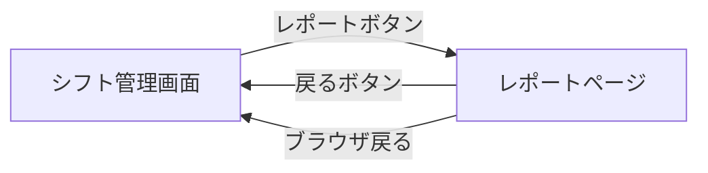
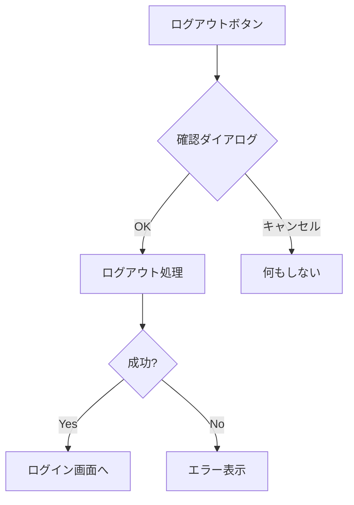
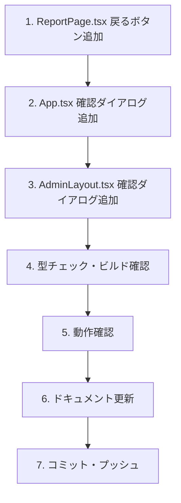

# Phase 42.1: ナビゲーション改善 - 技術設計書

**作成日**: 2025-12-06
**ステータス**: 承認済み

---

## 1. 設計概要

### 1.1 アーキテクチャ

```
┌─────────────────────────────────────────────────────────────────┐
│                         変更対象                                  │
├─────────────────────────────────────────────────────────────────┤
│                                                                   │
│  ┌─────────────────────────────────────────────────────────────┐ │
│  │  ReportPage.tsx                                              │ │
│  │  ┌─────────────────────────────────────────────────────────┐│ │
│  │  │  Header (変更)                                           ││ │
│  │  │  ├── BackButton (新規追加)                               ││ │
│  │  │  │   └── Link to="/" + ArrowLeftIcon                     ││ │
│  │  │  ├── Title: 月次レポート                                 ││ │
│  │  │  └── MonthNavigator                                      ││ │
│  │  └─────────────────────────────────────────────────────────┘│ │
│  └─────────────────────────────────────────────────────────────┘ │
│                                                                   │
│  ┌─────────────────────────────────────────────────────────────┐ │
│  │  App.tsx                                                     │ │
│  │  ┌─────────────────────────────────────────────────────────┐│ │
│  │  │  handleSignOut (変更)                                    ││ │
│  │  │  ├── window.confirm追加                                  ││ │
│  │  │  └── 確認後にsignOut実行                                 ││ │
│  │  └─────────────────────────────────────────────────────────┘│ │
│  └─────────────────────────────────────────────────────────────┘ │
│                                                                   │
│  ┌─────────────────────────────────────────────────────────────┐ │
│  │  AdminLayout.tsx                                             │ │
│  │  ┌─────────────────────────────────────────────────────────┐│ │
│  │  │  handleSignOut (変更)                                    ││ │
│  │  │  ├── window.confirm追加                                  ││ │
│  │  │  └── 確認後にsignOut実行                                 ││ │
│  │  └─────────────────────────────────────────────────────────┘│ │
│  └─────────────────────────────────────────────────────────────┘ │
│                                                                   │
└─────────────────────────────────────────────────────────────────┘
```

### 1.2 変更ファイル一覧

| ファイル | 種別 | 変更内容 |
|----------|------|----------|
| `src/pages/reports/ReportPage.tsx` | 変更 | ヘッダーに戻るボタン追加 |
| `App.tsx` | 変更 | handleSignOutに確認ダイアログ追加 |
| `src/pages/admin/AdminLayout.tsx` | 変更 | handleSignOutに確認ダイアログ追加 |

---

## 2. 詳細設計

### 2.1 ReportPage.tsx - 戻るボタン追加

**Before**:
```tsx
<header className="bg-white shadow-sm">
  <div className="max-w-7xl mx-auto px-4 sm:px-6 lg:px-8 py-4">
    <div className="flex justify-between items-center">
      <h1 className="text-2xl font-bold text-gray-900">月次レポート</h1>
      <MonthNavigator ... />
    </div>
  </div>
</header>
```

**After**:
```tsx
import { Link } from 'react-router-dom';

// ArrowLeftIconを追加
const ArrowLeftIcon = () => (
  <svg xmlns="http://www.w3.org/2000/svg" className="h-5 w-5" fill="none" viewBox="0 0 24 24" stroke="currentColor" strokeWidth={2}>
    <path strokeLinecap="round" strokeLinejoin="round" d="M10 19l-7-7m0 0l7-7m-7 7h18" />
  </svg>
);

<header className="bg-white shadow-sm">
  <div className="max-w-7xl mx-auto px-4 sm:px-6 lg:px-8 py-4">
    <div className="flex justify-between items-center">
      <div className="flex items-center gap-4">
        <Link
          to="/"
          className="inline-flex items-center gap-2 px-3 py-2 text-sm font-medium text-gray-600 hover:text-gray-900 hover:bg-gray-100 rounded-lg transition-colors"
          aria-label="シフト管理画面に戻る"
        >
          <ArrowLeftIcon />
          <span className="hidden sm:inline">シフト管理</span>
        </Link>
        <h1 className="text-xl sm:text-2xl font-bold text-gray-900">月次レポート</h1>
      </div>
      <MonthNavigator ... />
    </div>
  </div>
</header>
```

**UI視覚化**:
```
デスクトップ:
┌────────────────────────────────────────────────────────────┐
│ [← シフト管理]  月次レポート              [< 2025年12月 >] │
└────────────────────────────────────────────────────────────┘

モバイル:
┌─────────────────────────────────┐
│ [←]  月次レポート    [<12月>]   │
└─────────────────────────────────┘
```

### 2.2 App.tsx - ログアウト確認ダイアログ

**Before**:
```tsx
const handleSignOut = async () => {
  setIsSigningOut(true);
  const result = await signOut();
  if (result.success) {
    navigate('/');
  } else {
    // エラー処理
  }
};
```

**After**:
```tsx
const handleSignOut = async () => {
  // 確認ダイアログを表示
  const confirmed = window.confirm('ログアウトしますか？');
  if (!confirmed) {
    return; // キャンセル時は何もしない
  }

  setIsSigningOut(true);
  const result = await signOut();
  if (result.success) {
    navigate('/');
  } else {
    // エラー処理
  }
};
```

### 2.3 AdminLayout.tsx - ログアウト確認ダイアログ

AdminLayout.tsxにも同様の確認ダイアログを追加。

---

## 3. フロー図

### 3.1 レポートページナビゲーションフロー



### 3.2 ログアウト確認フロー



---

## 4. 実装順序



---

## 5. テスト計画

### 5.1 手動テスト

| テスト項目 | 期待結果 |
|-----------|----------|
| レポートページで戻るボタンをクリック | シフト管理画面に遷移 |
| レポートページで戻るボタンにキーボードフォーカス | フォーカスリング表示 |
| ログアウトボタン → OK | ログアウト実行 |
| ログアウトボタン → キャンセル | 何も起こらない |
| 管理画面でログアウト → OK | ログアウト実行 |

### 5.2 レスポンシブ確認

| 画面サイズ | 戻るボタン表示 |
|-----------|--------------|
| デスクトップ (≥640px) | アイコン + テキスト |
| モバイル (<640px) | アイコンのみ |

---

## 6. 影響分析

### 6.1 既存機能への影響

| 機能 | 影響 | 対策 |
|------|------|------|
| E2Eテスト | なし | セレクタ変更なし |
| ナビゲーション | 改善 | 追加のみ |
| ログアウト | 改善 | 確認追加のみ |

### 6.2 依存関係

- `react-router-dom`: Link コンポーネント使用（既存依存）
- `window.confirm`: ブラウザ標準API（追加依存なし）

---

## 7. ロールバック計画

変更は追加のみで、既存機能の削除・変更はないため、ロールバックリスクは低い。
必要な場合は、該当コミットをrevertする。
