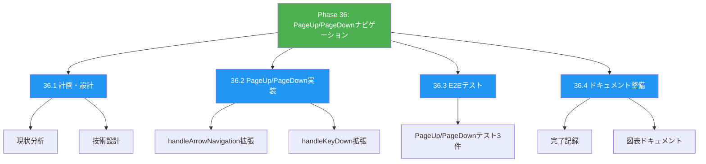
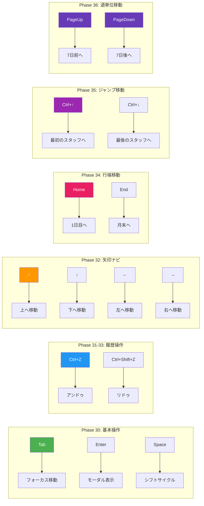
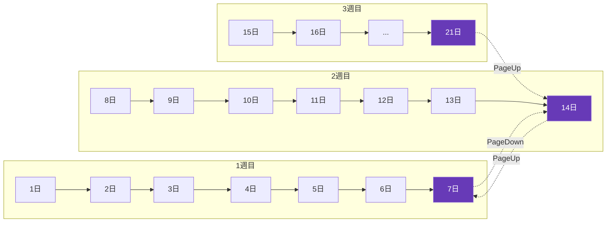
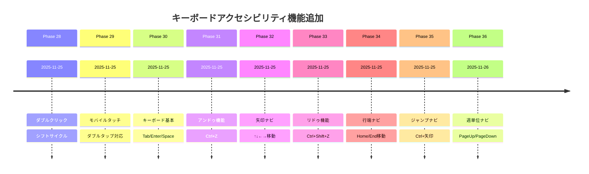
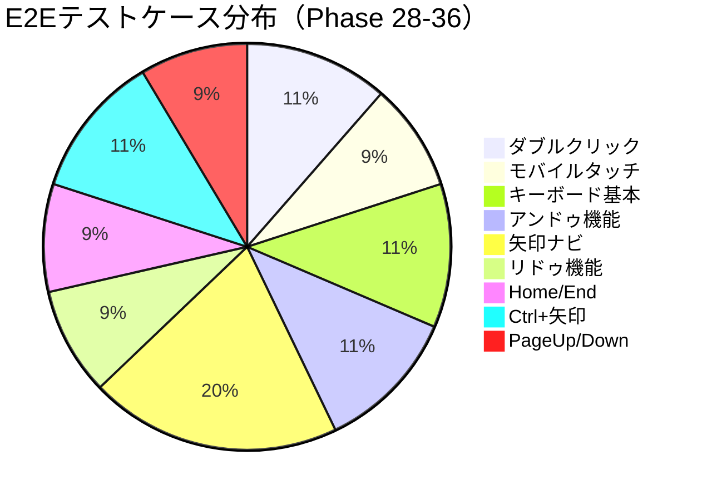

# Phase 36: PageUp/PageDown週単位ナビゲーション - 図表ドキュメント

**作成日**: 2025-11-26
**仕様ID**: pageup-pagedown-navigation
**Phase**: 36

---

## WBS（作業分解図）



---

## ガントチャート

```mermaid
gantt
    title Phase 36 実装スケジュール
    dateFormat HH:mm
    axisFormat %H:%M

    section 計画・設計
    現状分析           :done, a1, 00:00, 5m
    技術設計           :done, a2, after a1, 5m

    section 実装
    handleArrowNavigation拡張 :done, b1, after a2, 10m
    handleKeyDown拡張         :done, b2, after b1, 5m

    section E2Eテスト
    PageUp/PageDownテスト3件 :done, c1, after b2, 10m

    section 完了処理
    ドキュメント整備   :done, d1, after c1, 10m
    Git push           :active, d2, after d1, 5m
```



---

## PageUp/PageDown動作フロー

```mermaid
flowchart TD
    A[キー入力検出] --> B{PageUp/PageDown?}
    B -->|No| C[他のナビゲーション処理]
    B -->|Yes| D{どのキー?}

    D -->|PageUp| E[newDateIndex = max(0, dateIndex - 7)]
    D -->|PageDown| F[newDateIndex = min(totalDates-1, dateIndex + 7)]

    E --> G[新しいキー生成]
    F --> G

    G --> H{セル存在?}
    H -->|Yes| I[フォーカス移動]
    H -->|No| J[移動なし]

    style A fill:#4CAF50,color:white
    style I fill:#2196F3,color:white
    style E fill:#673AB7,color:white
    style F fill:#673AB7,color:white
```

---

## キーボード操作マトリックス（Phase 28-36）



---

## 週単位移動イメージ



---

## Phase 28-36 キーボードアクセシビリティ進捗



---

## テストカバレッジ



---

## 関連ドキュメント

- [Phase 36完了記録](./phase36-completion-2025-11-26.md)
- [Phase 36計画](./phase36-plan-2025-11-26.md)
- [Phase 34図表](../home-end-navigation/phase34-diagrams-2025-11-25.md)
- [Phase 35図表](../ctrl-arrow-navigation/phase35-diagrams-2025-11-25.md)
