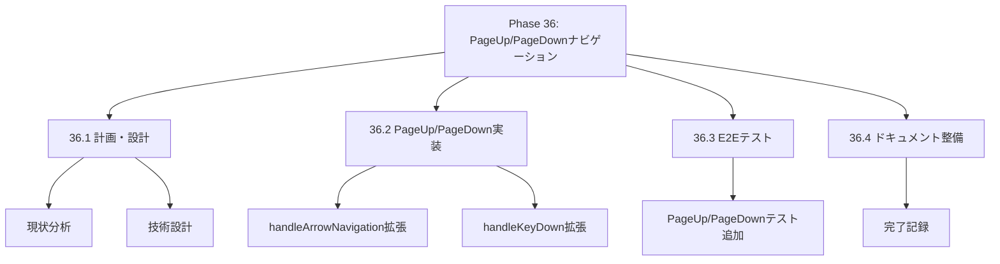

# Phase 36: PageUp/PageDown週単位ナビゲーション

**作成日**: 2025-11-26
**仕様ID**: pageup-pagedown-navigation
**Phase**: 36
**ステータス**: ✅ 完了

---

## エグゼクティブサマリー

PageUp/PageDownキーで週単位（7日）の移動ができるようにします。月初から月末まで素早く移動できるようになります。

### 目標

- [x] PageUp: 7日前に移動（週の始めに近づく）
- [x] PageDown: 7日後に移動（週の終わりに近づく）
- [x] 境界での適切な動作（0未満は0、月末超過は月末）
- [x] 既存のナビゲーションとの共存

---

## 技術設計

### 1. handleArrowNavigation関数の拡張

**PageUp/PageDownキー処理を追加:**

```typescript
// Phase 36: PageUp/PageDownで週単位移動
case 'PageUp':
  // 7日前に移動（最小0）
  newDateIndex = Math.max(0, dateIndex - 7);
  break;
case 'PageDown':
  // 7日後に移動（最大月末）
  newDateIndex = Math.min(totalDates - 1, dateIndex + 7);
  break;
```

### 2. handleKeyDown関数の拡張

**キー配列にPageUp/PageDownを追加:**

```typescript
// 矢印キー＋Home/End＋PageUp/PageDownナビゲーション
if (['ArrowUp', 'ArrowDown', 'ArrowLeft', 'ArrowRight', 'Home', 'End', 'PageUp', 'PageDown'].includes(e.key)) {
  handleArrowNavigation(e, staffIndex, dateIndex, type, totalStaff, totalDates);
  return;
}
```

---

## WBS（作業分解図）



---

## ガントチャート

```mermaid
gantt
    title Phase 36 実装スケジュール
    dateFormat HH:mm
    axisFormat %H:%M

    section 計画・設計
    現状分析           :done, a1, 00:00, 5m
    技術設計           :done, a2, after a1, 5m

    section 実装
    handleArrowNavigation拡張 :b1, after a2, 10m
    handleKeyDown拡張         :b2, after b1, 5m

    section E2Eテスト
    PageUp/PageDownテスト :c1, after b2, 10m

    section 完了処理
    ドキュメント整備   :d1, after c1, 10m
    Git push           :d2, after d1, 5m
```



---

## 成功基準

- [x] PageUpで7日前に移動
- [x] PageDownで7日後に移動
- [x] 境界での適切な動作
- [x] TypeScriptエラーなし
- [x] E2Eテスト通過

---

## 関連ドキュメント

- [Phase 32完了記録](../arrow-key-navigation/phase32-completion-2025-11-25.md)
- [Phase 34完了記録](../home-end-navigation/phase34-completion-2025-11-25.md)
- [Phase 35完了記録](../ctrl-arrow-navigation/phase35-completion-2025-11-25.md)
- [ShiftTable.tsx](../../../components/ShiftTable.tsx)
