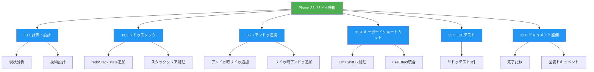
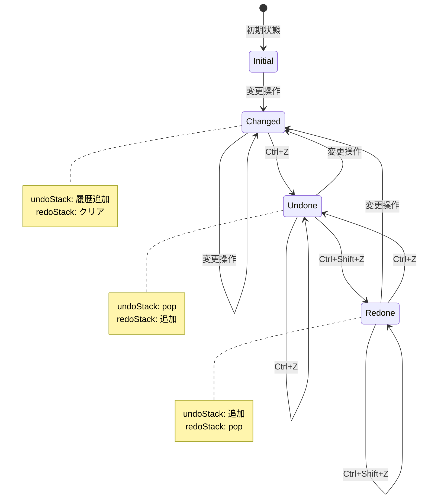
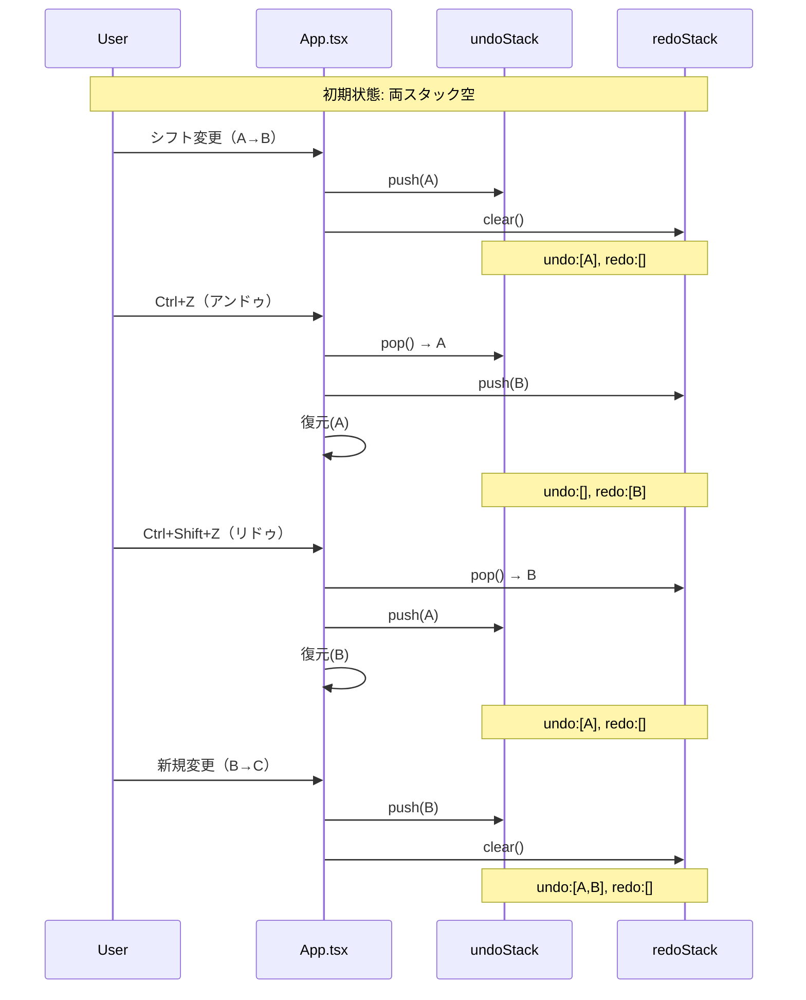
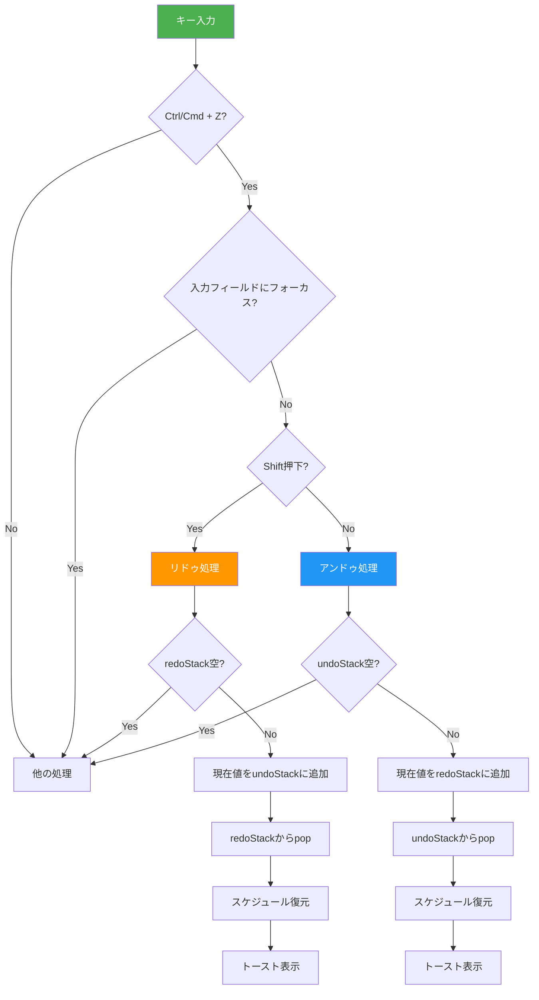
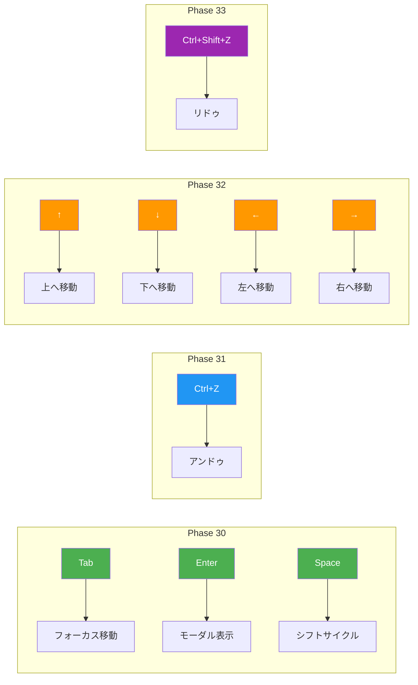
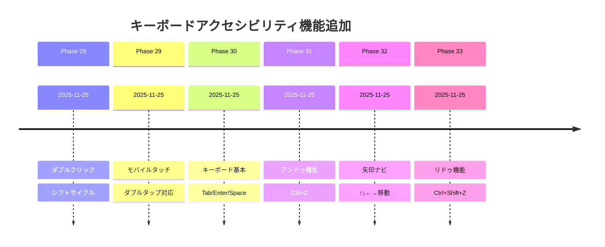
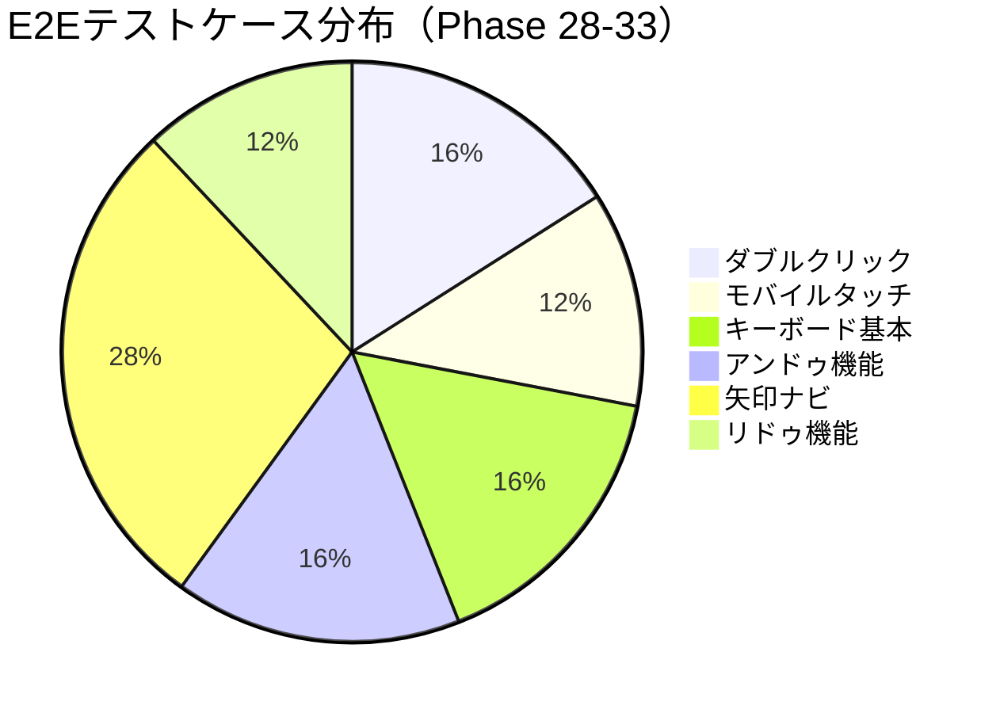

# Phase 33: リドゥ機能 - 図表ドキュメント

**作成日**: 2025-11-25
**仕様ID**: redo-functionality
**Phase**: 33

---

## WBS（作業分解図）

---

## ガントチャート

```mermaid
gantt
    title Phase 33 実装スケジュール
    dateFormat HH:mm
    axisFormat %H:%M

    section 計画・設計
    現状分析           :done, a1, 00:00, 5m
    技術設計           :done, a2, after a1, 10m

    section リドゥスタック
    redoStack追加      :done, b1, after a2, 5m
    スタッククリア     :done, b2, after b1, 5m

    section アンドゥ連携
    アンドゥ修正       :done, c1, after b2, 10m
    リドゥ実装         :done, c2, after c1, 15m

    section キーボード
    Ctrl+Shift+Z処理   :done, d1, after c2, 10m

    section E2Eテスト
    リドゥテスト       :done, e1, after d1, 15m

    section 完了処理
    ドキュメント整備   :done, f1, after e1, 10m
    Git push           :active, f2, after f1, 5m
```

---

## アンドゥ/リドゥ状態遷移図

---

## スタック動作シーケンス

---

## キーボード操作フローチャート

---

## キーボードアクセシビリティ累計

---

## Phase 28-33 実装進捗

---

## テストカバレッジ

---

## 関連ドキュメント

- [Phase 33完了記録](./phase33-completion-2025-11-25.md)
- [Phase 33計画](./phase33-plan-2025-11-25.md)
- [Phase 31図表](../undo-functionality/phase31-diagrams-2025-11-25.md)
- [Phase 32図表](../arrow-key-navigation/phase32-diagrams-2025-11-25.md)
