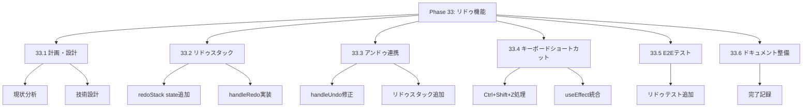

# Phase 33: リドゥ機能

**作成日**: 2025-11-25
**仕様ID**: redo-functionality
**Phase**: 33
**ステータス**: ✅ 完了

---

## エグゼクティブサマリー

Phase 31で実装したアンドゥ機能に対応するリドゥ（やり直し）機能を追加します。Ctrl+Shift+Z / Cmd+Shift+Zでアンドゥした操作を再実行できます。

### 目標

- [ ] Ctrl+Shift+Z / Cmd+Shift+Zでリドゥ
- [ ] アンドゥ時にリドゥスタックに追加
- [ ] 新しい変更時にリドゥスタックをクリア
- [ ] 既存のアンドゥ機能との連携

---

## 技術設計

### 1. リドゥスタック追加

**App.tsxに追加:**
```typescript
// Phase 33: リドゥ履歴スタック（最大10件）
const [redoStack, setRedoStack] = useState<ShiftHistoryEntry[]>([]);
```

### 2. アンドゥ時にリドゥスタックへ追加

**handleUndoを修正:**
```typescript
const handleUndo = useCallback(() => {
  if (undoStack.length === 0) return;

  const lastEntry = undoStack[undoStack.length - 1];

  // 現在の値をリドゥスタックに追加
  const currentStaff = schedule.find(s => s.staffId === lastEntry.staffId);
  const currentShift = currentStaff?.monthlyShifts.find(s => s.date === lastEntry.date);

  if (currentShift) {
    const currentValue: Partial<GeneratedShift> = lastEntry.type === 'planned'
      ? { plannedShiftType: currentShift.plannedShiftType || currentShift.shiftType }
      : { actualShiftType: currentShift.actualShiftType };

    const redoEntry: ShiftHistoryEntry = {
      ...lastEntry,
      previousValue: currentValue,
      timestamp: Date.now(),
    };

    setRedoStack(prev => [...prev.slice(-9), redoEntry]);
  }

  // ... 既存の復元処理
}, [undoStack, schedule, showSuccess]);
```

### 3. リドゥ実行

**handleRedoを追加:**
```typescript
const handleRedo = useCallback(() => {
  if (redoStack.length === 0) return;

  const lastEntry = redoStack[redoStack.length - 1];

  // 現在の値をアンドゥスタックに追加
  const currentStaff = schedule.find(s => s.staffId === lastEntry.staffId);
  const currentShift = currentStaff?.monthlyShifts.find(s => s.date === lastEntry.date);

  if (currentShift) {
    const currentValue = lastEntry.type === 'planned'
      ? { plannedShiftType: currentShift.plannedShiftType }
      : { actualShiftType: currentShift.actualShiftType };

    setUndoStack(prev => [...prev.slice(-9), {
      ...lastEntry,
      previousValue: currentValue,
    }]);
  }

  // スケジュールを復元
  setSchedule(prev => {
    return prev.map(staff => {
      if (staff.staffId === lastEntry.staffId) {
        return {
          ...staff,
          monthlyShifts: staff.monthlyShifts.map(shift => {
            if (shift.date === lastEntry.date) {
              return { ...shift, ...lastEntry.previousValue };
            }
            return shift;
          }),
        };
      }
      return staff;
    });
  });

  setRedoStack(prev => prev.slice(0, -1));
  showSuccess('変更をやり直しました (Ctrl+Shift+Z)');
}, [redoStack, schedule, showSuccess]);
```

### 4. キーボードショートカット

**useEffect拡張:**
```typescript
useEffect(() => {
  const handleKeyDown = (e: KeyboardEvent) => {
    // 入力フィールドにフォーカスがある場合は無視
    const activeElement = document.activeElement;
    if (activeElement instanceof HTMLInputElement || ...) return;

    if ((e.ctrlKey || e.metaKey) && e.key === 'z') {
      e.preventDefault();
      if (e.shiftKey) {
        // Ctrl+Shift+Z: リドゥ
        handleRedo();
      } else {
        // Ctrl+Z: アンドゥ
        handleUndo();
      }
    }
  };

  window.addEventListener('keydown', handleKeyDown);
  return () => window.removeEventListener('keydown', handleKeyDown);
}, [handleUndo, handleRedo]);
```

### 5. 新しい変更時にリドゥスタッククリア

**handleQuickShiftChangeを修正:**
```typescript
// 新しい変更時はリドゥスタックをクリア
setRedoStack([]);
```

---

## WBS（作業分解図）



---

## ガントチャート

```mermaid
gantt
    title Phase 33 実装スケジュール
    dateFormat HH:mm
    axisFormat %H:%M

    section 計画・設計
    現状分析           :done, a1, 00:00, 5m
    技術設計           :done, a2, after a1, 10m

    section リドゥスタック
    redoStack追加      :b1, after a2, 5m
    handleRedo実装     :b2, after b1, 15m

    section アンドゥ連携
    handleUndo修正     :c1, after b2, 10m
    リドゥスタック連携 :c2, after c1, 5m

    section キーボード
    Ctrl+Shift+Z処理   :d1, after c2, 10m

    section E2Eテスト
    リドゥテスト       :e1, after d1, 15m

    section 完了処理
    ドキュメント整備   :f1, after e1, 10m
    Git push           :f2, after f1, 5m
```



---

## 成功基準

- [ ] Ctrl+Shift+Z / Cmd+Shift+Zでリドゥ実行
- [ ] アンドゥ→リドゥの往復動作
- [ ] 新規変更時のリドゥスタッククリア
- [ ] TypeScriptエラーなし
- [ ] E2Eテスト通過

---

## 関連ドキュメント

- [Phase 31完了記録](../undo-functionality/phase31-completion-2025-11-25.md)
- [Phase 32完了記録](../arrow-key-navigation/phase32-completion-2025-11-25.md)
- [App.tsx](../../../App.tsx)
