# Phase 38: シフトタイプ設定UI - 図表

**作成日**: 2025-11-26
**仕様ID**: shift-type-settings
**Phase**: 38

---

## WBS（作業分解図）


---

## ガントチャート

```mermaid
gantt
    title Phase 38 実装スケジュール
    dateFormat HH:mm
    axisFormat %H:%M

    section 基盤
    型定義追加           :done, a1, 00:00, 30m
    constants追加        :done, a2, after a1, 15m

    section Service
    ShiftTypeService     :b1, after a2, 2h

    section UI
    ShiftTypeSettings    :c1, after b1, 2h
    編集モーダル         :c2, after c1, 1h

    section 統合
    ShiftTable統合       :d1, after c2, 1h30m
    App.tsx統合          :d2, after d1, 30m

    section 完了処理
    Firestoreルール      :e1, after d2, 30m
    E2Eテスト            :e2, after e1, 1h
    Git commit           :milestone, m1, after e2, 0m
```



---

## データフロー図


---

## コンポーネント構成図


---

## ER図（データモデル）


---

## UIモックアップ

```
┌─────────────────────────────────────────────────────────────┐
│ ▼ シフト種別設定                                            │
├─────────────────────────────────────────────────────────────┤
│                                                             │
│  ┌───────────────────────────────────────────────────────┐  │
│  │ [■] 早番    07:00 - 16:00   休憩 1h        [編集] ✓  │  │
│  │ [■] 日勤    09:00 - 18:00   休憩 1h        [編集] ✓  │  │
│  │ [■] 遅番    11:00 - 20:00   休憩 1h        [編集] ✓  │  │
│  │ [■] 夜勤    16:00 - 09:00   休憩 2h        [編集] ✓  │  │
│  │ [■] 休      --:-- - --:--   休憩 0h        [編集] ✓  │  │
│  │ [■] 明け休み --:-- - --:--   休憩 0h        [編集] ✓  │  │
│  └───────────────────────────────────────────────────────┘  │
│                                                             │
│  [+ 新しいシフト種別を追加]                                  │
│                                                             │
│  ───────────────────────────────────────────────────────── │
│                                                             │
│  シフトサイクル順序（ダブルクリック時）:                      │
│  [早番] → [日勤] → [遅番] → [夜勤] → [休] → [明け休み]       │
│                                                             │
└─────────────────────────────────────────────────────────────┘

編集モーダル:
┌─────────────────────────────────────────┐
│ シフト種別を編集                 [×]    │
├─────────────────────────────────────────┤
│                                         │
│ シフト名                                │
│ ┌─────────────────────────────────────┐ │
│ │ 早番                                │ │
│ └─────────────────────────────────────┘ │
│                                         │
│ 開始時間          終了時間              │
│ ┌──────────┐      ┌──────────┐         │
│ │ 07:00    │      │ 16:00    │         │
│ └──────────┘      └──────────┘         │
│                                         │
│ 休憩時間                                │
│ ┌──────────┐ 時間                       │
│ │ 1        │                           │
│ └──────────┘                           │
│                                         │
│ 表示色                                  │
│ ○ sky  ● emerald  ○ amber  ○ indigo   │
│ ○ slate  ○ rose  ○ violet              │
│                                         │
│ プレビュー: [早番]                       │
│                                         │
│ ☑ 有効にする                            │
│                                         │
├─────────────────────────────────────────┤
│ [削除]              [キャンセル] [保存]  │
└─────────────────────────────────────────┘
```

---

## 関連ドキュメント

- [要件定義書](./requirements.md)
- [設計書](./design.md)
- [タスク一覧](./tasks.md)
