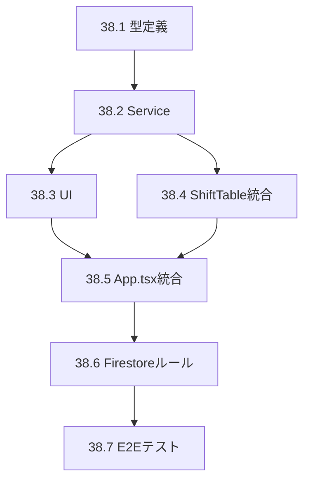

# Phase 38: シフトタイプ設定UI - タスク一覧

**作成日**: 2025-11-26
**仕様ID**: shift-type-settings
**Phase**: 38
**ステータス**: 実装中

---

## タスク概要

| タスクID | タスク名 | 工数 | ステータス |
|----------|----------|------|-----------|
| 38.1 | 型定義追加 | 0.5h | 未着手 |
| 38.2 | ShiftTypeService作成 | 2h | 未着手 |
| 38.3 | ShiftTypeSettings UI作成 | 3h | 未着手 |
| 38.4 | ShiftTable統合 | 1.5h | 未着手 |
| 38.5 | App.tsx統合 | 0.5h | 未着手 |
| 38.6 | Firestoreルール更新 | 0.5h | 未着手 |
| 38.7 | E2Eテスト作成 | 1h | 未着手 |
| **合計** | | **9h** | |

---

## Task 38.1: 型定義追加

**ファイル**: `types.ts`

**追加内容**:
```typescript
// Phase 38: シフトタイプ設定
export interface ShiftColor {
  background: string;
  text: string;
}

export interface ShiftTypeConfig {
  id: string;
  name: string;
  start: string;
  end: string;
  restHours: number;
  color: ShiftColor;
  isActive: boolean;
  sortOrder: number;
}

export interface FacilityShiftSettings {
  facilityId: string;
  shiftTypes: ShiftTypeConfig[];
  defaultShiftCycle: string[];
  updatedAt: Timestamp;
  updatedBy: string;
}
```

**完了条件**:
- [ ] 型定義が追加される
- [ ] TypeScriptエラーなし

---

## Task 38.2: ShiftTypeService作成

**ファイル**: `src/services/shiftTypeService.ts`（新規作成）

**実装内容**:
- `getSettings(facilityId)`: 設定取得（なければデフォルト作成）
- `saveSettings(facilityId, settings, userId)`: 設定保存
- `subscribeToSettings(facilityId, callback)`: リアルタイム購読

**完了条件**:
- [ ] サービスファイルが作成される
- [ ] 3つのメソッドが実装される
- [ ] Result型でエラーハンドリング
- [ ] TypeScriptエラーなし

---

## Task 38.3: ShiftTypeSettings UI作成

**ファイル**: `src/components/ShiftTypeSettings.tsx`（新規作成）

**実装内容**:
1. シフト種別一覧表示
2. 追加ボタン
3. 編集モーダル（ShiftTypeEditor）
4. 削除確認
5. シフトサイクル順序設定

**UIコンポーネント**:
```
src/components/
  ShiftTypeSettings.tsx      # メインコンポーネント
  ShiftTypeEditor.tsx        # 編集モーダル（オプション：同ファイル内でも可）
```

**完了条件**:
- [ ] 一覧が表示される
- [ ] シフト種別の追加ができる
- [ ] シフト種別の編集ができる
- [ ] シフト種別の削除ができる
- [ ] 色のプレビューが表示される
- [ ] 保存がFirestoreに反映される

---

## Task 38.4: ShiftTable統合

**ファイル**: `components/ShiftTable.tsx`

**変更内容**:
1. `shiftSettings` propsを追加
2. `SHIFT_CYCLE`を動的に取得
3. `getShiftColor()`を動的に取得
4. フォールバック処理を追加

**変更箇所**:
```typescript
// 追加: props
interface ShiftTableProps {
  // ...既存
  shiftSettings?: FacilityShiftSettings;
}

// 変更: SHIFT_CYCLE
const shiftCycle = shiftSettings?.defaultShiftCycle || DEFAULT_SHIFT_CYCLE;

// 変更: getShiftColor
const getShiftColor = (shiftType: string): string => {
  const config = shiftSettings?.shiftTypes.find(s => s.name === shiftType);
  if (config) {
    return `${config.color.background} ${config.color.text}`;
  }
  // フォールバック（既存のswitch文）
};
```

**完了条件**:
- [ ] shiftSettings propsが追加される
- [ ] 動的シフトサイクルが機能する
- [ ] 動的カラーが機能する
- [ ] フォールバックが機能する（設定なしでも動作）

---

## Task 38.5: App.tsx統合

**ファイル**: `App.tsx`

**変更内容**:
1. shiftSettings stateを追加
2. ShiftTypeServiceの購読を追加
3. ShiftTypeSettingsコンポーネントを追加
4. ShiftTableにshiftSettings propsを渡す

**追加箇所（概要）**:
```typescript
// State追加
const [shiftSettings, setShiftSettings] = useState<FacilityShiftSettings | null>(null);

// useEffect内でsubscribe
useEffect(() => {
  if (facility?.id) {
    const unsubscribe = ShiftTypeService.subscribeToSettings(
      facility.id,
      (settings, error) => {
        if (error) {
          console.error('ShiftSettings error:', error);
        } else {
          setShiftSettings(settings);
        }
      }
    );
    return () => unsubscribe();
  }
}, [facility?.id]);

// JSXにShiftTypeSettingsを追加（Accordion内）
<Accordion title="シフト種別設定" icon={<ClockIcon />}>
  <ShiftTypeSettings
    facilityId={facility.id}
    userId={user?.uid || ''}
    shiftSettings={shiftSettings}
    onSettingsChange={setShiftSettings}
  />
</Accordion>

// ShiftTableにprops追加
<ShiftTable
  // ...既存props
  shiftSettings={shiftSettings}
/>
```

**完了条件**:
- [ ] shiftSettings stateが追加される
- [ ] 購読が設定される
- [ ] ShiftTypeSettingsが表示される
- [ ] ShiftTableに設定が渡される

---

## Task 38.6: Firestoreルール更新

**ファイル**: `firestore.rules`

**追加内容**:
```javascript
// シフト設定サブコレクション
match /facilities/{facilityId}/shiftSettings/{settingId} {
  allow read: if isAuthenticated() && hasRole(facilityId, 'viewer');
  allow write: if isAuthenticated() && hasRole(facilityId, 'admin');
}
```

**完了条件**:
- [ ] ルールが追加される
- [ ] viewer以上が読み取り可能
- [ ] adminのみ書き込み可能

---

## Task 38.7: E2Eテスト作成

**ファイル**: `e2e/shift-type-settings.spec.ts`（新規作成）

**テストケース**:
```typescript
test.describe('シフト種別設定', () => {
  test('シフト種別一覧が表示される', async ({ page }) => {
    // 管理者でログイン
    // シフト種別設定を開く
    // 一覧が表示されることを確認
  });

  test('シフト種別を追加できる', async ({ page }) => {
    // 管理者でログイン
    // 「追加」ボタンをクリック
    // フォームに入力
    // 保存
    // 一覧に追加されることを確認
  });

  test('シフト種別を編集できる', async ({ page }) => {
    // 管理者でログイン
    // 既存シフトの「編集」をクリック
    // 名前を変更
    // 保存
    // 変更が反映されることを確認
  });

  test('ShiftTableで色が反映される', async ({ page }) => {
    // ログイン
    // シフト表を表示
    // カスタム色が適用されていることを確認
  });
});
```

**完了条件**:
- [ ] テストファイルが作成される
- [ ] 4つのテストケースが通過する

---

## 依存関係



---

## constants.ts への追加

**Task 38.1と併せて実施**

```typescript
// constants.ts に追加

import { ShiftTypeConfig, ShiftColor } from './types';

// シフト色プリセット
export const SHIFT_COLOR_PRESETS: Record<string, ShiftColor> = {
  sky: { background: 'bg-sky-100', text: 'text-sky-800' },
  emerald: { background: 'bg-emerald-100', text: 'text-emerald-800' },
  amber: { background: 'bg-amber-100', text: 'text-amber-800' },
  indigo: { background: 'bg-indigo-100', text: 'text-indigo-800' },
  slate: { background: 'bg-slate-100', text: 'text-slate-600' },
  slateLight: { background: 'bg-slate-200', text: 'text-slate-700' },
  rose: { background: 'bg-rose-100', text: 'text-rose-800' },
  violet: { background: 'bg-violet-100', text: 'text-violet-800' },
};

// デフォルトシフト種別
export const DEFAULT_SHIFT_TYPES: ShiftTypeConfig[] = [
  {
    id: 'shift_early',
    name: '早番',
    start: '07:00',
    end: '16:00',
    restHours: 1,
    color: SHIFT_COLOR_PRESETS.sky,
    isActive: true,
    sortOrder: 0,
  },
  // ... 他のシフト種別
];

export const DEFAULT_SHIFT_CYCLE = ['早番', '日勤', '遅番', '夜勤', '休', '明け休み'];
```

---

## 関連ドキュメント

- [要件定義書](./requirements.md)
- [設計書](./design.md)
