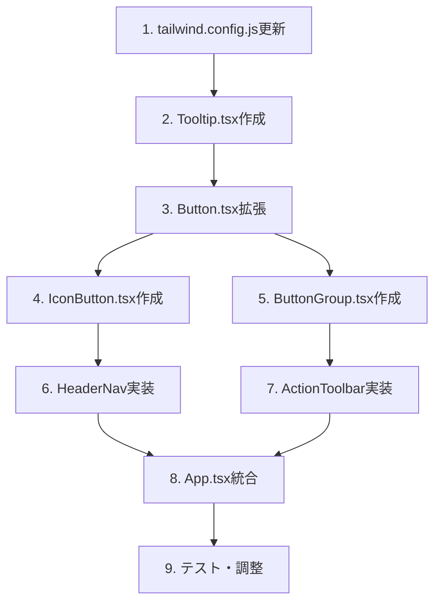

# Phase 42: UIデザイン改善 - 技術設計書

**作成日**: 2025-12-06
**ステータス**: ドラフト

---

## 1. 設計概要

### 1.1 アーキテクチャ

```
┌─────────────────────────────────────────────────────────┐
│                    App.tsx                               │
│  ┌───────────────────────────────────────────────────┐  │
│  │  Header (改善対象)                                 │  │
│  │  ┌─────────────────────────────────────────────┐  │  │
│  │  │  HeaderNav (新規)                            │  │  │
│  │  │  └── IconButton (新規) × 4                   │  │  │
│  │  └─────────────────────────────────────────────┘  │  │
│  └───────────────────────────────────────────────────┘  │
│                                                         │
│  ┌───────────────────────────────────────────────────┐  │
│  │  Main Content Header (改善対象)                    │  │
│  │  ┌─────────────────────────────────────────────┐  │  │
│  │  │  ActionToolbar (新規)                        │  │  │
│  │  │  ├── ButtonGroup (新規) - 編集系             │  │  │
│  │  │  │   └── Button (拡張) × 3                   │  │  │
│  │  │  └── ButtonGroup - ユーティリティ系          │  │  │
│  │  │      └── Button (拡張) × 2                   │  │  │
│  │  └─────────────────────────────────────────────┘  │  │
│  └───────────────────────────────────────────────────┘  │
└─────────────────────────────────────────────────────────┘
```

### 1.2 新規・変更コンポーネント

| コンポーネント | 種別 | 説明 |
|----------------|------|------|
| `Button.tsx` | 変更 | size, ghost, outline variants追加 |
| `IconButton.tsx` | 新規 | アイコンのみボタン + tooltip |
| `ButtonGroup.tsx` | 新規 | ボタングループ（視覚的分離） |
| `ActionToolbar.tsx` | 新規 | アクションボタンエリア統合 |
| `HeaderNav.tsx` | 新規 | ヘッダーナビゲーション統合 |
| `Tooltip.tsx` | 新規 | ホバーtooltip |

---

## 2. デザイントークン

### 2.1 tailwind.config.js 拡張

```javascript
// tailwind.config.js
module.exports = {
  theme: {
    extend: {
      colors: {
        // 既存のcare-*カラーに加えて
        'btn-primary': {
          DEFAULT: '#4F46E5', // indigo-600
          hover: '#4338CA',   // indigo-700
          active: '#3730A3',  // indigo-800
        },
        'btn-success': {
          DEFAULT: '#059669', // emerald-600
          hover: '#047857',   // emerald-700
          active: '#065F46',  // emerald-800
        },
        'btn-secondary': {
          DEFAULT: '#F3F4F6', // gray-100
          hover: '#E5E7EB',   // gray-200
          text: '#374151',    // gray-700
        },
      },
      spacing: {
        'btn-gap': '0.5rem', // 8px
      },
      minWidth: {
        'btn-sm': '5rem',    // 80px
        'btn-md': '6rem',    // 96px
      },
    },
  },
};
```

### 2.2 カラー適用ルール

```
┌─────────────────────────────────────────────────────────┐
│  Button Variant Color Mapping                           │
├─────────────────────────────────────────────────────────┤
│  primary   → btn-primary (indigo)  → 主要アクション     │
│  secondary → btn-secondary (gray)  → 副次アクション     │
│  success   → btn-success (emerald) → 確定アクション     │
│  ghost     → transparent + gray    → 控えめアクション   │
│  outline   → white + gray border   → エクスポート系     │
└─────────────────────────────────────────────────────────┘
```

---

## 3. コンポーネント設計

### 3.1 Button.tsx（拡張）

```typescript
interface ButtonProps {
  variant?: 'primary' | 'secondary' | 'success' | 'danger' | 'ghost' | 'outline';
  size?: 'sm' | 'md' | 'lg';
  icon?: React.ReactNode;
  iconPosition?: 'left' | 'right';
  children: React.ReactNode;
  className?: string;
  disabled?: boolean;
  // ... 既存props
}

// サイズ定義
const sizeStyles = {
  sm: 'min-h-[32px] px-3 py-1.5 text-sm',
  md: 'min-h-[40px] px-4 py-2 text-sm',
  lg: 'min-h-[48px] px-5 py-2.5 text-base',
};

// バリアント定義
const variantStyles = {
  primary: 'bg-btn-primary hover:bg-btn-primary-hover text-white',
  secondary: 'bg-btn-secondary hover:bg-btn-secondary-hover text-btn-secondary-text',
  success: 'bg-btn-success hover:bg-btn-success-hover text-white',
  danger: 'bg-red-600 hover:bg-red-700 text-white',
  ghost: 'bg-transparent hover:bg-gray-100 text-gray-600',
  outline: 'bg-white hover:bg-gray-50 text-gray-700 border border-gray-300',
};
```

### 3.2 IconButton.tsx（新規）

```typescript
interface IconButtonProps {
  icon: React.ReactNode;
  label: string;        // アクセシビリティ + tooltip用
  onClick?: () => void;
  disabled?: boolean;
  variant?: 'light' | 'dark';
  className?: string;
}

// 実装イメージ
export function IconButton({ icon, label, variant = 'light', ...props }: IconButtonProps) {
  return (
    <Tooltip content={label}>
      <button
        aria-label={label}
        className={`
          w-10 h-10 rounded-lg flex items-center justify-center
          transition-colors duration-200
          ${variant === 'light'
            ? 'hover:bg-white/30 text-white'
            : 'hover:bg-gray-100 text-gray-600'
          }
        `}
        {...props}
      >
        {icon}
      </button>
    </Tooltip>
  );
}
```

### 3.3 ButtonGroup.tsx（新規）

```typescript
interface ButtonGroupProps {
  children: React.ReactNode;
  separated?: boolean;  // グループ間の視覚的区切り
  className?: string;
}

export function ButtonGroup({ children, separated, className }: ButtonGroupProps) {
  return (
    <div
      className={`
        inline-flex items-center gap-2
        ${separated ? 'pl-4 border-l border-gray-200' : ''}
        ${className}
      `}
    >
      {children}
    </div>
  );
}
```

### 3.4 ActionToolbar.tsx（新規）

```typescript
interface ActionToolbarProps {
  // 編集系アクション
  onDemoClick: () => void;
  onSaveClick: () => void;
  onConfirmClick: () => void;
  // ユーティリティ系アクション
  onHistoryClick: () => void;
  onExportClick: () => void;
  // 状態
  isLoading: boolean;
  canSave: boolean;
  canConfirm: boolean;
  canShowHistory: boolean;
}

export function ActionToolbar(props: ActionToolbarProps) {
  return (
    <div className="flex items-center gap-4">
      {/* 編集グループ */}
      <ButtonGroup>
        <Button variant="primary" size="md" icon={<SparklesIcon />} onClick={props.onDemoClick}>
          デモ
        </Button>
        <Button variant="secondary" size="md" icon={<SaveIcon />} onClick={props.onSaveClick} disabled={!props.canSave}>
          保存
        </Button>
        <Button variant="success" size="md" icon={<CheckIcon />} onClick={props.onConfirmClick} disabled={!props.canConfirm}>
          確定
        </Button>
      </ButtonGroup>

      {/* ユーティリティグループ */}
      <ButtonGroup separated>
        <Button variant="ghost" size="md" icon={<ClockIcon />} onClick={props.onHistoryClick} disabled={!props.canShowHistory}>
          履歴
        </Button>
        <Button variant="outline" size="md" icon={<DownloadIcon />} onClick={props.onExportClick}>
          CSV
        </Button>
      </ButtonGroup>
    </div>
  );
}
```

### 3.5 Tooltip.tsx（新規）

```typescript
interface TooltipProps {
  content: string;
  children: React.ReactNode;
  position?: 'top' | 'bottom' | 'left' | 'right';
}

// CSS-only実装（軽量）
export function Tooltip({ content, children, position = 'bottom' }: TooltipProps) {
  return (
    <div className="relative group">
      {children}
      <div className={`
        absolute z-50 px-2 py-1 text-xs text-white bg-gray-800 rounded
        opacity-0 group-hover:opacity-100 transition-opacity duration-200
        pointer-events-none whitespace-nowrap
        ${position === 'bottom' ? 'top-full mt-1 left-1/2 -translate-x-1/2' : ''}
        ${position === 'top' ? 'bottom-full mb-1 left-1/2 -translate-x-1/2' : ''}
      `}>
        {content}
      </div>
    </div>
  );
}
```

---

## 4. ヘッダーナビゲーション設計

### 4.1 Before/After比較

**Before**:
```tsx
<div className="flex items-center gap-2">
  <Link to="/reports" className="px-3 py-2 bg-white bg-opacity-20 ...">
    📊 レポート
  </Link>
  <a href="/manual.html" className="px-3 py-2 bg-white bg-opacity-20 ...">
    📖 マニュアル
  </a>
  {isSuperAdmin() && (
    <Link to="/admin" className="px-3 py-2 bg-white bg-opacity-20 ...">
      ⚙️ 管理
    </Link>
  )}
  <button onClick={handleSignOut} className="px-3 py-2 bg-white bg-opacity-20 ...">
    {isSigningOut ? 'ログアウト中...' : 'ログアウト'}
  </button>
</div>
```

**After**:
```tsx
<HeaderNav>
  <IconButton
    icon={<ChartBarIcon className="w-5 h-5" />}
    label="レポート"
    as={Link}
    to="/reports"
  />
  <IconButton
    icon={<BookOpenIcon className="w-5 h-5" />}
    label="マニュアル"
    as="a"
    href="/manual.html"
    target="_blank"
  />
  {isSuperAdmin() && (
    <IconButton
      icon={<CogIcon className="w-5 h-5" />}
      label="管理"
      as={Link}
      to="/admin"
    />
  )}
  <IconButton
    icon={<ArrowRightOnRectangleIcon className="w-5 h-5" />}
    label={isSigningOut ? 'ログアウト中...' : 'ログアウト'}
    onClick={handleSignOut}
    disabled={isSigningOut}
  />
</HeaderNav>
```

### 4.2 アイコン選定（Heroicons）

| 機能 | アイコン | Heroicons名 |
|------|----------|-------------|
| レポート | 📊 → | `ChartBarIcon` |
| マニュアル | 📖 → | `BookOpenIcon` |
| 管理 | ⚙️ → | `CogIcon` |
| ログアウト | 🚪 → | `ArrowRightOnRectangleIcon` |

---

## 5. アクションボタンエリア設計

### 5.1 Before/After比較

**Before**:
```tsx
<div className="space-x-2">
  <button onClick={handleGenerateDemo} className="bg-care-secondary ...">
    <SparklesIcon/>
    <span className="ml-2">デモシフト作成</span>
  </button>
  <Button onClick={handleSaveDraft} variant="primary" ...>
    <svg>...</svg>
    <span className="ml-2">下書き保存</span>
  </Button>
  <Button onClick={handleConfirmSchedule} variant="success" ...>
    <svg>...</svg>
    <span className="ml-2">確定</span>
  </Button>
  <Button onClick={handleShowVersionHistory} variant="purple" ...>
    <svg>...</svg>
    <span className="ml-2">バージョン履歴</span>
  </Button>
  <button onClick={handleExportCSV} className="bg-white border ...">
    <DownloadIcon/>
    <span className="ml-2">CSV形式でダウンロード</span>
  </button>
</div>
```

**After**:
```tsx
<ActionToolbar
  onDemoClick={handleGenerateDemo}
  onSaveClick={handleSaveDraft}
  onConfirmClick={handleConfirmSchedule}
  onHistoryClick={handleShowVersionHistory}
  onExportClick={handleExportCSV}
  isLoading={isLoading}
  canSave={!!currentScheduleId && schedule.length > 0 && currentScheduleStatus === 'draft'}
  canConfirm={!!currentScheduleId && schedule.length > 0 && currentScheduleStatus === 'draft'}
  canShowHistory={!!currentScheduleId}
/>
```

### 5.2 視覚的レイアウト

```
┌────────────────────────────────────────────────────────────┐
│                                                            │
│  ┌─────────────────────────────┐ │ ┌──────────────────┐   │
│  │ [✨ デモ] [💾 保存] [✓ 確定] │ │ │ [🕐 履歴] [⬇ CSV] │   │
│  └─────────────────────────────┘ │ └──────────────────┘   │
│         primary group            │    utility group       │
│                                  │                        │
│    indigo   gray   emerald       │   ghost    outline     │
│                                                            │
└────────────────────────────────────────────────────────────┘
                                   ↑
                               セパレーター
                           (border-l border-gray-200)
```

---

## 6. 実装順序



---

## 7. テスト計画

### 7.1 ユニットテスト

| コンポーネント | テスト項目 |
|----------------|-----------|
| Button | 各variant/sizeの正しいクラス適用 |
| IconButton | tooltip表示、aria-label設定 |
| ButtonGroup | separated時のボーダー表示 |

### 7.2 E2Eテスト

| シナリオ | 期待結果 |
|----------|----------|
| ヘッダーナビゲーション | 各ボタンがクリック可能、遷移正常 |
| アクションボタン | デモ作成、保存、確定が動作 |
| キーボード操作 | Tab移動、Enter実行が正常 |

### 7.3 アクセシビリティテスト

- Lighthouse Accessibilityスコア: 90以上維持
- axe-core による自動検証

---

## 8. 参考資料

- [Heroicons](https://heroicons.com/) - SVGアイコン
- [Tailwind CSS](https://tailwindcss.com/docs) - スタイリング
- [WCAG 2.1 AA](https://www.w3.org/WAI/WCAG21/quickref/) - アクセシビリティ基準
