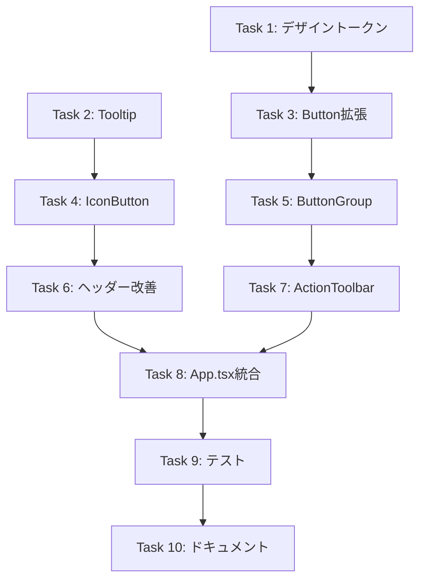

# Phase 42: UIデザイン改善 - タスク一覧

**作成日**: 2025-12-06
**ステータス**: ドラフト（ユーザー承認待ち）

---

## タスク概要

| タスク | 説明 | 工数 | ステータス |
|--------|------|------|-----------|
| Task 1 | デザイントークン定義 | 1h | 未着手 |
| Task 2 | Tooltipコンポーネント作成 | 0.5h | 未着手 |
| Task 3 | Button.tsx拡張 | 1.5h | 未着手 |
| Task 4 | IconButton.tsx作成 | 1h | 未着手 |
| Task 5 | ButtonGroup.tsx作成 | 0.5h | 未着手 |
| Task 6 | ヘッダーナビゲーション改善 | 2h | 未着手 |
| Task 7 | ActionToolbar.tsx作成 | 2h | 未着手 |
| Task 8 | App.tsx統合 | 2h | 未着手 |
| Task 9 | テスト・調整 | 2h | 未着手 |
| Task 10 | ドキュメント更新 | 1h | 未着手 |

**合計工数**: 約13.5h（約2日）

---

## Task 1: デザイントークン定義

### 概要
tailwind.config.jsにボタン用のカスタムカラーとサイズを追加

### 変更ファイル
- `tailwind.config.js`

### 実装内容
```javascript
// 追加するカラーパレット
'btn-primary': {
  DEFAULT: '#4F46E5',
  hover: '#4338CA',
},
'btn-success': {
  DEFAULT: '#059669',
  hover: '#047857',
},
'btn-secondary': {
  DEFAULT: '#F3F4F6',
  hover: '#E5E7EB',
  text: '#374151',
},
```

### 受け入れ条件
- [ ] カスタムカラーがTailwindで利用可能
- [ ] 既存スタイルへの影響なし

---

## Task 2: Tooltipコンポーネント作成

### 概要
軽量なCSS-onlyツールチップコンポーネントを作成

### 新規ファイル
- `src/components/Tooltip.tsx`

### 実装内容
```typescript
interface TooltipProps {
  content: string;
  children: React.ReactNode;
  position?: 'top' | 'bottom';
}
```

### 受け入れ条件
- [ ] ホバー時にツールチップが表示される
- [ ] 複数のポジションに対応
- [ ] アニメーション付き（opacity transition）

---

## Task 3: Button.tsx拡張

### 概要
既存Buttonコンポーネントにsize, ghost, outline variantsを追加

### 変更ファイル
- `src/components/Button.tsx`

### 実装内容
```typescript
// 追加するprops
size?: 'sm' | 'md' | 'lg';
variant: 'primary' | 'secondary' | 'success' | 'danger' | 'ghost' | 'outline-solid';
```

### 受け入れ条件
- [ ] 3つのサイズが正しく適用される
- [ ] ghost/outline variantが追加される
- [ ] 既存の使用箇所が破損しない（後方互換性）

---

## Task 4: IconButton.tsx作成

### 概要
アイコンのみのボタン（ヘッダーナビゲーション用）

### 新規ファイル
- `src/components/IconButton.tsx`

### 実装内容
```typescript
interface IconButtonProps {
  icon: React.ReactNode;
  label: string;
  as?: 'button' | typeof Link | 'a';
  variant?: 'light' | 'dark';
  // ...
}
```

### 受け入れ条件
- [ ] 40x40pxのタッチターゲット
- [ ] aria-label属性が設定される
- [ ] ホバー時にTooltipが表示される
- [ ] Link/a/buttonとしてレンダリング可能

---

## Task 5: ButtonGroup.tsx作成

### 概要
ボタンをグループ化し、視覚的に分離するコンポーネント

### 新規ファイル
- `src/components/ButtonGroup.tsx`

### 実装内容
```typescript
interface ButtonGroupProps {
  children: React.ReactNode;
  separated?: boolean;
}
```

### 受け入れ条件
- [ ] 子要素がflex配置される
- [ ] separated時にborder-leftが表示される

---

## Task 6: ヘッダーナビゲーション改善

### 概要
App.tsxのヘッダーナビゲーション部分をIconButtonで置き換え

### 変更ファイル
- `App.tsx`

### 実装内容
- 絵文字をHeroiconsに置き換え
- テキストラベルをTooltipに移動
- IconButtonコンポーネントを使用

### Before/After
```tsx
// Before
<Link className="...">📊 レポート</Link>

// After
<IconButton icon={<ChartBarIcon />} label="レポート" as={Link} to="/reports" />
```

### 受け入れ条件
- [ ] 4つのナビゲーション項目がアイコンボタンで表示
- [ ] ホバー時にラベルがTooltipで表示
- [ ] ログアウト処理が正常に動作

---

## Task 7: ActionToolbar.tsx作成

### 概要
アクションボタンエリアを統合コンポーネント化

### 新規ファイル
- `src/components/ActionToolbar.tsx`

### 実装内容
```typescript
interface ActionToolbarProps {
  onDemoClick: () => void;
  onSaveClick: () => void;
  onConfirmClick: () => void;
  onHistoryClick: () => void;
  onExportClick: () => void;
  isLoading: boolean;
  canSave: boolean;
  canConfirm: boolean;
  canShowHistory: boolean;
}
```

### レイアウト
```
[編集グループ: デモ | 保存 | 確定] │ [ユーティリティ: 履歴 | CSV]
```

### 受け入れ条件
- [ ] 2グループに視覚的に分離される
- [ ] 各ボタンに適切なvariantが適用される
- [ ] disabled状態が正しく表示される

---

## Task 8: App.tsx統合

### 概要
App.tsxのアクションボタンエリアをActionToolbarに置き換え

### 変更ファイル
- `App.tsx`

### 実装内容
```tsx
// Before: 5つの個別ボタン
<div className="space-x-2">
  <button>デモシフト作成</button>
  <Button>下書き保存</Button>
  ...
</div>

// After: ActionToolbarコンポーネント
<ActionToolbar
  onDemoClick={handleGenerateDemo}
  onSaveClick={handleSaveDraft}
  ...
/>
```

### 受け入れ条件
- [ ] 既存機能が正常に動作する
- [ ] UIが設計通りに表示される
- [ ] 無効状態が正しくハンドリングされる

---

## Task 9: テスト・調整

### 概要
E2Eテスト、アクセシビリティテスト、視覚的調整

### 実施内容
1. 既存E2Eテストの実行・修正
2. Lighthouseアクセシビリティ検証
3. 視覚的な微調整（色、間隔、アニメーション）
4. レスポンシブ確認

### 受け入れ条件
- [ ] 既存E2Eテストがパス
- [ ] Lighthouseアクセシビリティスコア90以上
- [ ] モバイル表示で崩れがない

---

## Task 10: ドキュメント更新

### 概要
GitHub Pagesドキュメント、メモリファイルの更新

### 変更ファイル
- `docs/index.html` - Phase 42追加
- `.serena/` - メモリファイル作成
- `PROJECT_HANDOFF_LATEST` - 更新

### 受け入れ条件
- [ ] GitHub Pagesに反映
- [ ] メモリファイルが作成される

---

## 依存関係



---

## 実装スケジュール（目安）

| 日程 | タスク |
|------|--------|
| Day 1 AM | Task 1-3 |
| Day 1 PM | Task 4-5 |
| Day 2 AM | Task 6-7 |
| Day 2 PM | Task 8-10 |

---

## 注意事項

1. **後方互換性**: 既存のButton使用箇所が破損しないよう、デフォルト値を維持
2. **E2Eテスト**: data-testid属性を変更しない
3. **アクセシビリティ**: aria-label, role属性を適切に設定
4. **レビュー**: 各タスク完了後にCodeRabbitレビューを実施
