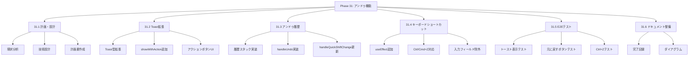
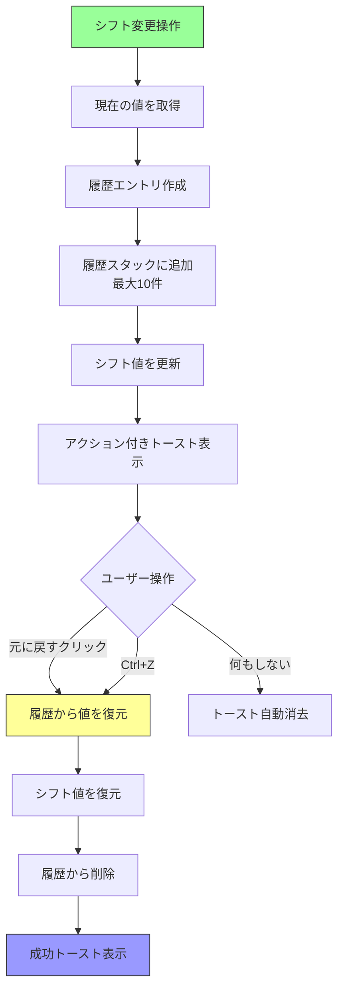
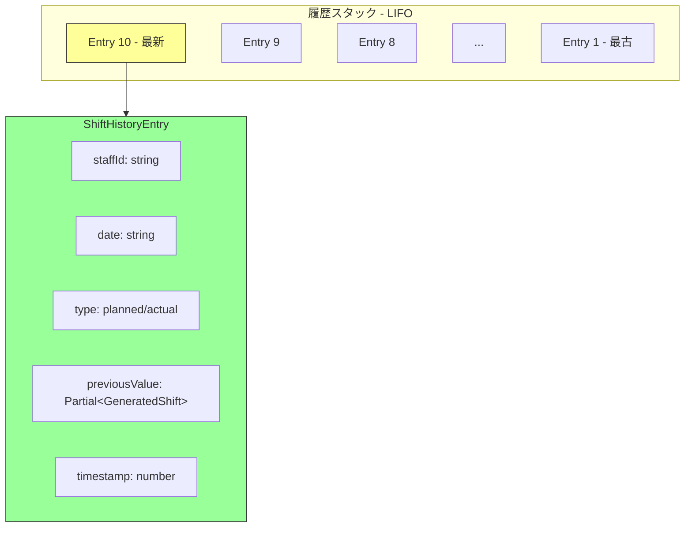
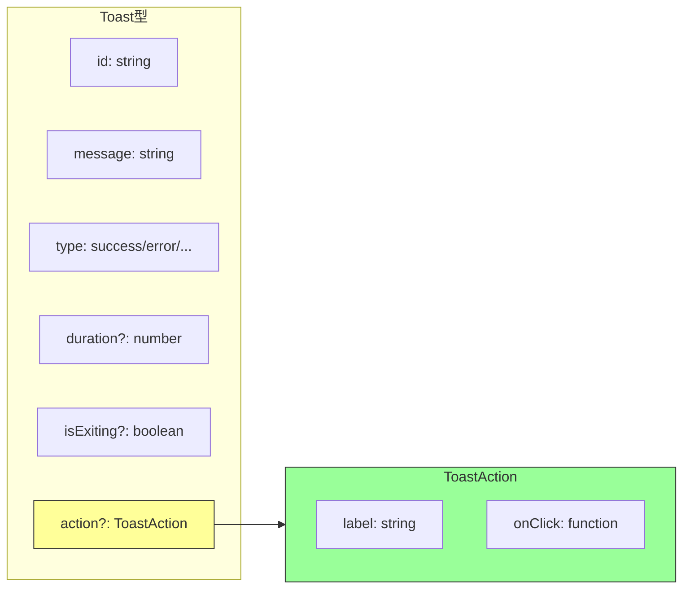
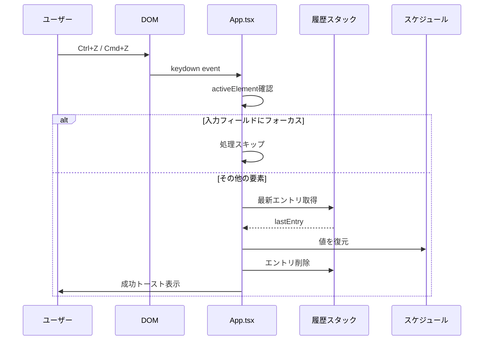
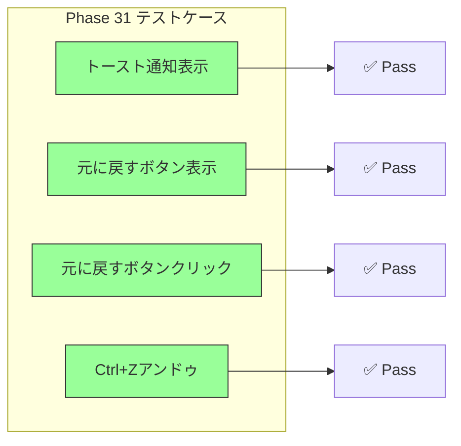
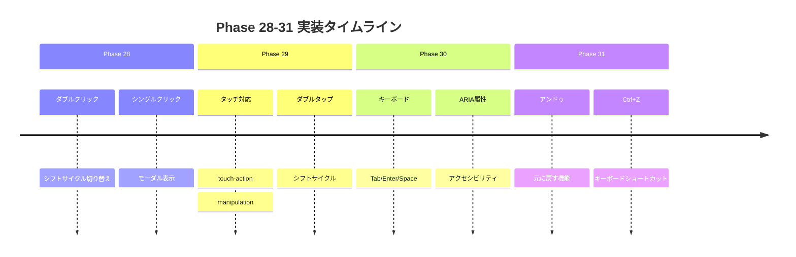
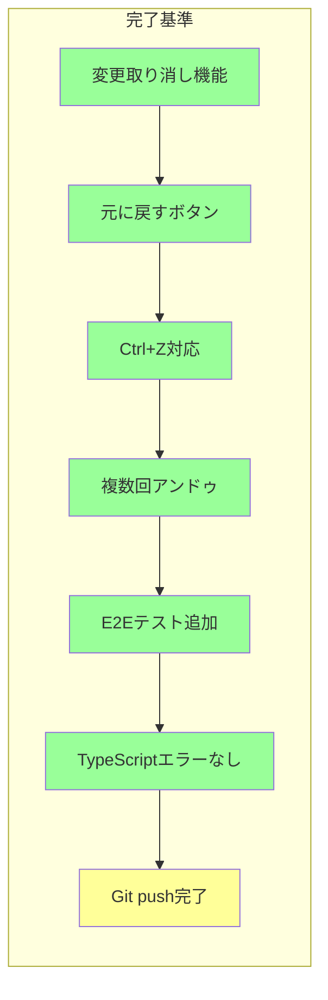

# Phase 31: アンドゥ機能 - ダイアグラム集

**作成日**: 2025-11-25
**仕様ID**: undo-functionality
**Phase**: 31

---

## 1. WBS（作業分解図）

---

## 2. ガントチャート

```mermaid
gantt
    title Phase 31 実装スケジュール
    dateFormat HH:mm
    axisFormat %H:%M

    section 計画・設計
    現状分析           :done, a1, 00:00, 10m
    技術設計           :done, a2, after a1, 10m
    計画書作成         :done, a3, after a2, 10m

    section Toast拡張
    Toast型拡張        :done, b1, after a3, 10m
    showWithAction追加 :done, b2, after b1, 10m
    アクションボタンUI :done, b3, after b2, 15m

    section アンドゥ履歴
    履歴スタック実装   :done, c1, after b3, 15m
    handleUndo実装     :done, c2, after c1, 10m
    handleQuickShiftChange更新 :done, c3, after c2, 15m

    section キーボード
    useEffect追加      :done, d1, after c3, 10m
    Ctrl/Cmd+Z対応     :done, d2, after d1, 10m

    section E2Eテスト
    テスト作成         :done, e1, after d2, 20m

    section 完了処理
    ドキュメント整備   :done, f1, after e1, 15m
    Git push           :f2, after f1, 5m
```

---

## 3. アンドゥ処理フロー

---

## 4. 履歴スタック構造

---

## 5. トースト拡張構造

---

## 6. キーボードショートカット処理

---

## 7. E2Eテスト構成

---

## 8. Phase 28-31 実装進捗

---

## 9. 完了基準チェックリスト

### チェックリスト

- [x] 履歴スタック実装（最大10件）
- [x] handleUndo関数実装
- [x] showWithAction追加
- [x] トーストUIにアクションボタン追加
- [x] Ctrl+Z / Cmd+Z対応
- [x] 入力フィールドフォーカス時の除外処理
- [x] E2Eテスト4件追加
- [x] TypeScriptコンパイル成功
- [ ] Git push完了

---

## 関連ドキュメント

- [Phase 31計画](./phase31-plan-2025-11-25.md)
- [Phase 31完了記録](./phase31-completion-2025-11-25.md)
- [Phase 30ダイアグラム](../keyboard-accessibility/phase30-plan-2025-11-25.md)
