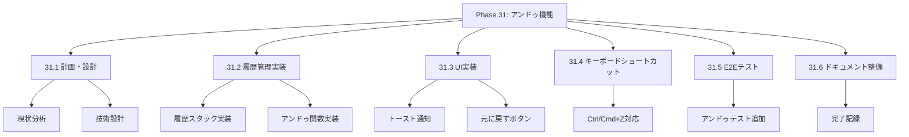

# Phase 31: アンドゥ機能（シフト変更取り消し）

**作成日**: 2025-11-25
**仕様ID**: undo-functionality
**Phase**: 31
**ステータス**: 🔄 実装中

---

## エグゼクティブサマリー

シフト変更後に「元に戻す」ボタンで直前の変更を取り消せるようにします。誤操作時の復元を可能にし、ユーザビリティを向上させます。

### 目標

- [ ] 直前のシフト変更を取り消せる
- [ ] トースト通知に「元に戻す」ボタン表示
- [ ] Ctrl+Z/Cmd+Zでもアンドゥ可能
- [ ] 複数回のアンドゥ対応（履歴スタック）

---

## 技術設計

### 1. アンドゥ履歴の管理

**状態管理:**
```typescript
interface ShiftHistoryEntry {
  staffId: string;
  date: string;
  type: 'planned' | 'actual';
  previousValue: Partial<GeneratedShift>;
  newValue: Partial<GeneratedShift>;
  timestamp: number;
}

// useStateで履歴スタックを管理
const [undoStack, setUndoStack] = useState<ShiftHistoryEntry[]>([]);
```

### 2. トースト通知 + 元に戻すボタン

**UI設計:**
```tsx
<Toast>
  <span>シフトを変更しました</span>
  <button onClick={handleUndo}>元に戻す</button>
</Toast>
```

### 3. キーボードショートカット

**対応キー:**
| キー | アクション |
|------|-----------|
| Ctrl+Z (Win) | アンドゥ |
| Cmd+Z (Mac) | アンドゥ |

**実装:**
```typescript
useEffect(() => {
  const handleKeyDown = (e: KeyboardEvent) => {
    if ((e.ctrlKey || e.metaKey) && e.key === 'z') {
      e.preventDefault();
      handleUndo();
    }
  };
  window.addEventListener('keydown', handleKeyDown);
  return () => window.removeEventListener('keydown', handleKeyDown);
}, [handleUndo]);
```

---

## WBS（作業分解図）



---

## ガントチャート

```mermaid
gantt
    title Phase 31 実装スケジュール
    dateFormat HH:mm
    axisFormat %H:%M

    section 計画・設計
    現状分析           :done, a1, 00:00, 10m
    技術設計           :done, a2, after a1, 10m

    section 履歴管理
    履歴スタック実装   :b1, after a2, 15m
    アンドゥ関数実装   :b2, after b1, 10m

    section UI実装
    トースト通知       :c1, after b2, 15m
    元に戻すボタン     :c2, after c1, 10m

    section キーボード
    Ctrl/Cmd+Z対応     :d1, after c2, 10m

    section E2Eテスト
    アンドゥテスト     :e1, after d1, 15m

    section 完了処理
    ドキュメント整備   :f1, after e1, 15m
    Git push           :f2, after f1, 5m
```



---

## 成功基準

- [ ] 直前のシフト変更を取り消せる
- [ ] トースト通知に「元に戻す」ボタン表示
- [ ] Ctrl+Z/Cmd+Zでアンドゥ動作
- [ ] TypeScriptエラーなし
- [ ] E2Eテスト通過

---

## 関連ドキュメント

- [Phase 30完了記録](../keyboard-accessibility/phase30-completion-2025-11-25.md)
- [ShiftTable.tsx](../../../components/ShiftTable.tsx)
