# バージョン履歴修正 - 視覚的ドキュメント

**更新日**: 2025-11-17
**種類**: 技術設計図・フローチャート
**関連**: [version-history-fix-2025-11-17.md](./version-history-fix-2025-11-17.md)

---

## 📊 システムアーキテクチャ図

### Firestoreデータ構造（修正後）

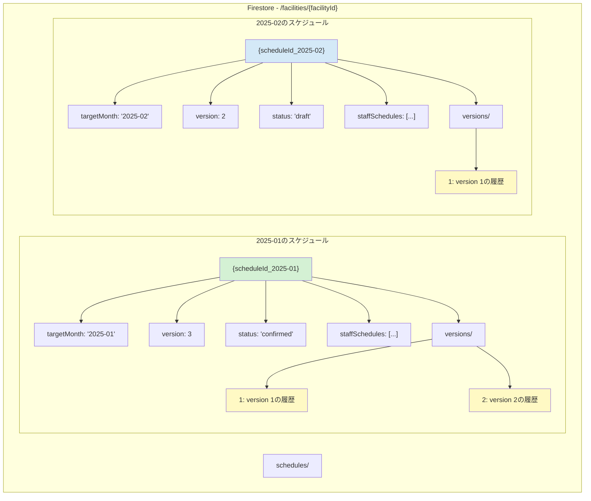

---

## 🔄 修正前後の処理フロー比較

### 修正前（問題のあるフロー）

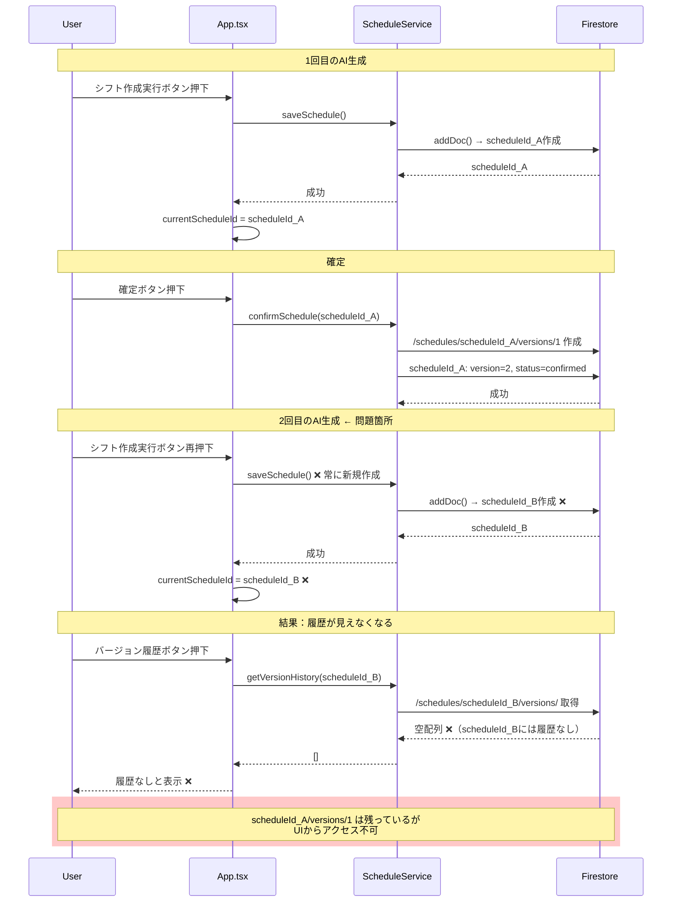

### 修正後（正しいフロー）

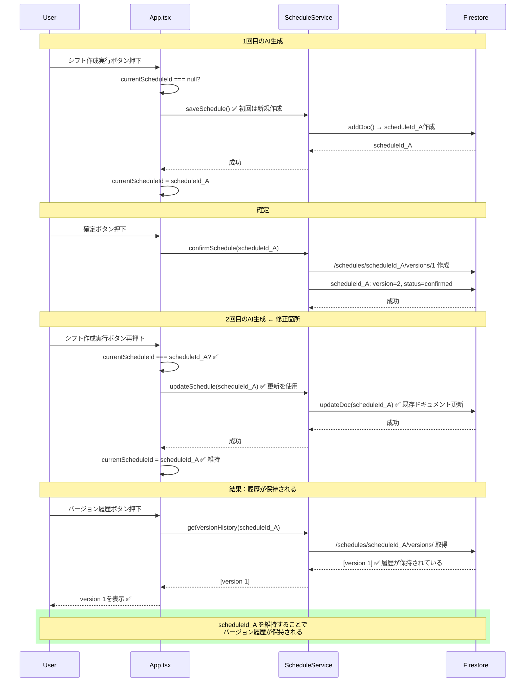

---

## 🔀 条件分岐フロー（修正後）

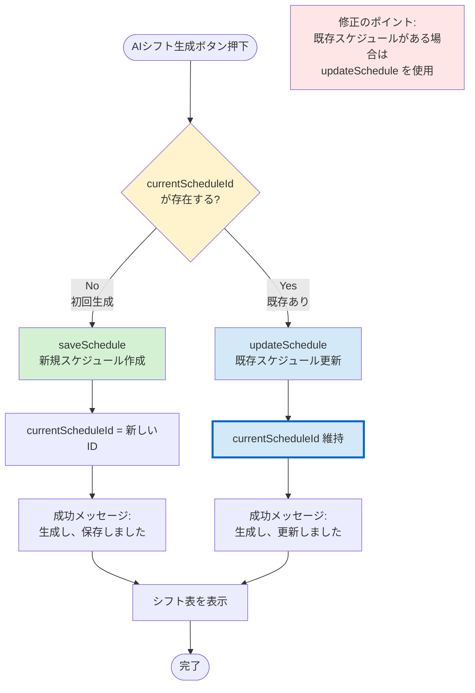

---

## 📅 バージョン履歴のライフサイクル

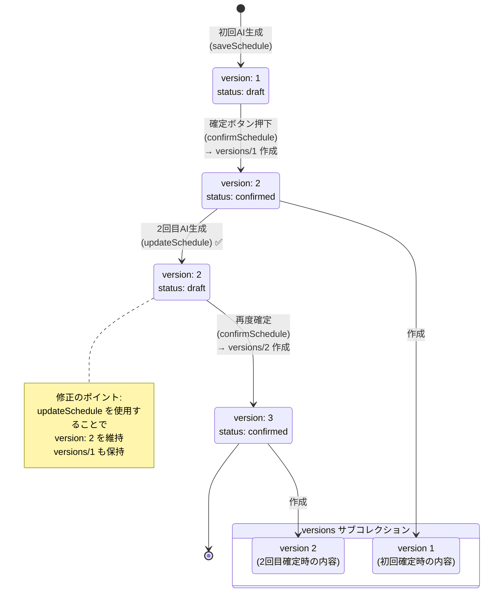

---

## 🔄 対象月切り替え時の動作

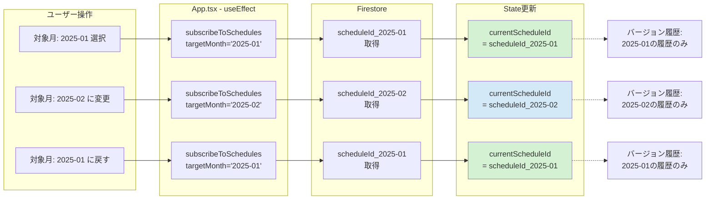

---

## 🧪 テストシナリオフロー

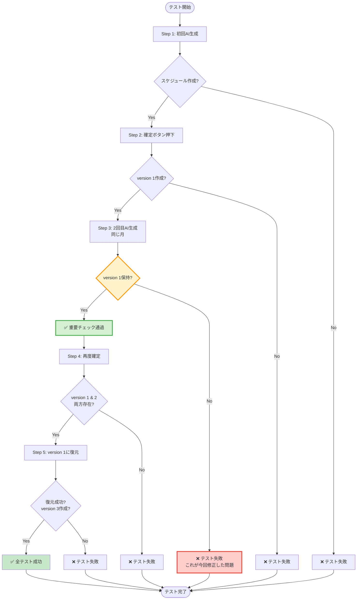

---

## 🔑 コード修正の核心部分

### 修正箇所の詳細フロー

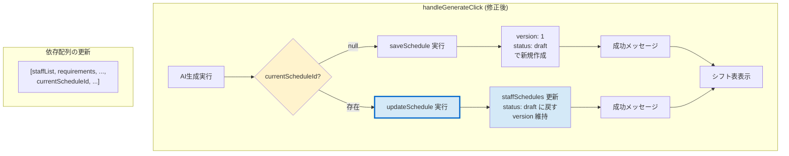

---

## 📊 影響範囲マップ

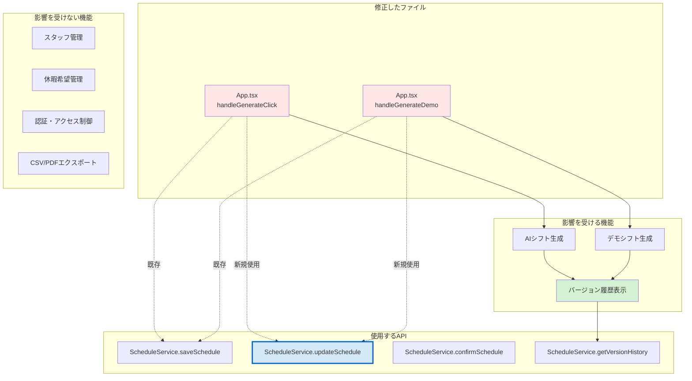

---

## 🎯 修正のビフォーアフター比較

### データフロー比較

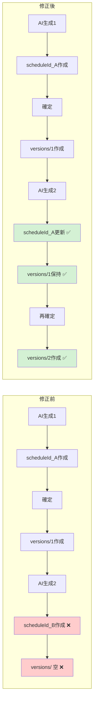

---

## 📈 タイムライン：修正作業の流れ

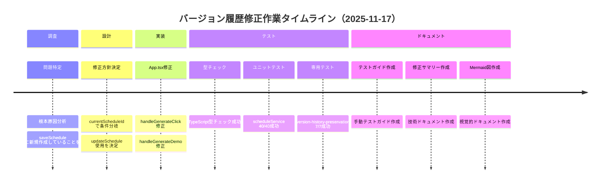

---

## 🔗 関連ドキュメントリンク

| ドキュメント | 用途 | パス |
|------------|------|------|
| **修正サマリー** | 詳細な説明 | [version-history-fix-2025-11-17.md](./version-history-fix-2025-11-17.md) |
| **手動テストガイド** | テスト手順 | [version-history-manual-test-guide.md](./../testing/version-history-manual-test-guide.md) |
| **自動テスト** | テストコード | [version-history-preservation.test.ts](../../src/__tests__/version-history-preservation.test.ts) |
| **ScheduleService** | API実装 | [scheduleService.ts](../../src/services/scheduleService.ts) |
| **型定義** | データ構造 | [types.ts](../../types.ts) |

---

**作成日**: 2025-11-17
**目的**: 将来のAIセッション・新規メンバーが即座に理解できるよう視覚化
