# Vertex AI Region Migration - Mermaid図版集

**作成日**: 2025年11月15日
**目的**: セッション全体像の視覚化
**関連**: [セッションサマリー](./vertex-ai-migration-session-summary-2025-11-15.md)

このドキュメントは、Vertex AI Region Migrationの全体像をMermaid図で表現します。

詳細なテキスト情報は[セッションサマリー](./vertex-ai-migration-session-summary-2025-11-15.md)を参照してください。

---

## 1. セッション全体フロー（ガントチャート）

```mermaid
gantt
    title Vertex AI Region Migration セッション進行状況
    dateFormat HH:mm
    axisFormat %H:%M

    section Phase 1: 現状確認
    現状確認・調査           :done, p1, 09:00, 10m

    section Phase 2: 移行計画
    Web調査（地域対応確認）  :done, p2, 09:10, 15m
    移行計画策定             :done, p2-2, 09:25, 5m

    section Phase 3: コード変更
    shift-generation.ts修正   :done, p3, 09:30, 10m
    phased-generation.ts修正  :done, p3-2, 09:40, 10m
    動作確認                  :done, p3-3, 09:50, 10m

    section Phase 4: ドキュメント
    Serenaメモリ更新         :done, p4, 10:00, 10m
    README.md更新            :done, p4-2, 10:10, 15m
    移行ドキュメント作成      :done, p4-3, 10:25, 15m

    section Phase 5: CI/CD
    コミット・プッシュ        :done, p5, 10:40, 5m
    GitHub Actions実行       :done, p5-2, 10:45, 10m

    section Phase 6: 課題対応
    Cloud Scheduler調査      :done, p6, 10:55, 15m
    完了手順書作成           :done, p6-2, 11:10, 15m

    section Phase 7: 引き継ぎ
    セッションサマリー作成    :active, p7, 11:25, 15m
    Mermaid図版作成          :active, p7-2, 11:40, 10m
```

---

## 2. セッション進行状況（円グラフ）

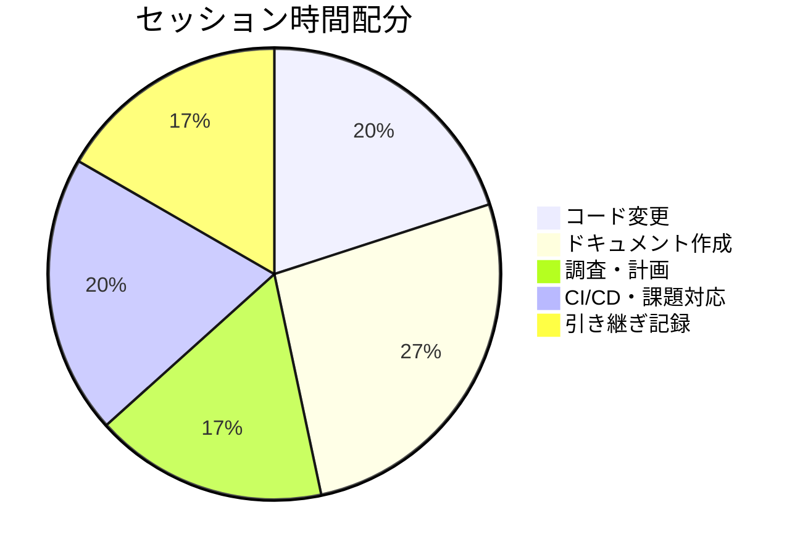

---

## 3. アーキテクチャ変更（Before/After）

### Before: Flash-Lite @ us-central1

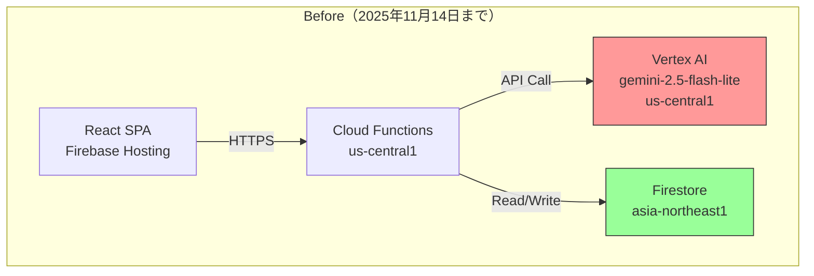

### After: Flash @ asia-northeast1

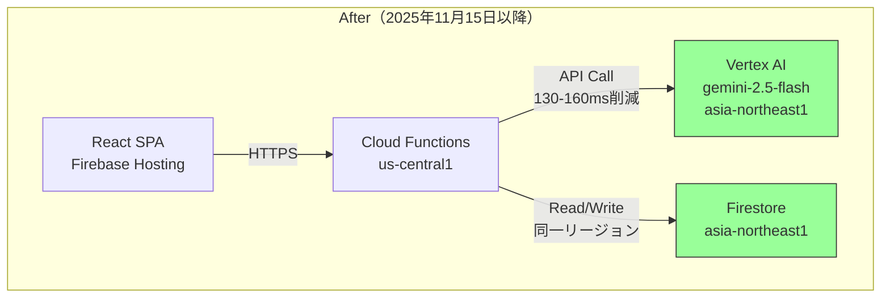

---

## 4. 意思決定フロー

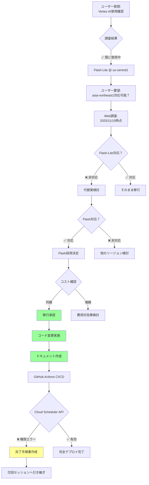

---

## 5. 変更ファイルマップ

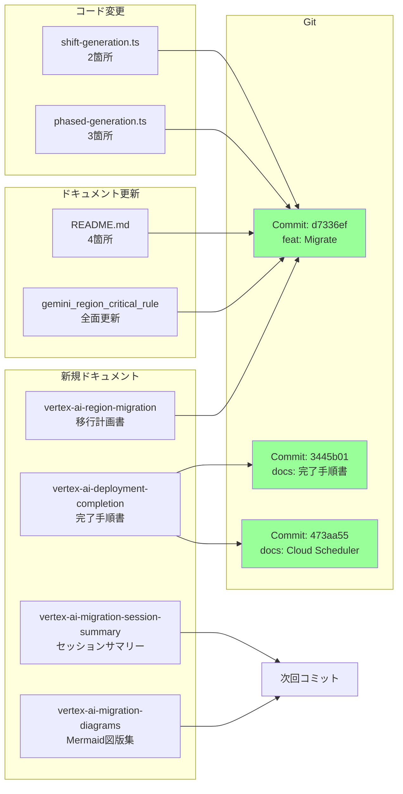

---

## 6. デプロイ状況（ステートマシン）

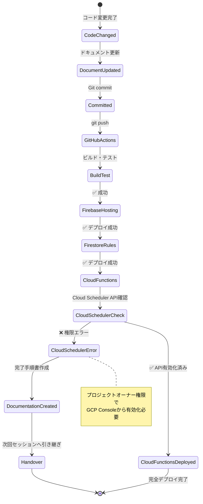

---

## 7. Before/After 性能比較

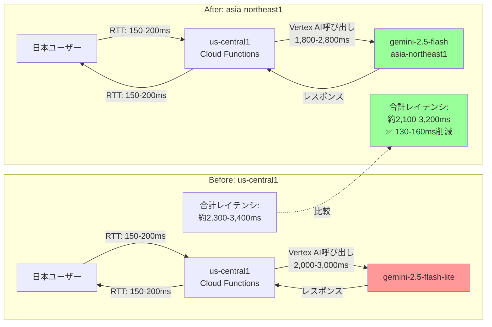

---

## 8. Cloud Scheduler API 必要性

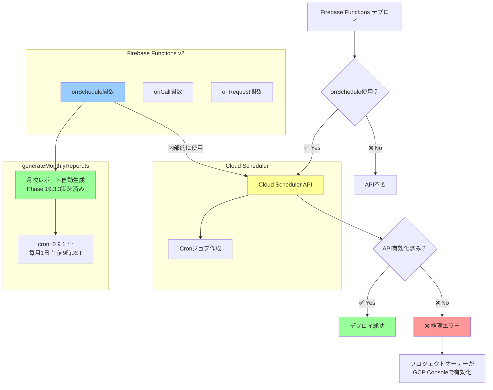

---

## 9. 完了チェックリスト（進行状況）

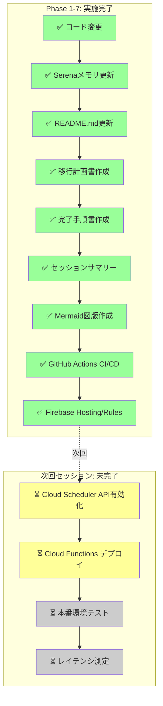

---

## 10. 引き継ぎフロー（次のセッション）

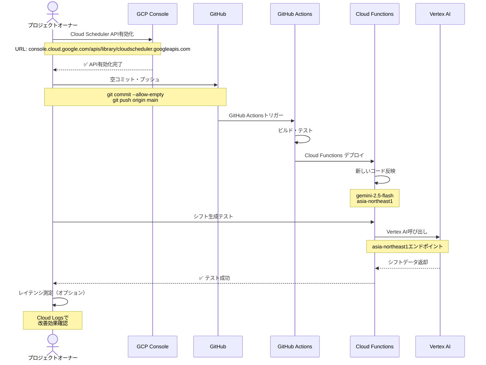

---

## 関連ドキュメント

- **テキスト版**: [セッションサマリー](./vertex-ai-migration-session-summary-2025-11-15.md)
- **完了手順書**: [デプロイ完了手順](./vertex-ai-deployment-completion-2025-11-15.md)
- **移行計画書**: [移行計画](./vertex-ai-region-migration-2025-11-15.md)

---

**記録者**: Claude Code
**作成日**: 2025年11月15日 11:40 JST
