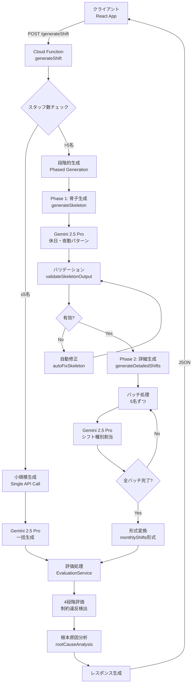
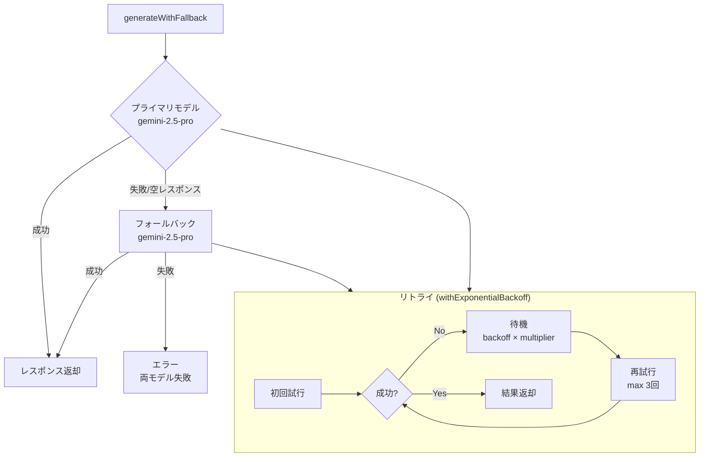
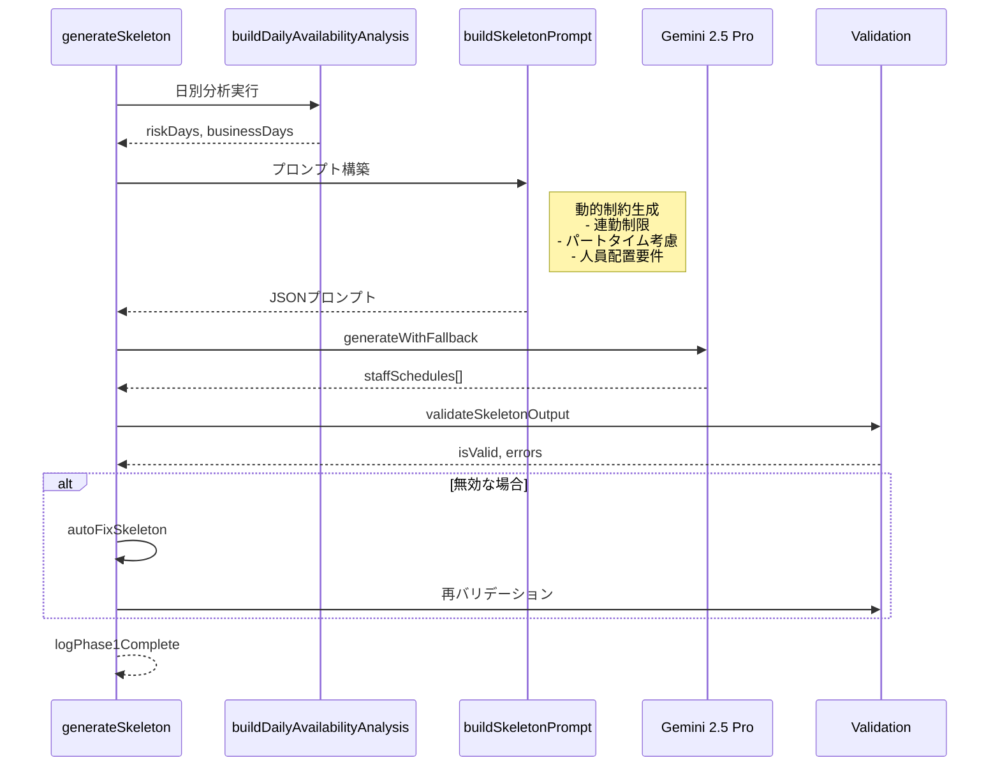
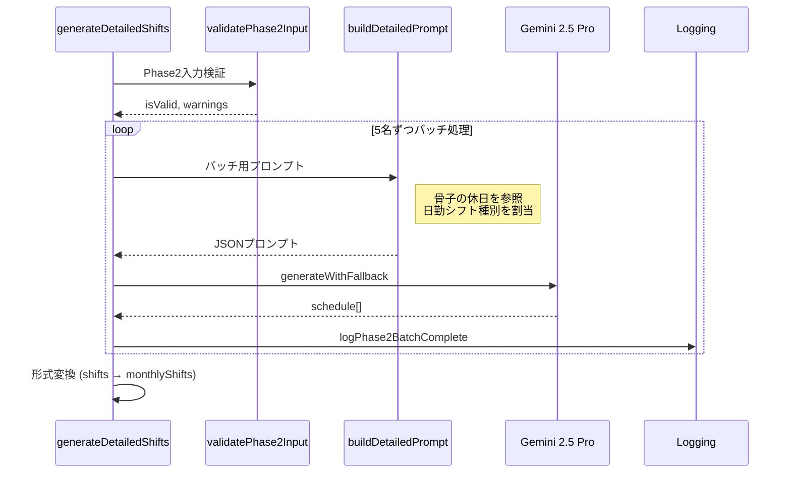
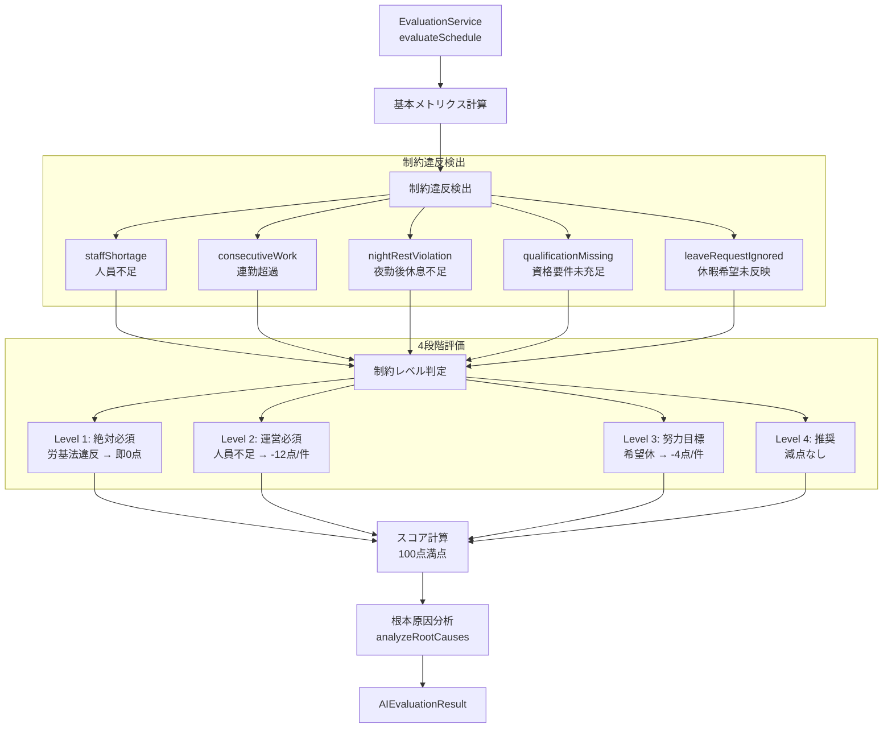

# AI Generation Flow - AIシフト生成フロー

## 概要

Phase 55時点のAI生成処理の詳細フローを示します。

## 1. 全体フロー図



## 2. モデル選択フロー



## 3. Phase 1: 骨子生成 詳細



## 4. Phase 2: 詳細生成 詳細



## 5. 評価フロー



## 6. 現状の問題点と安定性リスク

### 6.1 モデル冗長性（重大）
```
問題: GENERATION_CONFIGS の primary/fallback が同じモデル（gemini-2.5-pro）
影響: 実質的なフォールバック効果なし
      モデル固有の障害時に両方失敗

推奨: 異なるモデルファミリーを組み合わせ
      例: primary=gemini-2.5-pro, fallback=gemini-2.0-flash
```

### 6.2 JSON パース不安定性（重大）
```
問題: AIレスポンスのJSON形式が不安定
根拠: parseGeminiJsonResponse に多数のワークアラウンド
  - Markdownコードブロック抽出
  - トレーリングカンマ削除
  - JSONコメント削除
  - シングルクォート変換

影響: 予測不能なパースエラー
      BUG-014, BUG-022 などの過去事例
```

### 6.3 処理時間のばらつき
```
実測値:
- 小規模（≤5名）: 30-60秒
- 大規模（>5名）: 90-400秒（バッチ数に比例）
- 評価処理: 数百ミリ秒

問題: 400秒はCloud Functionsのタイムアウト（540秒）に近い
```

### 6.4 レート制限（429エラー）
```
問題: 連続API呼び出しで429エラー発生
対策: withExponentialBackoff（最大3回リトライ）
不足: 3回で解消しない場合の救済策なし
```

### 6.5 データ整合性警告の無視
```
コード箇所: phased-generation.ts:1431
問題: Phase 2入力バリデーション失敗時も処理続行
  「処理を続行しますが、品質に影響する可能性があります」

影響: 低品質シフトが生成される可能性
```

### 6.6 両モデル失敗時のハンドリング
```
コード箇所: phased-generation.ts:185
throw new Error(`${operationName}: 両モデルとも空レスポンス`);

問題: 同一モデルのため「両モデル」が機能しない
```

## 7. 改善提案

### 7.1 短期対策
1. **フォールバックモデル変更**: gemini-2.0-flash を fallback に設定
2. **リトライ回数増加**: maxRetries: 3 → 5
3. **バリデーション失敗時の停止**: 継続せずエラー返却

### 7.2 中期対策
1. **構造化出力の活用**: Gemini API の JSON Mode 安定版待ち
2. **処理分割**: 大規模シフトを非同期ジョブ化
3. **キャッシュ戦略**: 類似リクエストのキャッシュ

### 7.3 長期対策
1. **ファインチューニング**: 施設固有のパターン学習
2. **ハイブリッドアプローチ**: AI生成 + 制約ソルバー

## 8. ファイル構成

| ファイル | 役割 |
|---------|------|
| `functions/src/shift-generation.ts` | エントリーポイント（Cloud Function） |
| `functions/src/phased-generation.ts` | Phase 1/2 生成ロジック |
| `functions/src/ai-model-config.ts` | モデル設定、GENERATION_CONFIGS |
| `functions/src/evaluation/evaluationLogic.ts` | 評価サービス（1186行） |
| `functions/src/evaluation/constraintLevelMapping.ts` | 制約レベル設定 |
| `functions/src/evaluation/rootCauseAnalysis.ts` | 根本原因分析 |

## 9. API仕様

### リクエスト
```json
POST /generateShift
{
  "staffList": [...],
  "requirements": {
    "targetMonth": "2025-01",
    "timeSlots": [...],
    "requirements": {...}
  },
  "leaveRequests": {...}
}
```

### レスポンス
```json
{
  "success": true,
  "schedule": [...],
  "evaluation": {
    "overallScore": 85,
    "fulfillmentRate": 90,
    "constraintViolations": [...],
    "recommendations": [...],
    "simulation": {...},
    "rootCauseAnalysis": {...}
  },
  "metadata": {
    "generatedAt": "...",
    "model": "gemini-2.5-pro",
    "tokensUsed": 12345
  }
}
```

---

**最終更新**: 2025-12-30
