# Solver Generation Flow - シフト自動生成フロー

## 概要

CP-SAT Solverによるシフト自動生成の処理フロー（LLM完全廃止済み）。

## 1. 全体フロー図


## 2. CP-SAT Solverモデル

```
変数: x[staff_id, day, shift_type] = BoolVar (0/1)

ハード制約（必須）:
  - exactly-one: 各スタッフは1日1シフト
  - 人員充足: 各シフト×各日の最低人数
  - 連続勤務上限: 最大連続勤務日数
  - 遅番→早番禁止: 十分な休息確保
  - 夜勤チェーン: 夜勤の連続性
  - 固定休日: 希望休・公休の遵守

ソフト制約（最適化目標）:
  - シフト希望ボーナス
  - 勤務公平性（分散最小化）
  - 夜勤公平性
  - 休息間隔
  - 勤務日数目標
```

## 3. 評価フロー

```mermaid
flowchart TD
    A[EvaluationService<br/>evaluateSchedule] --> B[基本メトリクス計算]
    B --> C[制約違反検出]

    subgraph violations["制約違反検出"]
        C --> D1[staffShortage<br/>人員不足]
        C --> D2[consecutiveWork<br/>連勤超過]
        C --> D3[nightRestViolation<br/>夜勤後休息不足]
        C --> D4[qualificationMissing<br/>資格要件未充足]
        C --> D5[leaveRequestIgnored<br/>休暇希望未反映]
    end

    D1 & D2 & D3 & D4 & D5 --> E[制約レベル判定]

    subgraph levels["4段階評価"]
        E --> L1["Level 1: 絶対必須<br/>労基法違反 → 即0点"]
        E --> L2["Level 2: 運営必須<br/>人員不足 → -12点/件"]
        E --> L3["Level 3: 努力目標<br/>希望休 → -4点/件"]
        E --> L4["Level 4: 推奨<br/>減点なし"]
    end

    L1 & L2 & L3 & L4 --> F[スコア計算<br/>100点満点]
    F --> G[根本原因分析<br/>analyzeRootCauses]
    G --> H[EvaluationResult]
```



## 4. 性能特性

| 規模 | 処理時間 | ステータス |
|------|---------|-----------|
| 12名 | 0.22秒 | OPTIMAL |
| 15名×4シフト | 5.8秒 | OPTIMAL |
| 50名 | 0.89秒 | OPTIMAL |
| 100名 | <30秒 | OPTIMAL |

## 5. ファイル構成

| ファイル | 役割 |
|---------|------|
| `functions/src/shift-generation.ts` | エントリーポイント（Cloud Function） |
| `functions/src/solver-client.ts` | Solver呼び出しクライアント |
| `solver-functions/solver/unified_builder.py` | CP-SATモデル構築（コア） |
| `functions/src/evaluation/evaluationLogic.ts` | 評価サービス |
| `functions/src/evaluation/constraintLevelMapping.ts` | 制約レベル設定 |
| `functions/src/evaluation/rootCauseAnalysis.ts` | 根本原因分析 |

## 6. API仕様

### リクエスト
```json
POST /generateShift
{
  "staffList": [...],
  "requirements": {
    "targetMonth": "2026-03",
    "timeSlots": [...],
    "requirements": {...}
  },
  "leaveRequests": {...}
}
```

### レスポンス
```json
{
  "success": true,
  "schedule": [...],
  "evaluation": {
    "overallScore": 100,
    "fulfillmentRate": 100,
    "constraintViolations": [],
    "recommendations": [],
    "simulation": {...},
    "rootCauseAnalysis": {...}
  },
  "metadata": {
    "generatedAt": "...",
    "solver": "CP-SAT",
    "solveTimeMs": 220
  }
}
```

---

**最終更新**: 2026-02-16
