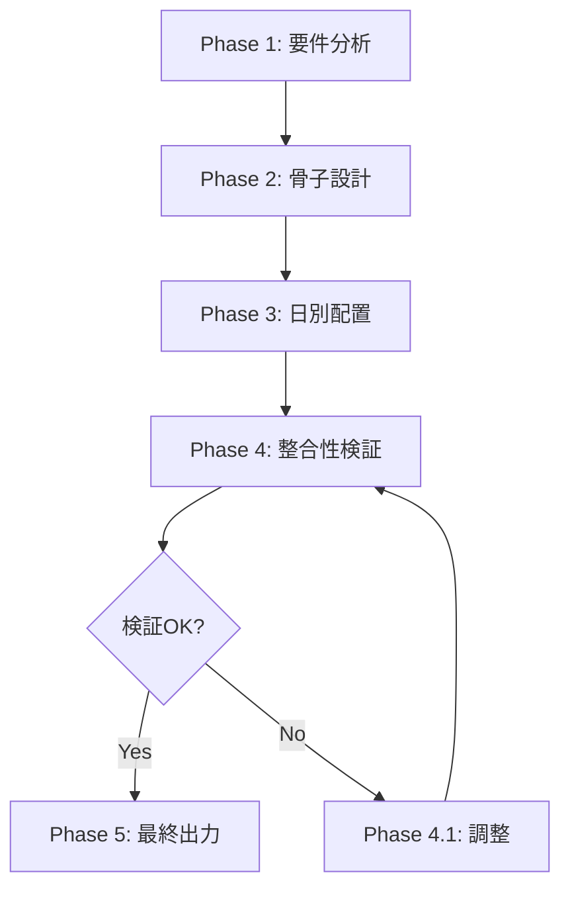

# AIシフト生成アルゴリズム改善プロジェクト会議

**開催日時**: 2025-12-07
**参加者（シミュレーション）**:
- プロジェクトマネージャー（PM）
- バックエンドエンジニア
- AIエンジニア（LLM専門）
- アルゴリズム専門家（制約充足問題）
- ドメインエキスパート（介護施設シフト管理）

---

## 議題1: 現状分析と問題定義

### PM: 現在の状況サマリー

```
目標: Gemini 2.5 Flashを使用したAI自動シフト生成の成功
現状: シフト配分が不均等（早番5名、日勤0名、遅番0名など）
成功実績: なし
```

### ドメインエキスパート: デイサービスの要件

| 項目 | 設定値 |
|------|--------|
| 施設種別 | デイサービス（通所介護）定員20名 |
| 営業日 | 月〜土（日曜休み） |
| スタッフ数 | 8名 |
| シフト区分 | 早番・日勤・遅番（夜勤なし） |

**必要人員（1日あたり）**:
- 早番: 2名
- 日勤: 2名（看護師1名以上）
- 遅番: 1名
- **合計: 5名/日**

**数学的検証**:
```
必要人日数 = 26営業日 × 5名/日 = 130人日
可能人日数 = 8名 × 週4.5回平均 × 4週 ≒ 144人日
余裕率 ≒ 11%（十分実現可能）
```

### AIエンジニア: 現行実装の問題分析

**現行の処理フロー**:
```
1. [骨子生成] 全スタッフの休日パターンを決定
2. [詳細生成] 5名ずつバッチで早番/日勤/遅番を割り当て
```

**問題点**:

1. **情報欠落**: 詳細生成プロンプトに「早番2名、日勤2名、遅番1名」という具体的数値がない
2. **局所最適化**: バッチ処理により全体最適化ができない
3. **制約の曖昧さ**: 「各日の必要人員を満たすよう調整する」だけでは不十分

---

## 議題2: 解決アプローチの検討

### アルゴリズム専門家: 制約充足問題（CSP）としての分析

シフト生成は典型的な**制約充足問題（Constraint Satisfaction Problem）**です。

**変数**: 各スタッフ × 各日 のシフト割当
**ドメイン**: {早番, 日勤, 遅番, 休}
**制約**:
- ハード制約（必須）: 人員配置、資格要件、連勤上限
- ソフト制約（努力目標）: 希望休、公平性

**推奨アプローチ: 階層的分解（Hierarchical Decomposition）**

```
人間の思考プロセス:
1. まず全体像を把握する
2. 大枠の構造を決める
3. 詳細を埋める
4. 整合性を確認する
5. 調整・修正する
```

### AIエンジニア: 段階的AIパイプライン提案

**提案: 5段階処理パイプライン**



| Phase | 処理内容 | 出力 |
|-------|----------|------|
| 1: 要件分析 | 制約条件の構造化、実現可能性判定 | 制約マトリクス |
| 2: 骨子設計 | 休日パターン、週単位勤務日数 | スタッフ別休日リスト |
| 3: 日別配置 | 日ごとに必要人員を満たすシフト割当 | 日別シフト表 |
| 4: 整合性検証 | 制約違反チェック、スコア算出 | 違反リスト |
| 4.1: 調整 | 違反箇所の修正 | 修正版シフト表 |
| 5: 最終出力 | JSON形式で出力 | schedule配列 |

### バックエンドエンジニア: 実装上の考慮点

**現行コード構造**:
- `shift-generation.ts`: メインエントリポイント
- `phased-generation.ts`: 段階生成ロジック
- `evaluation/evaluationLogic.ts`: 評価ロジック

**改修方針**:
1. 既存の2段階→5段階への拡張
2. 各Phaseを独立した関数として実装
3. Phase間のデータ受け渡しを型安全に

---

## 議題3: 具体的なソリューション設計

### AIエンジニア: 新プロンプト設計

**Phase 3: 日別配置の改善プロンプト例**:

```
あなたはデイサービスのシフト管理AIです。

# 対象日: 2026-01-06（月曜日）

# この日に勤務可能なスタッフ
- 田中太郎（管理者・介護福祉士）: 日勤のみ希望
- 佐藤花子（看護師）: いつでも可
- 鈴木美咲（看護師）: いつでも可
- 高橋健太（介護職員）: いつでも可
- 伊藤真理（介護職員）: いつでも可

# 必要人員（厳守）
| シフト | 必要人数 | 資格要件 |
|--------|----------|----------|
| 早番   | 2名      | なし     |
| 日勤   | 2名      | 看護師1名以上 |
| 遅番   | 1名      | なし     |

# 制約
- 合計5名を早番・日勤・遅番に振り分ける
- 日勤には看護師（佐藤または鈴木）を1名以上配置
- 日勤のみ希望のスタッフは日勤に優先配置

# 出力
この日のシフト割り当てをJSON形式で出力してください。
```

**ポイント**:
1. 1日単位で処理することで、人員配置の制約を確実に満たせる
2. 具体的な人数・資格要件を明示
3. 勤務可能スタッフのみを入力として渡す

### アルゴリズム専門家: 日単位処理のメリット

```
現行: スタッフ軸（5名 × 31日 = 155セル/バッチ）
提案: 日付軸（1日 × 8名 = 8セル/日）
```

**メリット**:
1. **制約充足が容易**: 「早番2名、日勤2名、遅番1名」を1回のAPI呼び出しで確実に満たせる
2. **トークン効率**: 1日分の出力は小さく、JSONパースエラーのリスク低減
3. **並列処理可能**: 各日は独立して処理可能（週単位でまとめることも可）

**デメリット**:
1. **API呼び出し回数増加**: 26営業日 = 26回（現行は骨子1回 + 詳細2回 = 3回）
2. **連勤制約の考慮**: 日をまたぐ制約は骨子段階で処理が必要

### PM: コスト・パフォーマンス分析

| 方式 | API呼び出し | 推定処理時間 | 成功確率 |
|------|-------------|--------------|----------|
| 現行（バッチ） | 3回 | 2-3分 | 低（不均等配分） |
| 提案（日単位） | 28回（骨子1+日26+検証1） | 3-4分 | 高 |
| ハイブリッド（週単位） | 6回（骨子1+週4+検証1） | 2-3分 | 中〜高 |

**推奨**: ハイブリッド方式（週単位処理）

---

## 議題4: 実装計画

### PM: マイルストーン

| フェーズ | 内容 | 期間 |
|----------|------|------|
| Phase A | 技術仕様書作成 | 即日 |
| Phase B | Phase 3（日別配置）の改善実装 | 1日 |
| Phase C | 検証・テスト | 1日 |
| Phase D | 本番デプロイ | 検証後 |

### バックエンドエンジニア: 即時実施可能な改善

**最小限の変更で最大の効果を得る方法**:

1. `buildDetailedPrompt`に必要人員の具体的数値を追加
2. バッチ処理を「週単位」に変更（1週間 × 8名 = 最大56セル）
3. 各週の開始時に前週の結果を参照して連勤制約をチェック

---

## 決定事項

1. **アーキテクチャ**: 5段階パイプライン方式を採用
2. **処理単位**: 週単位処理（ハイブリッド方式）を採用
3. **即時対応**: プロンプトに必要人員の具体的数値を追加
4. **中期対応**: 週単位バッチ処理への改修
5. **評価基準**: 人員充足率100%、制約違反0件

---

## 次のアクション

1. [ ] 技術仕様書の作成（本ドキュメントをベースに）
2. [ ] `buildDetailedPrompt`の改修
3. [ ] 週単位バッチ処理の実装
4. [ ] 統合テスト
5. [ ] 本番デプロイ

---

## 付録: 参考資料

- [phased-generation.ts](../functions/src/phased-generation.ts)
- [shift-generation.ts](../functions/src/shift-generation.ts)
- [seedDemoData.ts](../scripts/seedDemoData.ts)
- [Gemini 2.5 Flash ドキュメント](https://cloud.google.com/vertex-ai/docs/generative-ai/model-reference/gemini)
