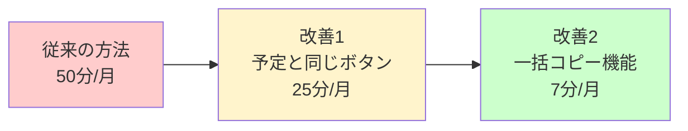
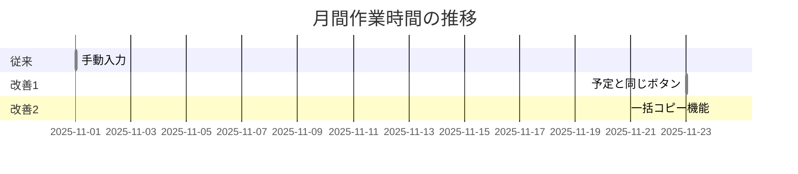
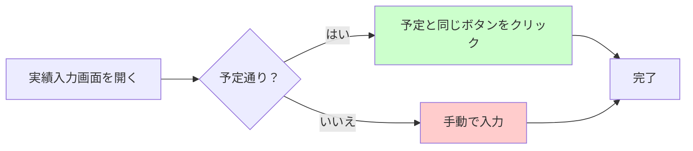
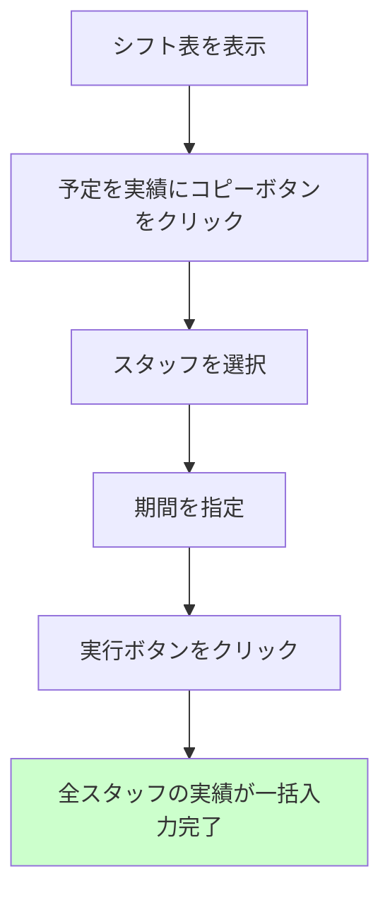
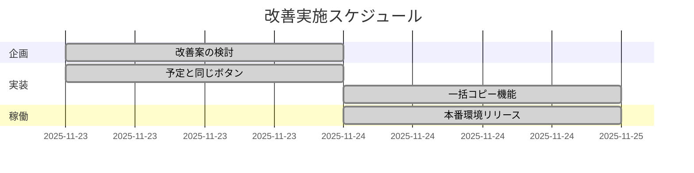

# シフト管理システム 改善実績

## 実績入力の効率化について

月末のシフト実績入力作業を大幅に効率化しました。

---

## 改善の流れ

---

## 作業時間の削減効果

### 削減率

- **改善1**: 50% 削減（50分 → 25分）
- **改善2**: 86% 削減（50分 → 7分）

---

## 改善内容の詳細

### 1. 「予定と同じ」ボタンの追加

実績入力時に予定通りだった場合、ワンクリックで入力できるようになりました。

**効果**: 入力時間が50%削減

---

### 2. 一括コピー機能

複数のスタッフの実績を一度にまとめて入力できるようになりました。

**効果**: 入力時間が86%削減

---

## 改善スケジュール

---

## 本番環境

[シフト管理システムを開く](https://ai-care-shift-scheduler.web.app)

---

## 開発者向け技術情報

[技術ドキュメント（詳細な構成図等）](technical.html)

---

**最終更新**: 2025年11月24日
