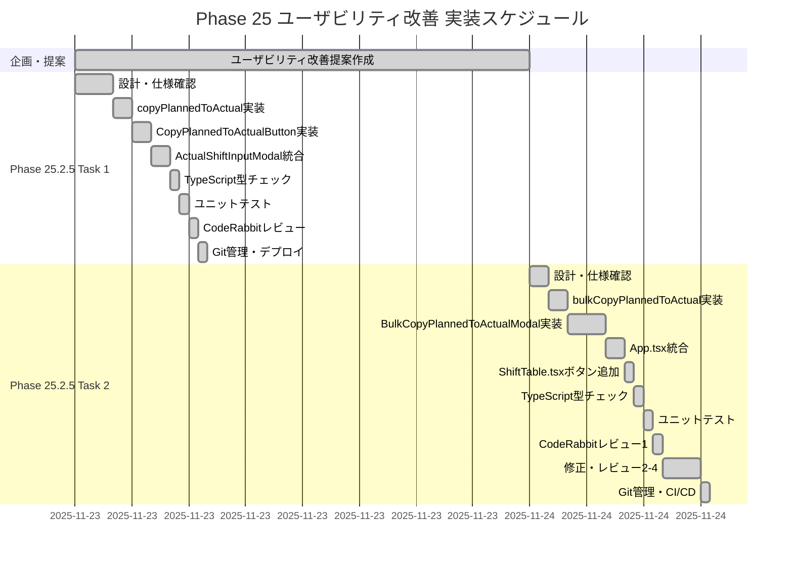
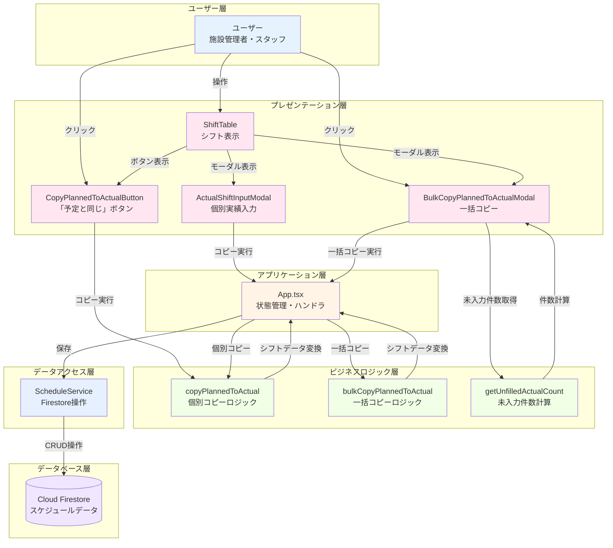
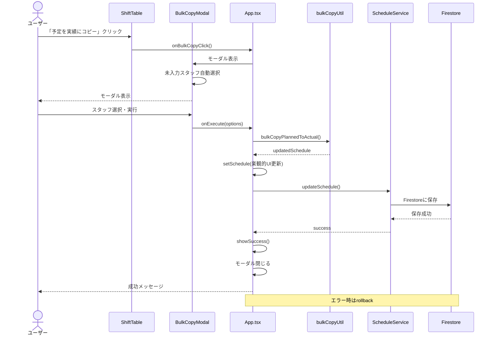
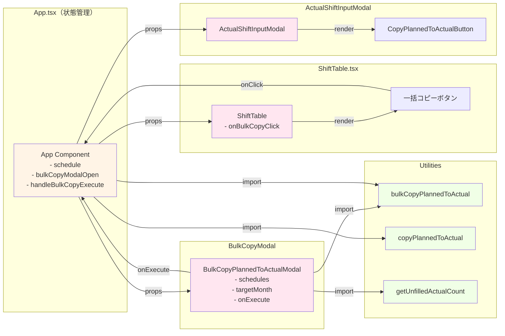
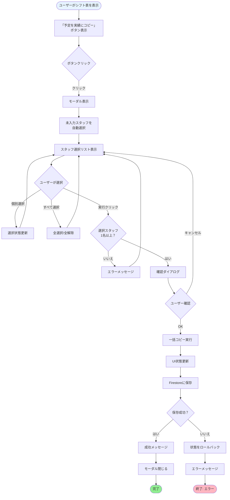

# 技術ドキュメント（開発者向け）

Phase 25 ユーザビリティ改善の技術詳細とダイアグラム集です。

---

## WBS（作業分解構造）

```mermaid
graph TB
    A[Phase 25.2.5<br/>ユーザビリティ改善]

    A --> B[Task 1<br/>個別「予定と同じ」ボタン]
    A --> C[Task 2<br/>一括予定→実績コピー]
    A --> D[Task 3<br/>ダブルクリック即時コピー<br/>未実装]

    B --> B1[設計・仕様確認]
    B --> B2[copyPlannedToActual実装]
    B --> B3[CopyPlannedToActualButton実装]
    B --> B4[ActualShiftInputModal統合]
    B --> B5[TypeScript型チェック]
    B --> B6[ユニットテスト]
    B --> B7[CodeRabbitレビュー]
    B --> B8[Git管理]

    C --> C1[設計・仕様確認]
    C --> C2[bulkCopyPlannedToActual実装]
    C --> C3[BulkCopyPlannedToActualModal実装]
    C --> C4[App.tsx統合]
    C --> C5[ShiftTable.tsxボタン追加]
    C --> C6[TypeScript型チェック]
    C --> C7[ユニットテスト]
    C --> C8[CodeRabbitレビュー<br/>4回・9件対応]
    C --> C9[Git管理・CI/CD]

    D --> D1[UI設計]
    D --> D2[イベントハンドラ実装]
    D --> D3[モーダル改修]
    D --> D4[E2Eテスト]

    style B fill:#90EE90
    style C fill:#90EE90
    style D fill:#FFE4B5
```

---

## ガントチャート（実装スケジュール）

---

## システム構成図

---

## データフロー図

---

## コンポーネント関係図

---

## ユーザーインタラクションフロー

---

[トップページに戻る](index.html)

**最終更新**: 2025年11月24日
